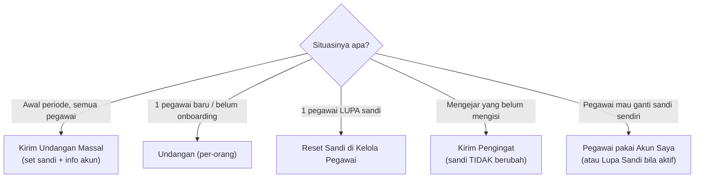
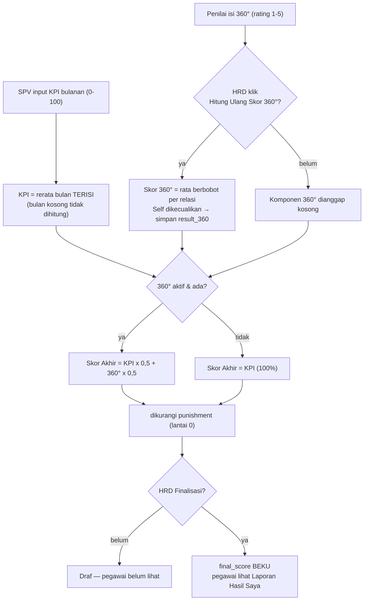
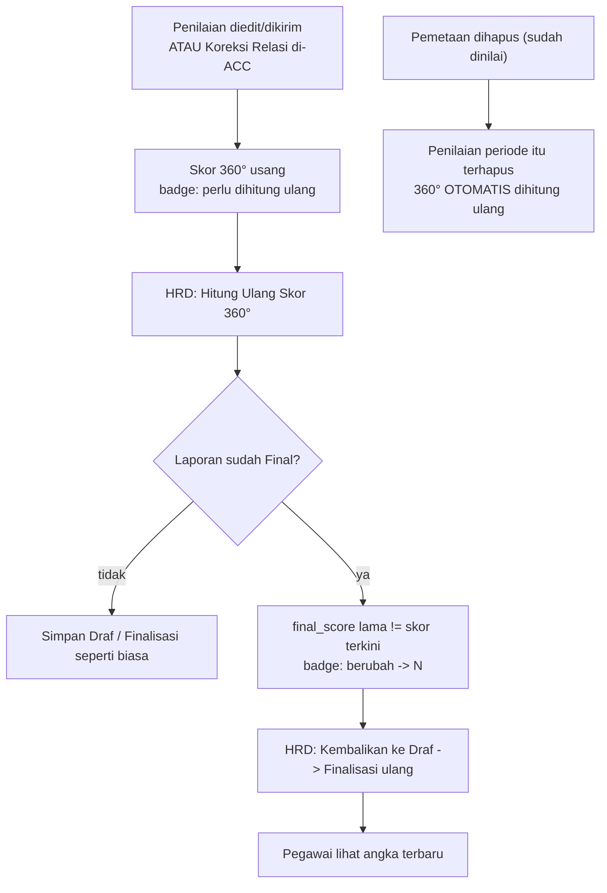
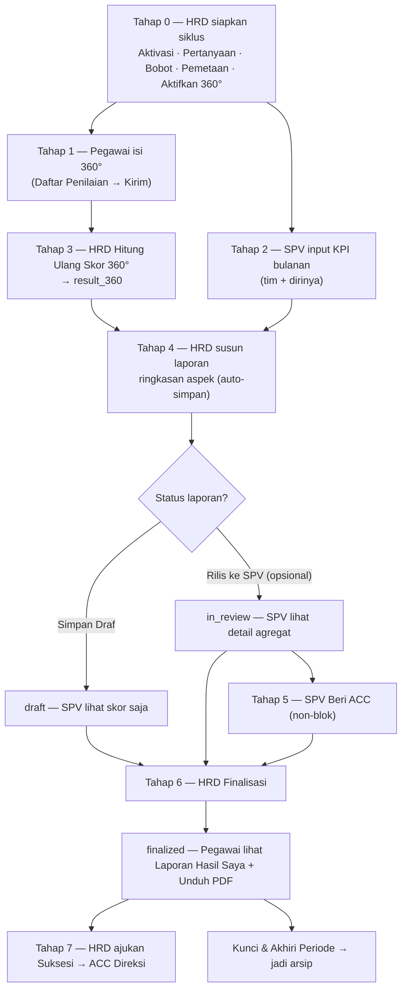

# Cara Penggunaan Aplikasi — Infarm 360° Portal

Panduan pengguna aplikasi penilaian kinerja (Performance Appraisal) 360°.
Disusun dari `PANDUAN Infarm 360 Portal.pdf` dan disesuaikan dengan aplikasi saat ini.

> 📌 **Rincian tiap tombol per halaman** (fungsi · peran · kondisi · konfirmasi): lihat
> [RINCIAN-TOMBOL.md](RINCIAN-TOMBOL.md) — kamus lengkap semua aksi di aplikasi.

> **Status:** aplikasi **live** dengan database **Supabase** (auth nyata, RLS per peran); email
> pengingat & undangan **aktif** (Gmail SMTP). **Sandi:** saat HRD menekan **Kirim Undangan**
> (onboarding), tiap pegawai disetel **sandi acak unik** yang dikirim via email; pegawai dapat
> menggantinya sendiri lewat **Akun Saya**. Bila pegawai lupa sandi, HRD **Reset Sandi** atau kirim
> **Undangan** ulang **ke orang itu** (tak mengganggu yang lain). Pegawai dikelola lewat
> **HRD → Kelola Pegawai** (lihat di bawah).
>
> ⚠️ **Hati-hati "Kirim Undangan Massal":** tombol ini **menyetel ulang sandi SEMUA orang** jadi
> acak baru — termasuk yang sudah mengganti sandinya sendiri. Lakukan **sekali di awal periode**;
> untuk pengingat berikutnya pakai **Kirim Pengingat** (tak menyentuh sandi).

---

## Login

1. Buka aplikasi (URL Vercel atau `http://localhost:3000` saat lokal).
2. Pilih **Nama** Anda — dropdown punya **kotak pencarian**; ketik sebagian nama untuk
   menyaring (daftar diambil otomatis dari data pegawai aktif, lengkap dengan **posisi** di label).
   Saat nama dipilih, **Peran terisi otomatis** → langsung ke Sandi. (Bisa juga pilih **Peran**
   dulu untuk menyaring daftar nama; keduanya valid.)
3. Masukkan **Sandi**.
4. Klik **Masuk**.

> **Field nama selalu tampil** sejak halaman dibuka (perbaikan: dulu bisa tak muncul di HP lambat
> bila pengguna menyentuh sebelum halaman siap). Pegawai baru yang ditambahkan HRD otomatis muncul.
> Tersedia juga cadangan **"Masuk dengan email manual"**. Dropdown nama berfitur pencarian juga
> dipakai di Pemetaan (Penilai/Target) & Penilaian Ad-Hoc.

> HRD Admin punya **2 mode**: bertindak sebagai **SPV** atau sebagai **HRD Admin**
> (mengelola seluruh sistem).

---

## Akun Saya — Ganti Sandi (semua peran)

Di **footer sidebar** (bawah, dekat tombol Keluar) ada tautan **Akun Saya**. Halaman ini
menampilkan info akun (nama, email login, divisi, peran, kode pegawai) dan form **Ganti Sandi**:

1. Isi **Sandi Saat Ini** (verifikasi keamanan), **Sandi Baru** (min. 8 karakter), dan
   **Ulangi Sandi Baru**.
2. Klik **Simpan Sandi Baru**.

> **Ikon mata** di samping tiap kolom sandi (di sini, di Login, & di reset via email)
> menampilkan/menyembunyikan tulisan sandi — agar Anda bisa memastikan ketikan benar.

> **Penting:** sandi awal dikirim **per orang** lewat email **Undangan** (acak unik). Tiap pegawai
> sebaiknya segera menggantinya dengan sandi pribadi lewat halaman ini — demi menjaga **integritas
> penilaian 360°** (mencegah orang lain login & menilai atas nama Anda). Sandi tidak pernah dicatat sistem.

---

## Tugas & Notifikasi (semua peran)

Di **sidebar bagian atas** terdapat panel **"Tugas & Notifikasi"** dengan badge jumlah
(juga muncul di tombol menu pada layar ponsel). Isinya **diturunkan otomatis** dari data —
tak perlu ditandai "sudah dibaca", selalu mengikuti keadaan nyata akun yang login:

- **X penilaian 360° menunggu diisi** → ke Daftar Penilaian Saya.
- **Laporan Hasil Anda sudah final** (Employee/SPV) → ke Laporan Hasil Saya.
- **X anggota belum ada KPI [bulan]** (SPV / HRD mode-SPV) → ke Input KPI.
- **X permohonan koreksi relasi menunggu**, **X penilaian 360° belum lengkap**, **X laporan belum
  difinalisasi**, & **X laporan final perlu dihitung ulang (data berubah)** → ke Review Hasil Akhir,
  muncul bila skor tersimpan laporan final berbeda dari skor terkini (HRD Admin).
- **X usulan suksesi menunggu ACC** (Direksi).

Tiap baris adalah tautan langsung ke halaman terkait. Bila kosong: *"Tak ada tugas tertunda 🎉"*.
Panel hanya aktif saat ada **periode aktif**.

> **Indikator tenggat periode.** Di bawah label periode (sidebar) tampil **sisa hari** menuju
> tanggal selesai: abu-abu bila masih lama, **kuning ⚠ saat ≤7 hari**, **merah saat berakhir
> hari ini / lewat tenggat**. Membantu HRD mengejar penyelesaian sebelum periode dikunci.

> **Navigasi keyboard.** Dropdown nama berpencarian bisa dioperasikan tanpa mouse: **↑/↓**
> memilih, **Enter** mengonfirmasi, **Esc** menutup.

---

## Peran: EMPLOYEE

### Daftar Penilaian Saya
- Di atas tabel ada **kartu "Penilaian Wajib Anda: X dari Y sudah dikirim"** (+ bar progres) —
  hanya menghitung penilaian **berstatus Wajib**, agar Anda tahu sisa tugas.
- **Banner info Garis Hubungan**: jelaskan bahwa relasi (Atasan/Peer/Bawahan/dst.) **menentukan
  bobot Skor 360°** → bila keliru, gunakan **Minta Koreksi**.
1. Lakukan penilaian 360° sesuai daftar "Rekan Kerja & Evaluasi dalam Daftar Penilaian Anda".
2. Cek kolom **Garis Hubungan** — jika hubungan kerja salah, ajukan **Minta Koreksi**
   dengan alasan, lalu **Kirim Pengajuan**. (Abaikan bila relasi sudah benar.)
   - Kolom **Sifat** menandai tiap penilaian **Wajib** atau **Opsional** (diatur HRD di Pemetaan).
3. Klik **Mulai Nilai** — form terpandu (rail aspek + satu indikator per layar):
   - **Panduan Penilaian Umum** (kotak di atas, dapat dibuka/tutup) berlaku untuk semua soal.
   - **Rail Aspek Budaya**: pilih aspek; tiap aspek menampilkan progres **selesai/total** (✓ bila
     lengkap). Item terakhir **Umpan Balik Kualitatif** — kini **WAJIB diisi semua**, bukan opsional.
     Di **HP** rail jadi **strip horizontal yang bisa di-geser**; di layar lebar tampil vertikal di kiri.
   - Bila HRD mengisi panduan, tiap indikator menampilkan **deskripsi perilaku** + **panduan
     rating per level** sebagai acuan menilai.
   - **Editor indikator**: pilih chip **Q1…Qn**, beri **Rating 1–5** (di HP, label makna muncul
     sebagai **"Pilihan Anda: N · Label"** di bawah angka), lalu isi **Komentar / Bukti Perilaku** —
     **wajib, min. 4 karakter**. Tombol **× Bersihkan** mengosongkan jawaban indikator itu.
   - Navigasi **Sebelumnya / Selanjutnya** berpindah antar indikator; dari indikator terakhir tombol
     berubah **"Ke Umpan Balik Kualitatif"**. **Bar progres** mencakup indikator **dan esai** (mis. 13/13).
   - **Auto-simpan otomatis**: isian tersimpan sendiri ~5 detik setelah Anda berhenti mengetik
     (indikator **"Tersimpan otomatis ✓"** di bawah bar progres). Boleh berhenti & lanjut nanti dari
     perangkat mana pun (draf tersimpan di server). Butuh internet; bila gagal, indikator merah →
     tekan **Simpan Draf**.
4. Belum selesai? Klik **Simpan Draf** — lanjutkan lagi dari "Daftar Penilaian Saya".
5. Sudah lengkap? Klik **Kirim Penilaian 360°** → muncul **konfirmasi** ("Kirim penilaian untuk
   <Nama>?") → **Ya, Kirim**. Bila ada rating/komentar/**esai** kurang, sistem **melompat ke bagian
   yang belum lengkap**. Setelah berhasil tampil **layar sukses** + pengingat **sisa penilaian wajib**
   (tombol **"Lanjut ke Penilaian Berikutnya"** bila masih ada). Penilaian terkirim **tetap bisa diedit**.
6. **Batal** kembali ke daftar tanpa menyimpan; **Buang Draf** (muncul bila ada draf
   tersimpan) menghapus draf beserta rating & komentarnya.
7. Menilai orang di luar daftar: fitur **Hak Penilaian Ad-Hoc Mandiri** (opsional) →
   "Pilih Rekan Kerja untuk Dinilai" → "Tambahkan Rekan" → nilai seperti biasa (relasi Lintas Unit).
   Target ad-hoc bisa **Dihapus** lewat tombol di barisnya — **kecuali** penilaiannya **sudah
   terkirim** (tombol dinonaktifkan demi menjaga data 360°). Pegawai eksternal tak bisa jadi target ad-hoc.

### Laporan Hasil Saya
> Muncul **hanya setelah HRD melakukan Finalisasi** (status `finalized`). Sebelum itu tampil
> "belum difinalisasi". ACC SPV bersifat non-blok — tidak menghambat finalisasi.
1. Pilih kuartal di **Pilih Kuartal Acuan**.
2. **Unduh PDF** jika laporan sudah tersedia.
3. Tampilan berupa **ringkasan agregat (anonim)**, bukan komentar mentah:
   - **Ringkasan skor** (Rerata KPI · Evaluasi 360° · Skor Akhir).
   - **Radar Aspek 360°**: garis **penuh = Penilaian Rekan**, garis **putus-putus = Evaluasi Diri
     (Self)** — pembanding persepsi diri vs rekan, + bar Rekan vs Diri per aspek.
   - **Evaluasi Aspek Budaya & Perilaku 360°** — ringkasan naratif dari HRD per aspek (anonim).
   > **Komentar mentah per penilai TIDAK ditampilkan** ke pegawai (menjaga anonimitas 360°);
   > yang tampil hanya agregat di atas.

---

## Peran: SUPERVISOR (SPV)

Selain semua fitur Employee di atas, SPV punya:

### Input KPI Anggota (bulanan)
- Daftar berisi **anggota tim** SPV (dari Pemetaan atasan di Kelola Pegawai) **+ SPV sendiri**
  — SPV juga mencatat **capaian KPI pribadinya**. (SPV hanya boleh menulis KPI anggota timnya
  & dirinya sendiri; tidak bisa mengubah KPI rekan SPV lain — ditegakkan via RLS.)
- **Pengisian Manual Apps**: pilih **Bulan & Tahun**, isi **Skor Baru (0–100)**,
  klik **Simpan Semua Skor**.
  - **Input pertama** suatu pegawai **boleh tanpa komentar**.
  - **Saat mengedit** skor yang sudah ada, **Komentar Ringkas Audit wajib diisi** — tanpa
    komentar, perubahan **tidak bisa disimpan** (demi jejak audit yang jelas).
- **Unggah Excel Kerja**: unduh "Format Template KPI Standard.xlsx", isi, drag-drop,
  tunggu ter-parsing, lalu **Pasang Data & Tinjau Kembali**.

### Riwayat & Audit Perubahan
- "Rekam Audit Skor Perubahan KPI" — filter **Pilih Pegawai Tim** untuk meninjau perubahan.
- **Termasuk diri sendiri**: jejak audit KPI SPV pribadi ikut tampil (muncul setelah ada
  perubahan KPI dirinya).

### Rekapitulasi Kuartal
- Rekap capaian KPI, Hasil 360, & Skor Akhir bawahan **+ SPV sendiri**. Filter **Tahun** & **Kuartal**.

### Laporan Kinerja Tim
- Tinjau "Final Report" tiap pegawai. Kolom **Skor Akhir** & **Status** tampil untuk semua anggota.
- **Visibilitas bertahap** (diatur HRD):
  - **Draf** → Anda hanya melihat **angka Skor Akhir**; tautan detail **terkunci**
    ("detail menunggu rilis HRD").
  - **Ditinjau** (HRD sudah menekan *Rilis ke SPV*) atau **Final** → tautan **terbuka**: Anda bisa
    membuka **detail agregat** — radar/skor per aspek + **ringkasan aspek dari HRD** (anonim).
    **Komentar mentah per penilai tidak pernah ditampilkan ke SPV** (menjaga anonimitas 360°).
- **Tombol ACC hanya muncul setelah HRD "Rilis ke SPV"** (status Ditinjau/Final). Saat masih
  **Draf**, kolom ACC menampilkan "**menunggu rilis HRD**" — Anda belum bisa meng-ACC (ditegakkan
  di klien & server).
- Saat status **Ditinjau**, koordinasikan/diskusikan dengan HRD **di luar aplikasi** bila ada
  ketidaksesuaian, lalu klik **Beri ACC** bila sudah setuju. **ACC tidak menghambat finalisasi** — HRD
  tetap bisa finalisasi tanpa menunggu ACC Anda (mis. bila Anda sedang cuti).
- **Baris diri sendiri** ikut tampil (badge "Anda"); **ACC sendiri dinonaktifkan**. Detail laporan
  pribadi kini **bisa Anda buka sejak status Ditinjau** (in_review) — sama seperti detail anggota tim
  (agregat anonim, tanpa komentar mentah). **Kotak pencarian** nama/divisi tersedia.

### Monitor Kinerja
- Memantau kinerja bawahan. **SPV hanya melihat pegawai sedivisi** dengannya.
- Filter periode/pegawai; pilih satu pegawai untuk lihat **tren bulanan**
  (KPI, Evaluasi 360°, Skor Akhir).

---

## Peran: HRD ADMIN

### Kelola Pegawai
Mengelola akun & data pegawai (tambah/ubah/nonaktif), tanpa edit file/reseed.
1. **Tambah Pegawai** → isi Nama, Peran, Divisi, **Kode Pegawai**, Email, **Sandi Awal**,
   dan (opsional) **Atasan/SPV**. Klik **Buat Pegawai**.
   - **Email boleh placeholder** (mis. `nama@infarm.test`) — login pakai email+sandi tanpa
     verifikasi inbox; ganti ke email asli kapan saja lewat **Ubah**.
   - **Kode Pegawai bebas** mengikuti skema perusahaan (mis. `FT2021-001`); saran otomatis
     melanjutkan nomor terakhir. Sistem **memperingatkan** bila kode/email duplikat.
   - **Peran** (bukan kode) yang menentukan hak akses. **Atasan** bisa SPV, HRD, atau Direksi.
   - **Penilai eksternal** (centang opsional) — untuk **vendor/freelance/mitra** yang ikut
     **menilai** pegawai Infarm. Eksternal **hanya menjadi penilai** (relasi Cross): mereka **tidak**
     punya KPI/Skor Akhir/laporan dan **tidak muncul** di dashboard/monitor/laporan; di Pemetaan &
     Ad-Hoc mereka **tak bisa dipilih sebagai "Yang Dinilai"**. Skor yang mereka berikan tetap masuk
     ke **Skor 360°** pegawai lewat bobot Cross. Baris eksternal ditandai badge **"Eksternal"**.
2. **Ubah** — ganti nama/divisi/peran/kode, email, atasan, atau status **Penilai eksternal**.
3. **Reset Sandi** — modal konfirmasi untuk setel sandi baru (tombol **Acak** mengisi sandi acak);
   disarankan pegawai menggantinya sendiri setelahnya.
4. **Aktif/Nonaktif** — menonaktifkan **mengunci akun** (tak bisa login) tanpa menghapus
   riwayat penilaian/KPI. Aktifkan kembali kapan pun.
5. **Impor dari Excel** (tombol di kanan atas) — tambah **banyak pegawai sekaligus**.
   Kolom: `nama`, `kode`, `divisi`, `peran` (employee/spv/hrd/direksi), opsional `email`
   (kosong → otomatis dari nama), `sandi` (kosong → **Sandi Default**), `atasan` (kode pegawai).
   Ada **Unduh template**, **Sandi Default**, dan **pratinjau tervalidasi** (✓ valid / ↷ dilewati
   karena duplikat / ✗ tidak valid + alasan) sebelum impor. Duplikat **dilewati** (tak menimpa).
   Tip: impor pegawai ber-peran **SPV/atasan dulu** agar kolom `atasan` bawahan langsung tertaut.
6. **Filter & cari** — kotak pencarian + filter **Peran**, **Divisi**, dan **Status**.

> Tips data asli: sandi **berbeda per orang** kini otomatis terpenuhi lewat **Progress 360 →
> Kirim Undangan** (men-set sandi acak unik per orang). Tak perlu menyetel sandi manual satu-satu.

> **Lupa Sandi via email (belum aktif).** Alur reset sandi mandiri lewat email sudah siap
> tapi sengaja disembunyikan. Untuk mengaktifkannya (agar pegawai bisa "Lupa sandi?" sendiri
> di halaman login): (1) isi **email asli** tiap pegawai di sini; (2) aktifkan **SMTP/Resend**
> di Supabase → *Authentication → Emails*; (3) daftarkan **Redirect URL**
> `https://<domain>/auth/callback` di *Authentication → URL Configuration*; (4) set env Vercel
> `NEXT_PUBLIC_ENABLE_PW_RESET=true` lalu redeploy. Sebelum itu, sandi diatur HRD lewat **Reset Sandi**.

### Kelola Siklus Periode
1. **Kontrol Aktivasi Siklus**: beri **Label Periode**, set **Tanggal Mulai/Selesai**,
   centang **Aktifkan Angket Evaluasi 360** bila perlu, set **Standar/Target KPI** (lihat di
   bawah), klik **Aktivasi Periode Penilaian**.
   - **Set Tanpa 360° / Aktifkan 360°** = **saklar buka/tutup form penilaian 360°**:
     - **"Set Tanpa 360°"** → form 360° **disembunyikan** dari pegawai (mereka lihat "Penilaian 360°
       belum dibuka") **dan** skor 360° tak dihitung. Pakai saat **menyiapkan** Pertanyaan/Bobot/Pemetaan.
       **Muncul konfirmasi** bila **sudah ada penilaian 360° terkirim** (karena menyembunyikan form +
       mengubah Skor Akhir jadi 100% KPI); saat setup awal (belum ada data) langsung tanpa konfirmasi.
     - **"Aktifkan 360°"** → form **tampil serentak** ke semua pegawai yang punya pemetaan = **peluncuran**.
       Kini **divalidasi**: ditolak bila belum ada **pertanyaan (indikator aktif)** atau **pemetaan**
       (cegah form 360° kosong) — lengkapi dulu di **Kelola Pertanyaan / Pemetaan**.
     - **Alur disarankan:** Aktivasi → **Set Tanpa 360°** → susun Pertanyaan → Bobot → Pemetaan
       (semua aman, form masih tertutup) → **Aktifkan 360°** (buka) → umumkan via email → finalisasi.
   - **Kunci & Akhiri Periode** menutup **seluruh** periode (KPI **dan** 360°) di akhir siklus;
     server menolak isi/edit setelahnya. Berbeda dari toggle 360° yang hanya membuka/menutup bagian 360°.
     **Muncul konfirmasi** sebelum mengunci — memperingatkan bila masih ada **laporan belum
     difinalisasi** / 360° belum lengkap / draf belum dikirim, karena **setelah dikunci, finalisasi
     tak bisa** dilakukan tanpa **mengaktifkan ulang** periode. (Urutan benar: **finalisasi semua
     dulu → baru Kunci & Akhiri**.)
2. **Arsip & Riwayat Kuartal**: meninjau riwayat kuartal ber-penilaian 360°.

> **Standar/Target KPI (kolom "Standar KPI").** Angka target (default 80) yang **bisa diatur
> per kuartal** — saat buat periode atau diubah langsung di tabel periode (ketik angka → Enter/klik
> luar). Dipakai **hanya** untuk kartu **"KPI Di Atas Standar (≥N)"** di Dashboard (% pegawai yang
> mencapai target). **Tidak memengaruhi perhitungan Skor Akhir/9-Box/A-B-C-D** — itu rumus terkunci.

> **Batas antar-kuartal.** Penilaian masuk ke **periode yang aktif saat Kirim**, bukan
> berdasarkan tanggal. Jadi **biarkan periode lama tetap aktif** hingga seluruh penilaian +
> KPI selesai (boleh melewati pergantian kalender), baru **Hitung Ulang → Finalisasi →
> Kunci**, lalu aktifkan periode berikutnya. Bila menekan **Aktivasi** sementara periode
> aktif masih punya **360° belum lengkap / draf / laporan belum final**, muncul **peringatan
> konfirmasi** (mengaktifkan periode baru akan mengunci yang lama beserta drafnya).

### Kelola Pertanyaan
- **Pakai Pertanyaan Periode Sebelumnya** (panel hijau di atas): pilih **periode sumber** dari
  dropdown (menampilkan jumlah aspek · indikator · esai) → **Salin ke Periode Aktif** → konfirmasi.
  Menyalin **aspek + indikator aktif + pertanyaan esai** dari periode itu ke periode aktif. **Aman dari
  duplikat**: aspek/esai yang **namanya/teksnya sudah ada** otomatis **dilewati** (tak menimpa). Skor
  historis tak tersentuh (indikator baru = baris baru periode aktif). Hasil menampilkan jumlah disalin
  + dilewati. Hemat waktu di awal kuartal baru tanpa mengetik ulang.
- Tiap aspek menampilkan daftar indikator kuantitatif (rating 1–5) — edit teks atau
  **nonaktifkan** (indikator dinonaktifkan, bukan dihapus, agar skor historis utuh).
- **Section khusus "Tambah Indikator Kuantitatif Baru"** (di bawah semua aspek): pilih
  **Aspek** → isi **Judul Ringkas** + **Deskripsi Perilaku** (opsional) → **Tambah Indikator ke Aspek**.
- **Panduan penilaian per indikator**: klik tanda ▸ di samping indikator untuk membuka editor —
  isi **Deskripsi Perilaku** (kotak penjelasan di form penilaian) dan **Panduan Rating per Level**
  (teks opsional untuk rating 1–5), lalu **Simpan Panduan**. Indikator ber-panduan ditandai
  label "panduan". Panduan ini tampil sebagai acuan penilai di form **Mulai Nilai**.
- **Hapus indikator**: tombol 🗑 di samping indikator. **Hanya bisa bila indikator belum
  dipakai penilaian mana pun** (untuk menjaga skor historis). Bila sudah dipakai, gunakan
  **Nonaktifkan** — indikator hilang dari form penilaian baru tanpa menghapus data lama.
- **Umpan Balik Kualitatif (Esai Bebas)** untuk pertanyaan kualitatif (hapus = permanen).

### Ekspor Dataset (Pemantauan)
Unduh data mentah **Excel (.xlsx)** untuk olah data lanjutan (pivot/statistik/BI). Pilih
**Periode** lewat dropdown (atau **Semua Periode**) — berlaku untuk dataset ber-periode;
**Pegawai** selalu lintas periode. Dataset tersedia:
- **Pegawai (Master)** — kode, nama, divisi, peran, status, atasan, email.
- **KPI Bulanan** — skor KPI per pegawai per bulan (format panjang).
- **Log Audit KPI** — jejak perubahan KPI: bulan, skor, pengubah, waktu, catatan.
- **Kepatuhan / Punishment** — poin punishment per pegawai, alasan, penetap.
- **Rekap Kinerja per Periode** — KPI rerata, Skor 360°, punishment, Skor Akhir, kategori, A/B/C/D.
- **Penilaian 360° Detail (anonim penilai)** — per pegawai dinilai: relasi, **aspek budaya**
  (mis. "Jujur & Tanggung Jawab"), indikator, rating, komentar (**identitas penilai sengaja
  tidak disertakan**).
- **Umpan Balik Kualitatif 360° (esai, anonim)** — jawaban pertanyaan esai per pegawai dinilai:
  relasi, pertanyaan, jawaban (**tanpa identitas penilai**; beda dari komentar per-indikator di
  dataset di atas — ini jawaban esai terpisah).
- **Pemetaan 360°** — pasangan penilai→target, relasi, sifat.

> Data sensitif (nama, skor, komentar) — simpan & bagikan file dengan bertanggung jawab.
> Nama file menyertakan periode terpilih untuk memudahkan arsip.

### Bobot & Kalkulasi Skor 360° (satu halaman)
- **Bobot Penilai**: pilih **Model 4-Kelas** (Atasan/Peer/Cross/**Bawahan**/Self) atau **2-Kelas**
  (Atasan/Internal — Internal = Peer+Cross+Bawahan), atur angka, lalu **Simpan & Terapkan Bobot**.
  **Self** selalu dikecualikan dari total. Setelah mengubah, jalankan **Hitung Ulang Skor 360°**.
- **Kalkulasi Skor 360°**: tombol **Hitung Ulang Skor 360°** menulis hasil resmi
  (`result_360`) memakai model aktif + tabel hasil per pegawai. (Tab terpisah lama
  sudah disatukan ke halaman ini.) Tombol **"Hitung Ulang Skor 360°"** kini **juga tersedia di
  halaman Review Hasil Akhir** (kokpit), jadi HRD tak perlu berpindah halaman.
- **Perbandingan Model 4-Kelas vs 2-Kelas**: pratinjau skor tiap pegawai bila dihitung
  dengan kedua model sekaligus + **Selisih**, membantu memilih model sebelum Hitung Ulang.
  (Pratinjau tak mengubah data.)

> **Kapan kedua model menghasilkan angka BERBEDA?** Hanya bila seorang pegawai dinilai oleh
> **beberapa kelas relasi sekaligus** — khususnya **Atasan + internal (Peer/Cross/Bawahan)**,
> atau beberapa kelas internal dengan rata-rata berbeda. Bila pegawai hanya dinilai **satu kelas**
> (mis. hanya Peer), **4-Kelas dan 2-Kelas menghasilkan angka identik** — bukan bug, melainkan
> sifat rumus (cuma ada satu sumber untuk dibobot). Jadi bila setelah Hitung Ulang tak terlihat
> beda antar-model, pastikan dulu **penilaian 360° sudah cukup terisi dari berbagai relasi** (cek
> Progress 360) — beda baru muncul saat data multi-relasi tersedia.

### Monitoring & Audit KPI (HRD Admin)
- **Satu halaman** berisi **Rekapitulasi Kuartal** + **Riwayat & Audit Perubahan KPI**
  berdampingan (split view; tab "Input KPI" tidak muncul di mode admin — input adalah tugas SPV).
- **Riwayat & Audit** punya **pencarian nama/divisi** pegawai.
- Memantau input & perubahan KPI yang dilakukan SPV (jejak audit append-only).
- Saat HRD beralih ke **mode SPV**, ketiga bagian (Input, Riwayat, Rekapitulasi) **hanya
  menampilkan pegawai di divisi HRD-nya sendiri**, konsisten dengan kebijakan SPV.

### Log Aktivitas HRD (Pemantauan)
- **Jejak audit aksi sensitif HRD** — *read-only* & **tak bisa diubah/dihapus** (append-only).
  Dapat dibuka HRD **dan Direksi** (pengawasan).
- Tercatat otomatis: aktif/kunci/toggle-360 **periode**, simpan **bobot**, **Hitung Ulang 360°**,
  finalisasi/draft/rilis **laporan**, **punishment**, kelola **pegawai** (buat/ubah/aktif/reset sandi/impor),
  **pemetaan** (buat/impor/hapus/koreksi), undangan/pengingat/paksa-selesai **progress**, kelola
  **pertanyaan**, dan **suksesi** (HRD ajukan/hapus rencana + **ACC/tolak Direksi**).
  *(Sandi tidak pernah dicatat.)*
- Tiap entri: **waktu** (WIB) · **pelaku** · **kategori** (badge) · **ringkasan**.
  Tersedia **filter Kategori & Pelaku** + **pencarian teks** (menampilkan 500 entri terbaru).

### Promosi & Penyesuaian
- Pilih **Rencana Suksesi (Rekomendasi HRD)** per pegawai, isi **Catatan Justifikasi**.
- Filter **Sektor/Divisi** dan **Saring Rencana Suksesi**.

### Review Hasil Akhir
**Daftar pegawai** (tabel "kokpit") berisi kolom **Pegawai · Divisi · KPI · 360° · Punish. ·
Skor Akhir · Dinilai oleh · ACC SPV · Status · Aksi**. Ada **pencarian nama/divisi**, **filter
Divisi**, dan **filter Kelengkapan 360°**. **Detail laporan rinci** dibuka lewat tombol **"Tinjau →"**
di kolom Aksi — **nama pegawai tidak bisa diklik lagi**.

- Di atas tabel ada **tombol "Hitung Ulang Skor 360° (semua)"** (tak perlu pindah ke halaman Bobot),
  **chip ringkasan** "⚠ N pegawai: penilaian berubah — perlu hitung ulang", + pintasan **"⚖ Atur Bobot"**
  & **"⚑ Flag Kepatuhan"**.
- **Kolom KPI** = rerata KPI + indikator **"X/Y bulan"** (**amber** bila belum semua bulan terisi;
  hover menampilkan bulan yang masih kosong).
- **Kolom 360°** = skor 360° terhitung; **"belum"** bila belum dihitung; **"N/A"** bila periode tanpa
  360°; badge **"⚠ perlu hitung"** bila penilaian berubah / koreksi relasi di-ACC sejak hitung terakhir.
- **Kolom Punish.** = poin pengurangan (−poin) bila ada.
- **Kolom Skor Akhir** untuk baris berstatus **Final** menampilkan **angka TERSIMPAN** (yang dilihat
  pegawai) + badge **"berubah → N"** bila skor terkini berbeda (perlu finalisasi ulang).
- **Kolom "Dinilai oleh X/Y"** = berapa penilai **wajib** pegawai itu yang sudah **submit** (badge
  **hijau + ✓** bila lengkap, **amber** bila belum, **"—"** bila tak ada penilai ditugaskan).
- **Filter "Kelengkapan 360°"**: **Semua / Lengkap dinilai (siap review) / Belum lengkap** +
  ringkasan **"N siap review"** — memudahkan HRD memilih siapa yang **datanya sudah cukup** untuk
  difinalisasi. (Pakai sebagai panduan #8: jangan finalisasi sebelum pengisian memadai.)

> **Beda dua istilah penanda skor:**
> - **"perlu dihitung ulang"** (badge/chip) = Skor 360° **usang** (penilaian atau koreksi relasi
>   berubah sejak hitung terakhir) → klik **Hitung Ulang Skor 360°**.
> - **"berubah → N"** = laporan **sudah Final** tetapi skor terkini berbeda dari yang **tersimpan** →
>   **Kembalikan ke Draf lalu Finalisasi ulang** agar pegawai melihat angka terbaru.

**Di halaman detail pegawai** (HRD):
1. **Panel Aksi** (di atas dokumen) — perilakunya **berbasis status** (state-machine) + badge
   **Status** & **Skor Akhir** terkini (bila berbeda dari skor terkini, ada badge **"berubah → N"**):
   - **Status draf / belum / Ditinjau SPV** (masih dapat diedit) → tombol **Unduh PDF · Simpan Draf ·
     Rilis ke SPV · Finalisasi Hasil**. ("Rilis ke SPV" **hilang** setelah status sudah **Ditinjau SPV**.)
     - **Unduh PDF** — cetak/simpan laporan sebagai PDF.
     - **Simpan Draf** — simpan tanpa merilis (status `draft`); SPV hanya lihat angka Skor Akhir.
     - **Rilis ke SPV** — status `in_review`: SPV terkait kini bisa membuka **detail agregat**
       (radar/aspek + ringkasan aspek HRD, **tanpa** komentar mentah) untuk ditinjau & diskusi
       **di luar aplikasi**. Langkah **opsional** — tujuannya alignment sebelum finalisasi.
     - **Finalisasi Hasil** — rilis ke **pegawai** (status `finalized`). Bisa dari `draft` **atau**
       `in_review`; **tidak wajib menunggu ACC SPV** (anti-macet bila SPV lambat/cuti). Tombol ini kini
       memunculkan **konfirmasi LUNAK** (Batal / Ya, finalisasi — **tidak memblokir keras**) bila:
       (a) Skor 360° **perlu dihitung ulang** (usang), ATAU (b) **KPI belum lengkap semua bulan**
       (mis. "baru 2 dari 3 bulan; bila pegawai baru aktif sebagian periode, lanjutkan").
   - **Status Final** → panel **READ-ONLY**: hanya **Unduh PDF** + tombol **"↩ Kembalikan ke Draf"**
     (amber, **dengan konfirmasi** karena akan **menyembunyikan laporan dari pegawai** lagi). Untuk
     mengubah apa pun saat sudah Final, **Kembalikan ke Draf** dulu.
   - Bila **KPI pegawai masih kosong**, tombol simpan dinonaktifkan (Skor Akhir belum bisa dihitung).
   - **Peringatan "Skor 360° perlu dihitung ulang" (banner amber)**: muncul bila ada perubahan
     **setelah** Skor 360° terakhir dihitung — **penilaian** dikirim/diubah, **atau koreksi relasi
     di-ACC** (yang mengubah kelas bobot), atau **belum pernah dihitung**. Banner menyebut **penyebab
     spesifik**. Artinya angka Skor 360°/Skor Akhir yang tampil masih lama. Jalankan **"Hitung Ulang
     Skor 360°"** (tersedia di **Review Hasil Akhir** atau halaman **Bobot & Kalkulasi**) lalu
     Simpan/Rilis/Finalisasi **ulang** agar skor mengikuti data terbaru.
2. **Ringkasan skor** (Rerata KPI · Evaluasi 360° · Skor Akhir) + **Radar Aspek 360°** — garis
   **penuh indigo = Penilaian Rekan**, garis **putus-putus amber = Evaluasi Diri (Self)**;
   tiap aspek juga ditampilkan dua bar (**Rekan** vs **Diri**) sebagai pembanding.
3. Section **Evaluasi Aspek Budaya & Perilaku 360°** — HRD menulis **ringkasan kalibrasi naratif
   per aspek** (anonim, tanpa nama penilai); ketik di tiap kotak aspek.
   > **Auto-simpan.** Ringkasan kini **tersimpan otomatis** (debounce ~5 detik setelah berhenti
   > mengetik + saat pindah fokus) dengan **indikator status** (belum disimpan / menyimpan… /
   > ✓ tersimpan otomatis). **Tidak ada lagi tombol "Simpan Ringkasan" manual**, dan **tidak ada**
   > banner "Perubahan belum disimpan" maupun konfirmasi saat Rilis/Finalisasi. Saat status **Final**,
   > editor **terkunci** — **Kembalikan ke Draf** dulu untuk mengubah ringkasan.
   *(Rencana: tombol "Buat Ringkasan Otomatis" via Claude API — HRD tetap bisa menyunting; lihat CLAUDE.md.)*
4. Section **Rincian Komentar Murni (Raw Feedback)** — **hanya HRD**, **anonim** (identitas
   penilai disembunyikan), dikelompokkan **per aspek → per indikator**: menampilkan **akumulasi
   rating mentah** (mis. 4, 5, 2, 3, 4, 1) + rerata + komentar; jawaban **esai** dikelompokkan
   **per pertanyaan**. (Self dikecualikan agar konsisten dengan skor "Rekan".)

### Pemetaan (Mapping)
- **Tambah Relasi (manual)**: pilih **Penilai** + **Target** lewat dropdown **berpencarian** →
  pilih **Relasi** → **Tambah Relasi**. Bisa juga **+ Impor dari Excel** (unduh template) atau
  **Salin dari Periode Sebelumnya**.
- **Sifat Penilaian**: setiap relasi yang dibuat HRD kini **selalu Wajib** (kebijakan; pilihan
  Opsional telah dihapus dari form & dipaksa di server untuk create/impor/salin). Satu-satunya
  penilaian **Opsional** adalah **Ad-Hoc** yang ditambahkan pegawai sendiri. Sifat tampil di kolom
  Sifat tabel mapping, di Daftar Penilaian Saya, dan di Progress 360.
- Daftar pemetaan menampilkan **"Total N pasangan penilaian"** + **filter Penilai & Target**
  (dengan tombol Bersihkan). Tiap baris bisa **dihapus** (akomodasi pegawai resign). Bila pasangan
  itu **sudah dinilai**, muncul **konfirmasi** dan penghapusan **sekaligus menghapus penilaian
  360°-nya** — **hanya di periode itu** (periode sebelumnya tidak terpengaruh) — lalu skor 360°
  **otomatis dihitung ulang**.
- Tinjau **Permohonan Koreksi Garis Hubungan** (setujui/tolak) di tab Koreksi Relasi.

### Progress 360 Feedback
- **Status "Lengkap" dihitung dari penilaian WAJIB saja.** Seorang penilai dianggap **Lengkap** bila
  seluruh penilaian **Wajib**-nya selesai; penilaian **Opsional tidak memengaruhi** status maupun kartu
  ringkasan (**Lengkap (wajib) · Belum (wajib) · Progres Wajib**). Opsional yang belum diisi tetap
  ditampilkan ("+N opsional belum") + bisa di-Paksa Selesai dari Rincian.
- Filter Divisi/Status/Nama; lihat status "Belum / Sudah Lengkap".
- Tiap baris menampilkan **dua progres berdampingan** (paritas legacy):
  - **Menilai (wajib)** — tugas **wajib** penilai terhadap orang lain (mis. `5/8 · 63%`).
  - **Dinilai oleh** — **berapa penilai yang sudah menilai pegawai ini** dari total yang
    ditugaskan (mis. `7/10 orang · 70%`).
- Klik **Rincian** → daftar target yang belum dinilai; tiap target menampilkan badge
  **Relasi** (Atasan/Peer/Cross/Self/Bawahan) dan **Wajib/Opsional** (dari Pemetaan).
- **Kirim Pengingat** / **Kirim Pengingat Massal** — kirim email berisi **daftar yang belum
  dinilai** (muncul hanya untuk penilai yang belum lengkap; yang sudah lengkap tak dikirimi).
  Email memuat tombol **Buka Portal** ke halaman login.
- **Undangan** / **Kirim Undangan Massal** — email **"Undangan & Info Akun"** untuk **awal periode**:
  memuat **peran, email (ID login), sandi, tombol login, daftar yang belum dinilai, & panduan
  ringkas sesuai peran**. ⚠️ Mengirim undangan **menyetel ulang sandi** orang itu (acak unik) →
  lakukan **sekali di awal**, sebelum mereka mengganti sandi sendiri (ada konfirmasi). **Saat trial,
  hanya alamat `@gmail.com` yang dikirimi**; alamat lain (mis. placeholder `@infarm.test`) **dilewati
  tanpa** mengubah sandinya. (Untuk produksi semua domain: set env `ONBOARDING_GMAIL_ONLY=false`.)
- **Paksa Selesai** — menandai penilaian selesai (penyesuaian manual).

### Sandi & Onboarding — tombol mana?

Empat aksi sering tertukar. Yang penting: **mana yang mengubah sandi.**

| Tombol (lokasi) | Mengubah sandi? | Fungsi | Kapan |
|---|---|---|---|
| **Undangan / Undangan Massal** (Progress 360) | ✅ **YA** — set sandi acak baru | Email info akun + sandi + panduan | **Sekali di awal** periode |
| **Kirim Pengingat / Massal** (Progress 360) | ❌ **Tidak** | Email daftar yang belum dinilai | Rutin selama periode |
| **Reset Sandi** (Kelola Pegawai) | ✅ **YA** — HRD set sandi baru | Tangani **1 orang** lupa sandi | Insidental |
| **Lupa Sandi** (halaman login) | ✅ ya, **oleh pegawai sendiri** | Reset mandiri via email | Dorman (belum aktif) |

> **Hanya 2 tombol yang Anda (HRD) tekan & mengubah sandi: Undangan dan Reset Sandi.** "Kirim
> Pengingat" **tidak pernah** menyentuh sandi. ⚠️ "Undangan Massal" menyetel ulang sandi **semua
> orang** (termasuk yang sudah menggantinya sendiri) — pakai sekali di awal, lalu cukup "Kirim Pengingat".



### Flag Kepatuhan Penilaian
- Memantau **kepatuhan** pengisian 360° dan memberi **punishment**.
- **Tabel default hanya menampilkan pegawai yang perlu perhatian** — yakni yang punya penilaian
  **Wajib** telat, ATAU belum **self-assessment**, ATAU sudah punya **punishment**. Pegawai patuh
  penuh & tanpa punishment **disembunyikan** agar halaman lebih bersih. Toggle **"Tampilkan semua
  pegawai"** menampilkan seluruhnya (untuk memberi punishment manual ke pegawai patuh). Bila semua
  patuh & tanpa punishment → **empty-state "Semua pegawai patuh"**.
- **Kartu ringkasan kini 3**: **telat** · **belum self** · **Dengan punishment** (baru).
- **Flag keterlambatan**: pegawai dengan penilaian **Wajib** yang belum selesai, lengkap
  dengan **jumlah** penilaian terlambat + daftar targetnya.
- **Flag Self Assessment**: menandai pegawai yang **belum** mengisi penilaian diri sendiri.
- **Punishment (pengurangan nilai)**: HRD input poin pengurangan per pegawai. **Kolom Punishment
  kosong bila belum ada** (placeholder "0", seperti KPI: kosong ≠ 0) — HRD mengisinya secara sadar.
  Poin ini **memotong Skor Akhir** (minimal 0) dan menjalar ke Review Hasil Akhir, Dashboard, dan
  Monitor Kinerja. **Per kuartal** — banner menampilkan siklus aktif yang sedang dipunish.

### Monitor Kinerja & Dashboard Organisasi
*(Keduanya ada di section sidebar **Pemantauan**.)*

**Monitor Kinerja** — banner "Sistem Intelijen Kinerja Tim" + 3 filter (**Divisi**,
**Pegawai**, **Periode/Kuartal**). SPV → tim, HRD/Direksi → semua. Dua mode:
- **Perbandingan antar-pegawai** (saat Pegawai = "Bandingkan Semua") — bar Skor Akhir
  berperingkat + tabel KPI/360°/Skor Akhir, di-scope periode terpilih (atau rerata lintas periode).
- **Tren bulanan individual** (saat satu pegawai dipilih) — grafik KPI/360°/Skor Akhir per bulan + tabel.

**Dashboard Organisasi** — **Panel Filter** di atas: **Periode/Kuartal** & **Divisi**;
seluruh chart dihitung ulang konsisten untuk lingkup itu (default: periode aktif, semua
divisi). Skor Akhir mengikuti flag **360° aktif/nonaktif** periode terpilih (KPI 50% +
360° 50% ↔ 100% KPI murni). **4 sub-dashboard (tab):**
- **Kompilasi Kinerja Organisasi** — stat talenta, **Distribusi Kategori Kinerja**,
  **Rencana Tindak Lanjut**, **Skor KPI per Divisi**, **Evaluasi Budaya 360° (sub-aspek)**,
  Matriks **9-Box** & **4-Box**, **Papan Pertimbangan Suksesi & Promosi (Skor ≥ 90)**, top/bottom.
- **Analisis Hasil KPI** — rerata KPI organisasi, **Skor KPI Tertinggi & Terendah** (dengan
  nama pegawai), **% KPI Di Atas Standar (≥N)** (N = Standar KPI periode, diatur HRD di Kelola
  Periode), KPI per divisi, perkembangan KPI bulanan, leaderboard KPI teratas/terendah.
- **Analisis 360 Feedback** — rerata 360°, rataan sub-aspek budaya, leaderboard 360° teratas/terendah.
- **Tabel Hasil Seluruh Pegawai** — tabel rinci + **pencarian nama/divisi** & **filter A/B/C/D Player**.

#### Klasifikasi Talenta (tab Kompilasi)
- **Matriks 9-Box (KPI × 360°)** — sebaran pegawai pada 9 kategori (Star Talent,
  High Performer, Core Contributor, dst.) dari band KPI (≥90 / 80–89,99 / <80) ×
  band 360° (≥80 / 70–79,99 / <70).
- **Matriks 4-Box (A / B Culture / B KPI / C)** — berbasis **KPI (rerata) × Skor 360° langsung**,
  ambang **80** (bukan Skor Akhir, **tanpa kelas D**):
  **A** (KPI ≥ 80 **dan** 360° ≥ 80) · **B Player (High Culture)** (KPI < 80 **dan** 360° ≥ 80) ·
  **B Player (High KPI)** (KPI ≥ 80 **dan** 360° < 80) · **C** (keduanya < 80).
  Pegawai dengan KPI & 360° **keduanya kosong** tak terklasifikasi.
- **Sefase periode:** KPI & 360° diambil dari **periode yang dipilih** di Panel Filter
  (default periode aktif) agar klasifikasi adil. Semua pegawai ditampilkan di tiap kotak.
- **Periode tanpa 360°:** 9-Box tidak ditampilkan; pada 4-Box hanya **B (High KPI)** atau **C**
  yang mungkin — **A & B (High Culture) tidak tersedia** (butuh sumbu 360°).

#### Tabel Hasil Seluruh Pegawai
- Kolom **Klasifikasi 9-Box** dan **A/B/C/D Player** per pegawai (konsisten dengan kedua
  matriks di atas). Saat kuartal tanpa 360°, kolom 9-Box menampilkan **N/A · Tanpa 360°**.

---

## Peran: DIREKSI

- **Daftar Penilaian Saya** — sama seperti Employee (mengisi 360°).
- **Laporan Hasil Saya** — laporan hasil 360° diri sendiri (muncul setelah HRD finalisasi).
- **Dashboard Eksekutif** — sama dengan Dashboard Organisasi HRD.
- **Log Aktivitas HRD** — *read-only*, mengawasi jejak aksi sensitif HRD (sama seperti yang
  dilihat HRD; lihat bagian HRD Admin).
- **Promosi & Penyesuaian** — respon **Kewenangan Diskusi / ACC Direksi** terhadap
  Rencana Suksesi yang diajukan HRD.

> Catatan: Direksi **tidak** punya "Monitor Kinerja" maupun "Rekapitulasi Kuartal" (sengaja
> dihapus — keduanya milik SPV/HRD). Pemantauan agregat Direksi lewat **Dashboard Eksekutif**.

---

## Bagaimana Nilai Dihitung — KPI, 360°, Skor Akhir, & Dampak Edit

Bagian ini merangkai **dari input mentah hingga angka akhir** dalam satu tempat, plus apa yang
terjadi bila ada **edit/interupsi** di tengah jalan. (Rumus inti terkunci di kode & diuji otomatis;
HRD hanya mengubah *input*: KPI, bobot, 360° aktif/nonaktif, punishment.)

### 1. Nilai KPI
- SPV memasukkan skor **0–100 per bulan** untuk tiap pegawai (Input KPI).
- **KPI pegawai = rerata bulan yang TERISI.** Bulan yang belum diisi **tidak** dihitung sebagai 0 —
  hanya tidak ikut rata-rata. (Mis. terisi 2 dari 3 bulan → rerata dari 2 bulan itu; kolom KPI di
  Review Hasil Akhir menandai **"2/3 bln"** amber agar HRD sadar belum lengkap.)

### 2. Skor 360°
- Tiap penilai memberi **rating 1–5** per indikator → diubah ke **skala 0–100**.
- Skor digabung **berbobot menurut kelas relasi** penilai (Atasan / Peer / Cross / Bawahan pada
  Model 4-Kelas, atau Atasan / Internal pada Model 2-Kelas). **Self selalu dikecualikan** dari total.
- ⚠️ **Skor 360° baru "jadi" saat HRD menekan "Hitung Ulang Skor 360°".** Hasilnya disimpan sebagai
  **foto/snapshot** (`result_360`) bertanda waktu. Sebelum ditekan, komponen 360° dianggap kosong →
  Skor Akhir = 100% KPI.

### 3. Skor Akhir
```
360° aktif & ada   :  Skor Akhir = KPI × 0,5  +  Skor 360° × 0,5
tanpa 360°         :  Skor Akhir = KPI (100%)
keduanya           :  lalu DIKURANGI punishment (Flag Kepatuhan), minimal 0
```
- KPI kosong → Skor Akhir belum bisa dihitung (tombol simpan laporan dinonaktifkan).

### 4. Dua macam angka: "live" vs "foto beku"
- **Angka live** dihitung ulang **tiap halaman dibuka** dari data terkini.
- **Foto beku** ada dua: **Skor 360°** (`result_360`, berubah hanya saat *Hitung Ulang*) dan
  **laporan Final** (`final_score`, berubah hanya saat *Finalisasi ulang*). Pegawai melihat **foto
  beku**, bukan live.
- Bila foto beku **ketinggalan** dari data terkini, aplikasi menandainya (lihat tabel di bawah).

### 5. Bila ada edit / interupsi di tengah jalan

| Kejadian | Akibat | Yang harus dilakukan HRD |
|---|---|---|
| Penilai **mengubah / mengirim** penilaian setelah Hitung Ulang | Skor 360° (`result_360`) **usang** → badge **"⚠ perlu hitung"** | Klik **Hitung Ulang Skor 360°** |
| **Koreksi Garis Hubungan di-ACC** | Kelas bobot penilai berubah → usang | Hitung Ulang Skor 360° |
| **Pemetaan dihapus** (pasangan sudah dinilai) | Penilaiannya di periode itu ikut terhapus → skor 360° **otomatis dihitung ulang** | (tak perlu aksi) |
| **KPI diedit** (bulan yang sudah ada) | Wajib isi **Komentar Audit**; bila kosong → ditolak | Simpan Draf laporan → Skor Akhir dihitung ulang dari data terkini |
| **Punishment diubah** | Skor Akhir **live** berubah | (terbawa otomatis saat simpan/finalisasi) |
| Data berubah **setelah laporan Final** | `final_score` tersimpan ≠ skor terkini → badge **"berubah → N"** | **Kembalikan ke Draf → Finalisasi ulang** agar pegawai melihat angka terbaru |

> **Ringkas:** badge **"perlu dihitung ulang"** = Skor 360° (foto) usang → *Hitung Ulang*. Badge
> **"berubah → N"** = laporan **Final** (foto) usang → *Kembalikan ke Draf lalu Finalisasi ulang*.
> Selama belum ditekan, pegawai tetap melihat foto lama — itulah sebabnya kedua badge penting
> diperhatikan sebelum menutup periode.

### Bagan alur perhitungan

> Dirender otomatis di GitHub. Di VS Code, pasang ekstensi **"Markdown Preview Mermaid Support"**
> agar tampil di Preview.



### Bagan alur saat ada edit / interupsi



---

## Alur Lengkap — dari penilaian hingga rilis ke pegawai

### Bagan alur tahapan (Tahap 0–7)

> Dirender otomatis di GitHub. Di VS Code, pasang ekstensi **"Markdown Preview Mermaid Support"**.



### Tahap demi tahap

**Tahap 0 — HRD menyiapkan siklus.** Aktivasi periode (+ opsional angket 360° + Standar KPI),
atur **Pemetaan** (siapa menilai siapa + relasi + sifat Wajib/Opsional), atur **Bobot Penilai**.
*Tanpa periode aktif, form 360° tidak terbuka.*

**Tahap 1 — Pegawai mengisi 360°.** Setiap pegawai (semua peran) di **Daftar Penilaian Saya** →
Mulai Nilai → rating + komentar (wajib ≥4 karakter) → Umpan Balik Kualitatif → **Simpan Draf**
atau **Kirim**. Tersimpan sebagai data mentah (lapis 3).

**Tahap 2 — SPV input KPI bulanan.** Untuk tiap anggota tim **+ dirinya**. Input pertama boleh
tanpa komentar; **edit (input kedua di bulan sama) WAJIB Komentar Audit** — bila kosong, ditolak.

**Tahap 3 — HRD hitung Skor 360°.** Bobot & Kalkulasi → **Hitung Ulang Skor 360°** → menulis
`result_360`. *Bila tidak diklik, komponen 360° kosong → Skor Akhir = 100% KPI.*

**Tahap 4 — HRD menyusun laporan** (Review Hasil Akhir → detail pegawai):
- **(a) Ringkasan kualitatif** — tulis narasi per aspek; **tersimpan otomatis** (auto-simpan, tanpa
  tombol Simpan manual) dengan indikator status.
- **(b) Status laporan** — **Simpan Draf** / **Rilis ke SPV** / **Finalisasi**.

**Tahap 5 — SPV meninjau & ACC** (status `in_review`). SPV buka **detail agregat** anggota
(radar/aspek + ringkasan HRD, anonim, **tanpa lapis 3**) → **Beri ACC** (tombol muncul **hanya
setelah Rilis**). Diskusi HRD–SPV **di luar aplikasi**; **ACC non-blok**. Laporan **diri SPV
sendiri** kini juga bisa dibuka detailnya sejak `in_review` (ACC sendiri tetap nonaktif).

**Tahap 6 — Finalisasi & rilis ke pegawai.** HRD klik **Finalisasi** (status `finalized`) →
pegawai melihat **Laporan Hasil Saya** berupa **agregat** (skor + radar/aspek + ringkasan HRD),
**bukan** komentar mentah. Bisa Unduh PDF.

**Tahap 7 — HRD → Direksi.** Usulan promosi/suksesi untuk **ACC Direksi**.

### Ceklis HRD — Menjalankan Satu Periode (mulai → akhir)

Rujukan langkah-demi-langkah lengkap dengan dampaknya. Urutan disarankan:

```
Buat → Aktivasi → Set Tanpa 360° → Pertanyaan → Bobot → Pemetaan
   → Aktifkan 360° (LUNCURKAN) → Umumkan (email) → (pegawai mengisi)
   → Hitung Skor 360° → Review → Rilis ke SPV → Finalisasi
   → Kunci & Akhiri → periode berikutnya
```

| # | Aksi HRD | Dampak |
|---|----------|--------|
| 0 | **Buat periode** (label, tanggal, Standar KPI) | Periode dibuat, **belum aktif** — belum ada efek |
| 1 | **Aktivasi Periode** | Status → **aktif**; **Input KPI** terbuka; **hanya 1 periode aktif** (yang lain otomatis diakhiri) |
| 2 | **Set Tanpa 360°** | Form 360° **disembunyikan** dari pegawai — aman untuk menyiapkan |
| 3 | **Kelola Pertanyaan → Bobot → Pemetaan** | Tersimpan ke periode; **belum terlihat** pegawai (360° masih tutup) |
| 4 | **Aktifkan 360°** 🚀 | Form 360° **tampil serentak** ke semua pegawai berpemetaan = **peluncuran** |
| 5 | **Kirim Undangan Massal** (lalu Pengingat) | Pegawai menerima info akun + sandi + panduan; tahu harus mulai |
| 6 | *(pengisian berjalan)* — pantau **Progress 360** | Data 360° + KPI terkumpul; kirim pengingat utk yang belum |
| 7 | **Hitung Ulang Skor 360°** | `result_360` terisi; banner "Skor 360° perlu dihitung ulang" bila ada perubahan setelah hitung |
| 8 | **Review Hasil Akhir** → **Rilis ke SPV** | Status `in_review`; SPV bisa lihat detail agregat + ACC |
| 9 | **Finalisasi** per pegawai | Status `finalized`; **pegawai bisa lihat Laporan Hasil Saya** |
| 10 | **Kunci & Akhiri Periode** | Status **ended**; **semua isi/edit ditolak server**; periode jadi arsip |
| 11 | **Aktivasi periode berikutnya** | Periode lama otomatis diakhiri; **palang kesiapan** bila masih ada tugas tertunda |

**Dua "saklar" yang berbeda — jangan tertukar:**

| Saklar | Mengatur | Dipakai kapan |
|--------|----------|----------------|
| **Aktifkan 360° / Set Tanpa 360°** | buka/tutup **bagian 360°** (form + skor) saja | di tengah persiapan/berjalan |
| **Aktivasi / Kunci & Akhiri** | hidup/mati **seluruh periode** (KPI **dan** 360°) | awal & akhir siklus |

> **Peluncuran 360° dikendalikan oleh "Aktifkan 360°"**, bukan oleh pembuatan pemetaan. Selama
> 360° masih "Set Tanpa 360°", pegawai **tak melihat** form meski pemetaan sudah dibuat. **"Kunci &
> Akhiri" hanya untuk akhir siklus** — bukan untuk menyembunyikan form sementara.

> **Periode berikutnya:** ulangi langkah 0–10. Bila pegawai sudah pernah onboarding, **lewati langkah 5**
> (cukup "Kirim Pengingat" biasa, tanpa Undangan Massal yang menyetel ulang sandi).

### Transisi status & siapa melihat apa

```
draft ───────────→ in_review ─────────→ finalized
(Simpan Draf)      (Rilis ke SPV)        (Finalisasi)
```

| Status | HRD (admin) | SPV — anggota tim | SPV — laporan sendiri | Pegawai |
|--------|-------------|-------------------|------------------------|---------|
| **draft** | Penuh + raw anonim | Skor saja (detail terkunci, ACC "menunggu rilis") | Skor saja (detail terkunci) | — (belum tampil) |
| **in_review** | Penuh + raw anonim | **Detail agregat + Beri ACC** | **Detail agregat** (ACC off) | — (belum tampil) |
| **finalized** | Penuh + raw anonim | Detail agregat | Detail agregat | **Laporan Hasil Saya (agregat)** |

**Tiga lapis informasi:**
- **L1** Skor Akhir (angka) — SPV lihat sejak `draft`.
- **L2** Detail agregat (radar/aspek + ringkasan HRD, anonim) — SPV/diri sejak `in_review`; pegawai saat `finalized`.
- **L3** Komentar mentah per penilai — **HANYA HRD** (anonim); **tidak pernah** ke SPV maupun pegawai.

---

# Rincian Fitur HRD Admin & Dampaknya

HRD Admin adalah peran pusat: hampir semua aksinya **mengubah apa yang dilihat/dikerjakan
peran lain**. Berikut tiap fitur, fungsinya, dan **ke mana dampaknya menyebar**.

> Catatan: backend **Supabase sudah aktif** — seluruh perhitungan (Skor 360°, Skor Akhir,
> dsb.) berjalan penuh dari data nyata. Penjelasan "dampak" di bawah adalah perilaku
> aktual aplikasi.

### 1. Kelola Siklus Periode — *gerbang utama seluruh proses*
**Fungsi:** membuka/menutup kuartal & mengaktifkan angket 360.
**Berdampak ke:**
- **Aktivasi Periode** → form 360 di **Daftar Penilaian Saya** menjadi **aktif untuk semua
  peran** (Employee, SPV, Direksi). Tanpa ini, tidak ada yang bisa menilai.
- Centang **Aktifkan Angket 360** → menentukan apakah kuartal punya komponen 360. Ini
  mengubah **rumus Skor Akhir**: tanpa 360 = KPI murni; dengan 360 = blend 50/50 KPI+360.
  Terlihat di Monitor Kinerja, Rekapitulasi, Review Hasil Akhir, Dashboard.
- **Kunci & Akhiri Periode** → semua form 360 **nonaktif**; Employee/SPV tak bisa isi/edit.
  Mengunci data agar bisa difinalisasi.

### 2. Pemetaan (Mapping) — *menentukan siapa menilai siapa*
**Fungsi:** mendaftarkan pasangan Penilai → Target + Relasi (Atasan/Peer/Cross/Bawahan/Self) + **Sifat** (Wajib/Opsional).
**Catatan:** sejak kebijakan "semua Wajib", setiap relasi baru otomatis **Wajib** (opsi Opsional dihapus dari form; satu-satunya sumber Opsional = penilaian **Ad-Hoc** mandiri pegawai).
**Berdampak ke:**
- **Daftar Penilaian Saya** tiap pegawai → menentukan **daftar orang yang wajib ia nilai**.
- Kolom **Garis Hubungan** yang dilihat penilai (sumber "Minta Koreksi").
- **Sifat Wajib/Opsional** → tampil di Daftar Penilaian Saya & Progress 360, dan menjadi
  dasar **Flag Kepatuhan** (hanya penilaian Wajib yang dihitung "terlambat").
- **Perhitungan 360**: relasi menentukan masuk kelas bobot mana (lihat Kelola Bobot).
- **Progress 360**: total target yang harus diisi tiap orang dihitung dari mapping.
- Hapus relasi (mis. pegawai resign) → target itu hilang dari daftar penilaian terkait. Bila pasangan
  **sudah dinilai**, hapus (dengan konfirmasi) **juga menghapus penilaian 360°-nya di periode itu saja**
  → skor 360° **otomatis dihitung ulang**.
- Setujui/tolak **Permohonan Koreksi** → mengubah relasi yang sudah terdaftar.
- **Penilai eksternal** (vendor/freelance, ditandai di Kelola Pegawai) **boleh dipilih sebagai
  Penilai** tapi **tidak muncul** di daftar "Yang Dinilai" — mereka hanya menilai, tak pernah dinilai.

### 3. Kelola Pertanyaan — *isi form penilaian*
**Fungsi:** tambah/edit/hapus indikator kuantitatif (rating 1–5) & pertanyaan kualitatif.
**Berdampak ke:**
- **FormAssess** (Mulai Nilai) yang dilihat **semua penilai** — pertanyaan langsung berubah.
- Struktur aspek di **Review Hasil Akhir** & "Rincian Komentar Murni".
- **Dashboard** (Indeks Sub-Aspek Kompetensi & Perilaku) yang mengelompokkan per indikator.
- ⚠️ **Hapus = permanen** (tidak bisa undo) → jawaban historis untuk indikator itu bisa hilang konteksnya.

### 4. Kelola Bobot Penilai — *cara skor 360 dihitung*
**Fungsi:** atur bobot Atasan/Peer/Cross (Model 4-Kelas) atau Atasan/Internal (Model 2-Kelas).
**Berdampak ke:**
- **Nilai Evaluasi 360** tiap pegawai → mengubah **Skor Akhir** → menjalar ke Monitor
  Kinerja, Rekapitulasi Kuartal, Review Hasil Akhir, Dashboard, **Kategori Evaluasi**, dan
  **Papan Pertimbangan Suksesi** (skor > 90).
- Berlaku setelah klik **Simpan & Terapkan Bobot**, lalu jalankan **Hitung Ulang Skor 360°**
  (menyimpan bobot saja tidak otomatis menghitung ulang).

### 5. Review Hasil Akhir — *finalisasi & rilis laporan bertahap*
**Fungsi:** audit Final Report per pegawai, tulis ringkasan aspek, rilis ke SPV, lalu finalisasi.
**Panel aksi berbasis status** (state-machine) di halaman detail — saat masih dapat diedit
(draf/belum/Ditinjau SPV): **Unduh PDF · Simpan Draf · Rilis ke SPV · Finalisasi Hasil**; saat
**Final** panel jadi **read-only**: **Unduh PDF + "↩ Kembalikan ke Draf"** (amber, dengan konfirmasi).
Badge **Status** & **Skor Akhir** + badge **"berubah → N"** bila skor terkini beda dari tersimpan.
**Alur tiga tahap: `draft → in_review → finalized`.**
**Berdampak ke:**
- **Simpan Draf** (`draft`) → tersimpan; SPV hanya melihat **angka Skor Akhir** (detail terkunci).
- **Rilis ke SPV** (`in_review`) → SPV terkait bisa membuka **detail agregat** (radar/aspek +
  ringkasan aspek HRD, **anonim, tanpa komentar mentah**) untuk ditinjau; diskusi **di luar aplikasi**.
  Langkah **opsional**. ACC SPV bersifat **non-blok** (tak menghambat finalisasi).
- **Finalisasi Hasil** (`finalized`) → laporan **muncul untuk pegawai** di **Laporan Hasil Saya**
  & bisa **Unduh PDF**. Bisa dari `draft` atau `in_review`. Memunculkan **konfirmasi lunak** bila
  Skor 360° perlu dihitung ulang atau KPI belum lengkap semua bulan (tidak memblokir keras). Sebelum
  final, pegawai tidak melihat apa pun. Untuk mengedit laporan yang sudah Final, **Kembalikan ke Draf** dulu.
- **Ringkasan Aspek** (naratif HRD per aspek) **tersimpan otomatis** (auto-simpan, tanpa tombol manual);
  **Rincian Komentar Murni** (HRD-only, anonim) menampilkan akumulasi rating + komentar per indikator
  & esai per pertanyaan (Self dikecualikan). **Komentar mentah/per-penilai tidak pernah ditampilkan ke SPV.**

### 6. Promosi & Penyesuaian — *usulan ke Direksi*
**Fungsi:** input Rencana Suksesi + Catatan Justifikasi per pegawai.
**Berdampak ke:**
- **Direksi** → muncul di Promosi & Penyesuaian Direksi untuk **ACC / diskusi**.
- Kolom **Rencana Suksesi / Promosi** di Dashboard Organisasi & Tabel Hasil Seluruh Pegawai.

### 7. Progress 360 Feedback — *kontrol kelengkapan*
**Fungsi:** pantau siapa sudah/belum mengisi; dorong penyelesaian.
**Berdampak ke:**
- **Kirim Pengingat** → email ke penilai yang belum selesai (**aktif** via Gmail SMTP; tombol "Buka
  Portal" ke halaman login). **Kirim Undangan** (awal periode) mengirim info akun + **sandi acak unik**
  (menyetel ulang sandi orang itu). Saat trial hanya alamat `@gmail.com` yang dikirimi.
- **Paksa Selesai** → meng-override status pengisian menjadi selesai (penyesuaian manual),
  sehingga data dianggap lengkap untuk finalisasi.
- Tidak mengubah skor, tapi memengaruhi **kesiapan data** sebelum Review Hasil Akhir.

### 8. Flag Kepatuhan Penilaian & Punishment — *menghukum ketidakpatuhan*
**Fungsi:** menandai keterlambatan penilaian **wajib** & Self Assessment yang kosong, lalu
memberi **punishment** (pengurangan poin).
**Berdampak ke:**
- **Flag** dihitung dari **Sifat (Pemetaan)** + status pengisian (assessList).
- **Punishment** → input poin **per kuartal** per pegawai → **memotong Skor Akhir** (minimal 0).
- Pengurangan menjalar ke **Review Hasil Akhir, Dashboard, Monitor Kinerja** (matriks &
  tren bulanan) untuk kuartal terkait.

### 9. Monitoring & Audit KPI — *pengawasan, bukan pengubahan*
**Fungsi:** melihat input & perubahan KPI yang dilakukan SPV (jejak audit).
**Berdampak ke:** tidak mengubah data — alat **transparansi/kontrol** atas pekerjaan SPV.

### 10. Monitor Kinerja & Dashboard Organisasi — *analitik, read-only*
**Fungsi:** memantau **semua pegawai & semua divisi** (keduanya di section Pemantauan),
4 sub-dashboard agregat, termasuk **Matriks 9-Box** (KPI × 360°) & **Matriks 4-Box
A / B-Culture / B-KPI / C** (berbasis KPI × 360° langsung, ambang 80, tanpa D), serta **Papan Pertimbangan Suksesi**.
**Berdampak ke:** tidak mengubah data — dasar **pengambilan keputusan** (promosi, pembinaan).
- Klasifikasi **sefase periode** lewat Panel Filter (KPI, 360°, Skor Akhir dari **periode
  yang dipilih**; default periode aktif).
- Mengikuti flag **360°** periode (dari Kelola Periode, #1): periode tanpa 360° → 9-Box
  disembunyikan & kolom 9-Box jadi **N/A**, kategori **A Player** tidak tersedia (Skor Akhir = 100% KPI).

### 11. Mode Ganda (berganti "topi") & Izin HRD Admin
**Inti:** "HRD Admin" adalah **izin mengoperasikan aplikasi**, bukan jabatan. Seseorang berposisi
**Pegawai** atau **SPV** bisa **diberi izin HRD Admin** tanpa kehilangan posisi/tim aslinya.
**Pemberian izin:** di **Kelola Pegawai**, tekan tombol **perisai** pada baris pegawai (badge "HRD"
muncul). Hanya HRD Admin yang boleh memberi/mencabut; tercatat di **Log Aktivitas HRD**.
**Cara berganti topi:** pemegang izin melihat tombol **Mode Admin ↔ Mode Pegawai/SPV** di sidebar.
- **Saat login** mendarat di **Mode posisi-asli** (aman); masuk **Mode Admin** disengaja via tombol.
- **Mode posisi-asli:** Pegawai → isi 360° & Laporan Hasil Saya; SPV → Menu Supervisor (tim).
- **Mode Admin:** seluruh Menu Administrator + Pemantauan.
- Tombol = **lensa tampilan**, bukan tembok keamanan (DB tetap mengenali izinnya).

**Fungsi (HRD-posisi bertindak sebagai SPV):** HRD beralih ke mode SPV.
**Berdampak ke:** HRD bisa **Input KPI** & **ACC Laporan Kinerja Tim** layaknya SPV. Di mode ini
batasannya mengikuti aturan SPV — **Input KPI, Riwayat & Audit, Rekapitulasi, dan Laporan Kinerja
Tim** semuanya hanya menampilkan pegawai **divisi HRD-nya sendiri** (termasuk dirinya).
- **Visibilitas laporan setara SPV:** saat membuka detail laporan dalam mode-SPV, HRD **hanya**
  melihat **detail agregat** (radar/aspek + ringkasan aspek HRD), **tanpa komentar mentah per
  penilai** — sama seperti SPV biasa, dan detail terkunci sampai laporan **Ditinjau/Final**. Untuk
  melihat raw 360° (anonim) & finalisasi, HRD kembali ke **mode admin** (Review Hasil Akhir).

### 12. Log Aktivitas HRD (jejak audit)
**Fungsi:** mencatat **otomatis** setiap aksi sensitif HRD ke jejak **append-only** (tak bisa
diubah/dihapus). **Tidak mengubah data** — alat **akuntabilitas**.
**Berdampak ke:** memberi HRD & **Direksi** rekaman *siapa melakukan apa & kapan* (kunci periode,
ubah bobot, Hitung Ulang 360°, finalisasi, punishment, kelola akun/pemetaan/pertanyaan, dll).
Berguna saat audit/sengketa. Sandi tak pernah dicatat.

---

### Ringkasan rantai dampak

```
Kelola Periode ─┐
Pemetaan ───────┤→ Daftar Penilaian (semua pegawai) → pengisian 360
Kelola Pertanyaan┘                                         │
Kelola Bobot ───────────────────→ Skor 360 ──┐            │
                                   KPI (SPV) ─┴→ Skor Akhir → Monitor/Rekap/Dashboard
Flag Kepatuhan → Punishment (−poin/kuartal) ──┘  │
                                                  │
Review Hasil Akhir (draft → Rilis ke SPV/in_review → Finalisasi) → Laporan Hasil Saya (pegawai) + PDF
Promosi & Penyesuaian → ACC Direksi
```
