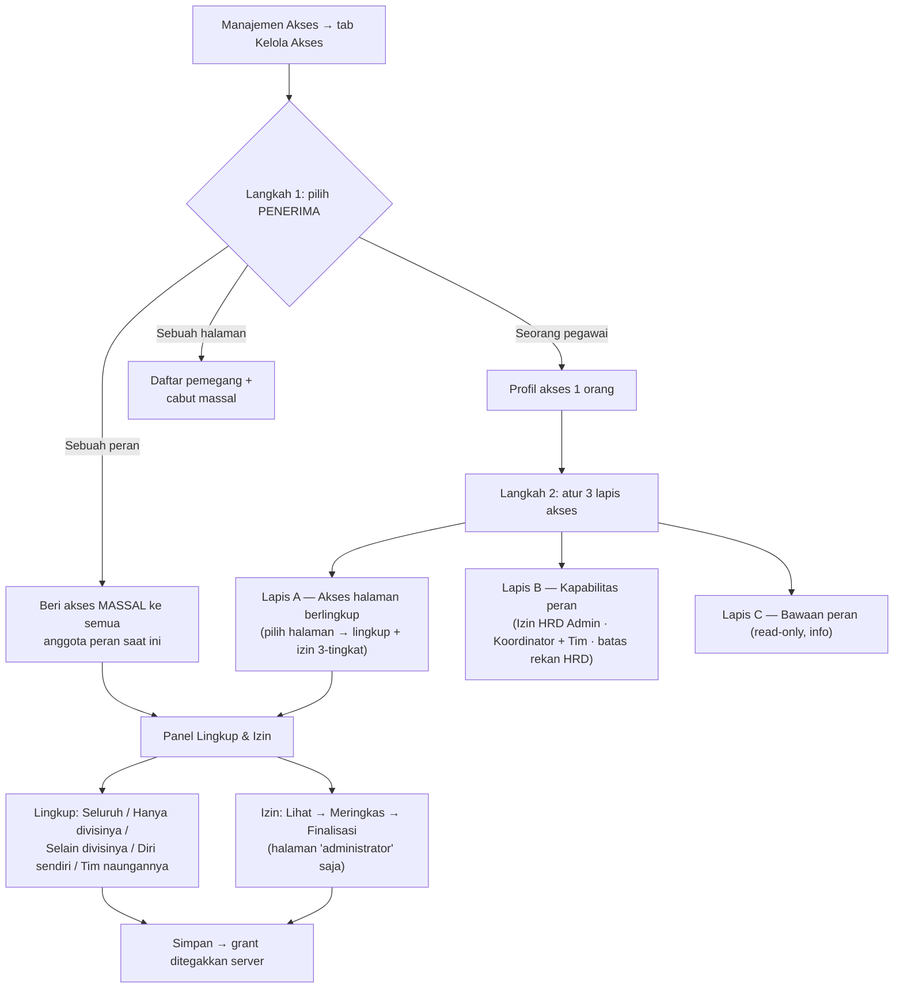
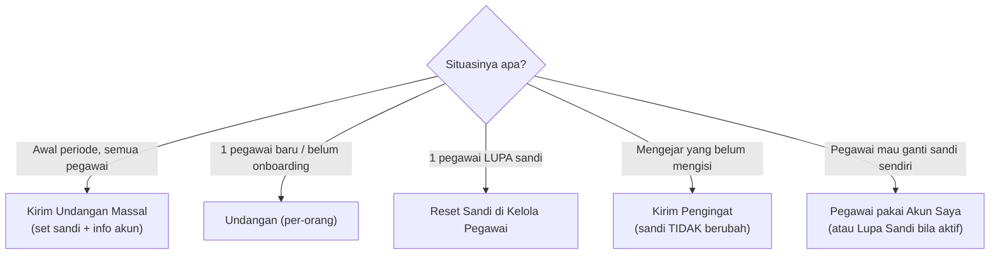
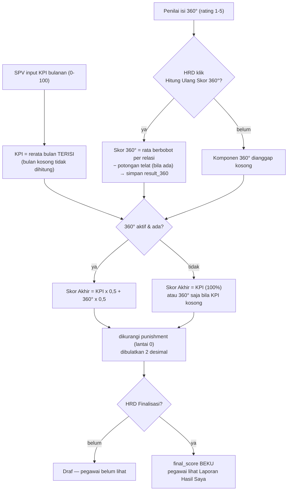
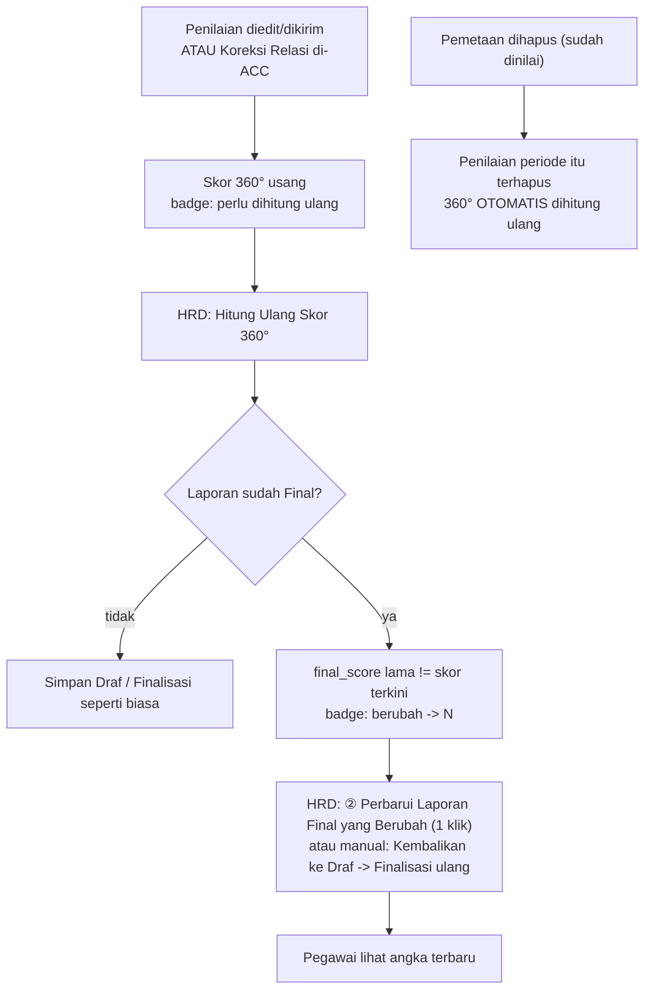
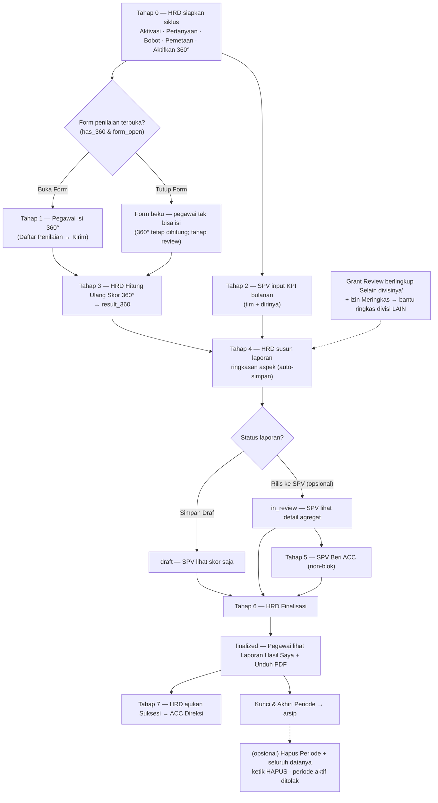
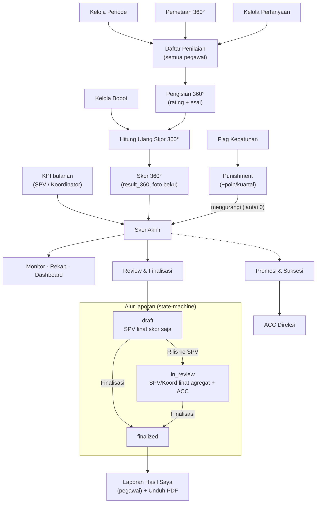

# Cara Penggunaan Aplikasi — Infarm 360° Portal

Panduan pengguna aplikasi penilaian kinerja (Performance Appraisal) 360°.
Disusun dari `PANDUAN Infarm 360 Portal.pdf` dan disesuaikan dengan aplikasi saat ini.

> **Diperbarui 2026-09-29** — mencerminkan kebijakan Q3 2026: **Self Assessment dinonaktifkan**,
> **Ad-Hoc instan diganti "Ajukan Penilaian"** (ACC HRD), **Deadline 360° + potongan keterlambatan
> −3**, **evidence minimal 20 karakter**, fitur **N/A dicabut**, **Kirim Ulang** untuk penilaian
> terkirim, **rumus Skor Akhir tunggal**, **Trend KPI / "Belum terbaca"**, **ACC gugur** bila laporan
> berubah, **periode terkunci bisa dibuka kembali**, menu **Review & Finalisasi** (HRD) &
> **Tinjauan Hasil Akhir** (Direksi), tombol **② Perbarui Laporan Final yang Berubah**.

> 📌 **Rincian tiap tombol per halaman** (fungsi · peran · kondisi · konfirmasi): lihat
> [RINCIAN-TOMBOL.md](RINCIAN-TOMBOL.md) — kamus lengkap semua aksi di aplikasi.

> **Status:** aplikasi **live** dengan database **Supabase** (auth nyata, RLS per peran); email
> pengingat & undangan **aktif** (Gmail SMTP). **Sandi:** saat HRD menekan **Kirim Undangan**
> (onboarding), tiap pegawai disetel **sandi acak unik** yang dikirim via email; pegawai dapat
> menggantinya sendiri lewat **Akun Saya**. Bila pegawai lupa sandi, HRD **Reset Sandi** atau kirim
> **Undangan** ulang **ke orang itu** (tak mengganggu yang lain). Pegawai dikelola lewat
> **HRD → Kelola Pegawai** (lihat di bawah).
>
> ⚠️ **Hati-hati "Kirim Undangan Massal":** tombol ini **menyetel ulang sandi SEMUA orang** jadi
> acak baru — termasuk yang sudah mengganti sandinya sendiri. Lakukan **sekali di awal periode**;
> untuk pengingat berikutnya pakai **Kirim Pengingat** (tak menyentuh sandi).

---

## Login

1. Buka aplikasi (URL Vercel atau `http://localhost:3000` saat lokal).
2. Pilih **Nama** Anda — dropdown punya **kotak pencarian**; ketik sebagian nama untuk
   menyaring (daftar diambil otomatis dari data pegawai aktif, lengkap dengan **posisi** di label).
   Saat nama dipilih, **Peran terisi otomatis** → langsung ke Sandi. (Bisa juga pilih **Peran**
   dulu untuk menyaring daftar nama; keduanya valid.)
3. Masukkan **Sandi**.
4. Klik **Masuk**.

> **Field nama selalu tampil** sejak halaman dibuka (perbaikan: dulu bisa tak muncul di HP lambat
> bila pengguna menyentuh sebelum halaman siap). Pegawai baru yang ditambahkan HRD otomatis muncul.
> Tersedia juga cadangan **"Masuk dengan email manual"**. Dropdown nama berfitur pencarian juga
> dipakai di Pemetaan (Penilai/Target) & Ajukan Penilaian.

> HRD Admin punya **2 mode**: bertindak sebagai **SPV** atau sebagai **HRD Admin**
> (mengelola seluruh sistem).

---

## Akun Saya — Ganti Sandi (semua peran)

Di **footer sidebar** (bawah, dekat tombol Keluar) ada tautan **Akun Saya**. Halaman ini
menampilkan info akun (nama, email login, divisi, peran, kode pegawai) dan form **Ganti Sandi**:

1. Isi **Sandi Saat Ini** (verifikasi keamanan), **Sandi Baru** (min. 8 karakter), dan
   **Ulangi Sandi Baru**.
2. Klik **Simpan Sandi Baru**.

> **Ikon mata** di samping tiap kolom sandi (di sini, di Login, & di reset via email)
> menampilkan/menyembunyikan tulisan sandi — agar Anda bisa memastikan ketikan benar.

> **Penting:** sandi awal dikirim **per orang** lewat email **Undangan** (acak unik). Tiap pegawai
> sebaiknya segera menggantinya dengan sandi pribadi lewat halaman ini — demi menjaga **integritas
> penilaian 360°** (mencegah orang lain login & menilai atas nama Anda). Sandi tidak pernah dicatat sistem.

---

## Tugas & Notifikasi (semua peran)

Di **sidebar bagian atas** terdapat panel **"Tugas & Notifikasi"** dengan badge jumlah
(juga muncul di tombol menu pada layar ponsel). Isinya **diturunkan otomatis** dari data —
tak perlu ditandai "sudah dibaca", selalu mengikuti keadaan nyata akun yang login:

- **X penilaian 360° menunggu diisi** → ke Daftar Penilaian Saya.
- **Laporan Hasil Anda sudah final** (Employee/SPV) → ke Laporan Hasil Saya.
- **X anggota belum ada KPI [bulan]** (SPV / HRD mode-SPV) → ke Input KPI.
- (HRD Admin) **X permohonan … menunggu** → ke **Pemetaan 360° (tab Permohonan)**; **X penilaian 360°
  belum lengkap** → ke **Progress 360**; **X laporan belum difinalisasi** & **X laporan final … (data
  berubah)** → ke **Review & Finalisasi** (yang terakhir muncul bila skor tersimpan laporan Final berbeda
  dari skor terkini → tekan **② Perbarui Laporan Final yang Berubah**).
- **X usulan suksesi menunggu ACC** (Direksi).

Tiap baris adalah tautan langsung ke halaman terkait. Bila kosong: *"Tak ada tugas tertunda 🎉"*.
Panel hanya aktif saat ada **periode aktif**.

> **Indikator tenggat periode.** Di bawah label periode (sidebar) tampil **sisa hari** menuju
> **tanggal selesai periode** (bukan Deadline 360° — deadline pengisian 360° tampil terpisah di Daftar
> Penilaian Saya & Flag Kepatuhan): abu-abu bila masih lama, **kuning ⚠ saat ≤7 hari**, **merah saat berakhir
> hari ini / lewat tenggat**. Membantu HRD mengejar penyelesaian sebelum periode dikunci.

> **Navigasi keyboard.** Dropdown nama berpencarian bisa dioperasikan tanpa mouse: **↑/↓**
> memilih, **Enter** mengonfirmasi, **Esc** menutup.

---

## Peran: EMPLOYEE

### Daftar Penilaian Saya
Halaman ini punya **dua tab**: **Penilaian** (daftar rekan yang harus Anda nilai) dan **Pengajuan**
(menambah rekan / status permohonan Anda).

> **Kebijakan Q3 2026:** **Self Assessment (menilai diri sendiri) DINONAKTIFKAN** — tidak ada lagi
> penilaian untuk diri sendiri di daftar Anda. Anda hanya melihat **orang yang Anda nilai**; siapa yang
> menilai Anda tidak ditampilkan (hanya HRD yang tahu).

**Tab Penilaian**
- Di atas tabel ada **kartu "Penilaian Wajib Anda: X dari Y sudah dikirim"** (+ bar progres) —
  hanya menghitung penilaian **berstatus Wajib** — beserta **Deadline** pengisian 360° (WIB) bila HRD
  sudah menetapkannya.
- **Banner "Deadline penilaian sudah lewat"** muncul bila deadline terlewati & masih ada penilaian wajib
  yang belum dikirim: form **masih bisa diisi**, tetapi kiriman sesudah deadline tercatat **Terlambat** dan
  **Skor 360° Anda dipotong 3 poin** (sekali per periode; HRD dapat menyesuaikan nilainya).
- **Banner info Garis Hubungan**: relasi (Atasan/Peer/Bawahan/dst.) **menentukan bobot Skor 360°** →
  bila keliru, gunakan **Minta Koreksi**.
- **Fase tinjau pemetaan** (bila HRD sudah **mengumumkan** pemetaan tapi form belum dibuka): daftar
  tampil untuk **diperiksa** — tombol **Mulai Nilai** belum ada (tertulis "belum dibuka"); Anda boleh
  **Ajukan Hapus**, **Minta Koreksi**, atau **Ajukan Penilaian**. Semua permohonan diputuskan HRD.
1. Cek kolom **Garis Hubungan** — jika hubungan kerja salah, klik **Minta Koreksi**, isi alasan
   (min. 5 karakter), lalu **Kirim Pengajuan**. (Abaikan bila relasi sudah benar.)
   - Kolom **Sifat** menandai tiap penilaian **Wajib** atau **Opsional**. Label **"Ajuan · wajib
     selesai"** = penilaian yang **Anda ajukan sendiri & sudah disetujui HRD** — mulai **periode Q3 2026**
     ia **wajib dituntaskan sebelum deadline** (bila tidak, ikut potongan keterlambatan).
   - Badge **Terlambat** = penilaian yang pertama kali dikirim sesudah deadline.
   - **Ajukan Hapus** (untuk pemetaan dari HRD): minta agar Anda **tidak perlu menilai** orang itu
     (mis. tak pernah bekerja sama), dengan alasan min. 5 karakter. Pemetaan baru hilang **setelah HRD
     menyetujui**. Satu permohonan aktif per rekan (baris bertanda "Menunggu HRD").
2. Klik **Mulai Nilai** (atau **Lanjutkan** untuk draf, **Edit** untuk yang sudah terkirim) — form
   terpandu (rail aspek + satu indikator per layar):
   - **Panduan Penilaian Umum** (kotak di atas, dapat dibuka/tutup) berlaku untuk semua soal.
   - **Rail Aspek Budaya**: pilih aspek; tiap aspek menampilkan progres **selesai/total** (✓ bila
     lengkap). Item terakhir **Umpan Balik Kualitatif** — **WAJIB diisi semua**.
     Di **HP** rail jadi **strip horizontal yang bisa di-geser**; di layar lebar tampil vertikal di kiri.
   - **Panduan BARS untuk indikator ini**: bila HRD mengisinya, tiap level rating (5→1) tampil dengan
     **key point** (label pendek khusus indikator itu) + deskripsi perilaku, sebagai acuan menilai.
   - **Editor indikator**: pilih chip **Q1…Qn**, beri **Rating 1–5** (angka; di HP tampil
     **"Pilihan Anda: N"**), lalu isi **Komentar / Bukti Perilaku (evidence)** — **wajib, minimal 20
     karakter** (penghitung karakter tampil di bawah kotak). **Tidak ada pilihan N/A** — semua indikator
     wajib diberi rating + evidence. Tombol **×** mengosongkan jawaban indikator itu.
   - Navigasi **Sebelumnya / Selanjutnya** berpindah antar indikator; dari indikator terakhir tombol
     berubah **"Ke Umpan Balik Kualitatif"**. **Bar progres** mencakup indikator **dan esai** (mis. 13/13).
   - **Auto-simpan otomatis** (hanya untuk penilaian yang **belum terkirim**): isian tersimpan sendiri
     ~5 detik setelah Anda berhenti mengetik (indikator **"Tersimpan otomatis"**). Boleh berhenti &
     lanjut nanti dari perangkat mana pun (draf tersimpan di server). Butuh internet; bila gagal,
     indikator merah → tekan **Simpan Draf**.
3. Belum selesai? Klik **Simpan Draf** — lanjutkan lagi dari "Daftar Penilaian Saya".
4. Sudah lengkap? Tombol berubah dari **"Lengkapi Penilaian (N tersisa)"** menjadi **Kirim Penilaian
   360°** → muncul **konfirmasi** ("Kirim penilaian untuk <Nama>?") → **Ya, Kirim Sekarang**. Bila ada
   rating/evidence/**esai** kurang, sistem **melompat ke bagian yang belum lengkap**. Setelah berhasil
   tampil **layar sukses** + pengingat **sisa penilaian wajib** (tombol **"Lanjut ke Penilaian
   Berikutnya"** bila masih ada).
5. **Mengubah penilaian yang sudah terkirim:** buka **Edit** → ubah → tekan **Kirim Ulang Penilaian
   360°**. Untuk penilaian terkirim **tidak ada Simpan Draf & tidak ada auto-simpan** (agar statusnya
   tak turun jadi draf) — perubahan baru tersimpan saat Anda menekan Kirim Ulang. Waktu kirim
   **pertama** tetap menjadi acuan tepat waktu/terlambat. **Hanya sampai deadline:** setelah deadline lewat,
   penilaian yang sudah terkirim **terkunci** — tombolnya menjadi **Lihat** (baca-saja). Penilaian yang
   belum terkirim tetap bisa diselesaikan & dikirim setelah deadline (tercatat Terlambat), lalu ikut terkunci.
6. **Batal** kembali ke daftar tanpa menyimpan; **Buang Draf** (muncul bila ada draf
   tersimpan) menghapus draf beserta rating & komentarnya (dengan konfirmasi).

**Tab Pengajuan — menambah rekan yang Anda nilai**
- Fitur **Ad-Hoc instan sudah dinonaktifkan** (Q3 2026). Satu-satunya jalur menambah rekan di luar
  daftar = **Ajukan Penilaian**: pilih rekan, pilih **hubungan kerja** (Atasan saya / Rekan sejawat /
  Lintas Divisi / Bawahan saya), pilih **alasan** dari daftar (pilihan "Lainnya" wajib keterangan min.
  5 karakter) → kirim. Permohonan **menunggu keputusan HRD**.
- Bila **disetujui**, rekan itu masuk daftar Anda sebagai penilaian **Opsional** berlabel **"Ajuan ·
  wajib selesai"** — karena Anda sendiri yang memintanya, mulai **periode Q3 2026** ia **wajib dikirim
  sebelum deadline** (bila tidak, Skor 360° Anda terkena potongan keterlambatan).
- Panel **Permohonan Saya** menampilkan semua pengajuan Anda (koreksi relasi, hapus, tambah) beserta
  status & **alasan penolakan HRD** bila ditolak.
- Penilaian **Ad-Hoc lama** (dari periode sebelum kebijakan ini) masih bisa **Dihapus** pemiliknya
  selama belum terkirim (konfirmasi lewat jendela di dalam aplikasi).

### Laporan Hasil Saya
> Muncul **hanya setelah HRD melakukan Finalisasi** (status `finalized`). Sebelum itu tampil
> "belum difinalisasi". ACC SPV bersifat non-blok — tidak menghambat finalisasi.
1. Pilih periode di **Pilih periode** (daftar laporan Final Anda, lintas periode).
2. **Unduh PDF** jika laporan sudah tersedia.
3. Tampilan berupa **ringkasan agregat (anonim)**, bukan komentar mentah:
   - **Ringkasan skor** (Rerata KPI · Evaluasi 360° · Skor Akhir). Skor Akhir yang tampil = angka
     **tersimpan** saat finalisasi.
   - **Radar Aspek 360°**: garis **hijau penuh = Penilaian Rekan**. Garis **oranye putus-putus =
     Evaluasi Diri (Self)** hanya muncul pada laporan **periode lama** yang masih memakai Self
     (Self Assessment dinonaktifkan mulai Q3 2026). Sumbu radar diberi
     **nomor** (1, 2, 3…); **nama lengkap tiap aspek** ada di daftar "Rincian Aspek Budaya" sesuai
     nomornya — sehingga nama panjang/serupa tak terpotong.
   - **Evaluasi Aspek Budaya & Perilaku 360°** — ringkasan naratif dari HRD per aspek (anonim).
   > **Komentar mentah per penilai TIDAK ditampilkan** ke pegawai (menjaga anonimitas 360°);
   > yang tampil hanya agregat di atas.

---

## Akses Khusus: Review & Finalisasi berlingkup (grant halaman)

> **Perubahan penting (per 2026-07-24):** izin lama **"Peninjau Lintas Divisi"** (tombol 👁️ di
> Kelola Pegawai + menu "Review Lintas Divisi") **sudah dipensiunkan**. Fungsinya kini diwujudkan
> lewat mekanisme umum **grant halaman berlingkup** di **Manajemen Akses** (lihat bagian HRD Admin):
> HRD memberi seseorang akses ke halaman **"Review & Finalisasi"** dengan **lingkup "Selain
> divisinya"** dan **izin "Meringkas"**. Hasilnya **identik** dengan Peninjau lama — satu halaman yang
> menyesuaikan lingkup, bukan halaman/menu khusus.

Bila Anda diberi akses ini, muncul menu **"Review & Finalisasi"** di section sidebar **"Akses dari
HRD"**. Yang Anda lihat & bisa lakukan **ditentukan oleh lingkup + izin** yang HRD berikan:

- **Lingkup data** membatasi **pegawai mana** yang tampil — mis. *Selain divisinya* (semua divisi
  kecuali divisi Anda sendiri, untuk hindari konflik kepentingan), *Hanya divisinya*, *Seluruh
  pegawai*, atau *Diri sendiri*. `?dept=` di URL **tak bisa** menembus lingkup ini (ditegakkan server).
- **Izin 3-tingkat** menentukan **apa yang boleh Anda lakukan**:
  - **Lihat** — hanya membaca Skor Akhir, radar/aspek, & **komentar anonim** (tanpa nama penilai).
  - **Meringkas** — di atas "Lihat", boleh **menulis Ringkasan Aspek** (tersimpan otomatis). *(Ini
    setara peran "Peninjau" lama.)*
  - **Finalisasi** — di atas "Meringkas", boleh **memfinalisasi** laporan dalam lingkupnya.
- **Yang tetap TIDAK bisa** (kecuali diberi izin lebih tinggi): melihat **nama penilai** (L3
  bernama — **tak pernah** untuk non-HRD), mengubah skor/bobot, atau finalisasi bila izin Anda hanya
  "Lihat"/"Meringkas". Laporan yang sudah **Final** → ringkasan terkunci.

> **Gembok NYATA, bukan sekadar tampilan.** Untuk pemegang grant **non-HRD**, batas lingkup & izin
> ditegakkan di **server** (jalur baca/tulis via `service_role` berfilter) — bukan hanya
> menyembunyikan tombol. Pemegangnya **tetap pegawai biasa** di mata database (RLS menolaknya); akses
> hanya tersedia lewat halaman yang di-grant, tersaring persis pada lingkupnya.

---

## Peran: SUPERVISOR (SPV)

Selain semua fitur Employee di atas, SPV punya:

### Input KPI Anggota (bulanan)
- Daftar berisi **anggota tim** SPV (dari Pemetaan atasan di Kelola Pegawai) **+ SPV sendiri**
  — SPV juga mencatat **capaian KPI pribadinya**. (SPV hanya boleh menulis KPI anggota timnya
  & dirinya sendiri; tidak bisa mengubah KPI rekan SPV lain.) **KPI hanya bisa diubah lewat halaman
  ini** oleh pimpinan yang berwenang — tidak bisa lewat jalur lain; lingkup & jejak audit ditegakkan
  di server.
- **Pegawai yang punya Koordinator dikeluarkan dari daftar ini** — KPI mereka diinput oleh
  **Koordinatornya** (lihat *Akses Khusus: Koordinator Tim*). SPV menginput KPI **hanya** pegawai
  **tanpa** koordinator (+ dirinya sendiri).
- **Input Manual**: pilih **Bulan & Tahun Evaluasi**, isi skor **(0–100)**, klik **Simpan Semua Skor**.
  - **Input pertama** suatu pegawai **boleh tanpa komentar**.
  - **Saat mengedit** skor yang sudah ada, **Komentar Audit wajib diisi** — tanpa
    komentar, perubahan **tidak bisa disimpan** (demi jejak audit yang jelas).
  - **Hapus** (di samping skor tersimpan): menghapus skor bulan itu — **alasan wajib**, tercatat di
    Riwayat & Audit, dan mengurangi rerata KPI.
  - Ketikan yang belum disimpan **diamankan otomatis di perangkat/browser** (tahan refresh), tetapi baru
    masuk database saat **Simpan Semua Skor** ditekan.
- **Impor Excel**: klik **Unduh template** (`template-kpi-<bulan>.xlsx`, kolom `emp_code`, `score`,
  opsional `note`), isi, unggah, tinjau pratinjau, lalu **Terapkan & Simpan (N baris)**.

### Riwayat & Audit Perubahan
- "Rekam Audit Skor Perubahan KPI" — filter **Pilih Pegawai Tim** untuk meninjau perubahan.
- **Termasuk diri sendiri**: jejak audit KPI SPV pribadi ikut tampil (muncul setelah ada
  perubahan KPI dirinya).

### Rekapitulasi Kuartal
- Rekap capaian KPI, Hasil 360, & Skor Akhir bawahan **+ SPV sendiri**. Filter **Tahun** & **Kuartal**.

### Laporan Kinerja Tim
- Tinjau "Final Report" tiap pegawai. Kolom **Skor Akhir** & **Status** tampil untuk semua anggota.
- Kolom **Trend KPI** (3 bulan kuartal) — ditentukan oleh **jumlah bulan yang terisi** (angka **0**
  dihitung sebagai nilai sungguhan, bukan "kosong"):
  - **0 bulan terisi** → "—" (belum ada data).
  - **1 bulan terisi** → **Belum terbaca** (mis. pegawai baru masuk / kuartal baru berjalan 1 bulan).
  - **2 bulan terisi** → **Stabil** (selisih ≤ 2 poin) / **Naik** / **Turun**.
  - **3 bulan terisi** → **Stabil** (tiap selisih ≤ 2) / **Naik** (terus naik) / **Turun** (terus turun) /
    selain itu **Fluktuatif**. *Fluktuatif hanya mungkin bila ketiga bulan terisi.*
  - Pegawai **Belum terbaca** dikecualikan dari rerata, distribusi, & ranking KPI di Dashboard Organisasi
    (belum menggambarkan kuartal — bukan berarti berkinerja rendah).
- **Visibilitas bertahap** (diatur HRD):
  - **Draf** → Anda hanya melihat **angka Skor Akhir**; tautan detail **terkunci**
    ("detail menunggu rilis HRD").
  - **Ditinjau** (HRD sudah menekan *Rilis ke SPV*) atau **Final** → tautan **terbuka**: Anda bisa
    membuka **detail agregat** — radar/skor per aspek + **ringkasan aspek dari HRD** (anonim)
    **+ umpan balik mentah ANONIM** (komentar & rating verbatim per aspek/esai, **tanpa nama
    penilai**). **Identitas penilai (siapa memberi komentar apa) TIDAK PERNAH ditampilkan ke SPV** —
    hanya versi anonim (menjaga anonimitas 360°). ⚠️ Pada kelas penilai sangat kecil (mis. hanya
    1–2 Peer/Cross), komentar "anonim" bisa **tertebak** asalnya — gunakan dengan bijak.
- **Tombol ACC hanya muncul setelah HRD "Rilis ke SPV"** (status Ditinjau/Final). Saat masih
  **Draf**, kolom ACC menampilkan "**menunggu rilis HRD**" — Anda belum bisa meng-ACC (ditegakkan
  di klien & server).
- Saat status **Ditinjau**, koordinasikan/diskusikan dengan HRD **di luar aplikasi** bila ada
  ketidaksesuaian, lalu klik **Beri ACC** bila sudah setuju. **ACC tidak menghambat finalisasi** — HRD
  tetap bisa finalisasi tanpa menunggu ACC Anda (mis. bila Anda sedang cuti).
- **ACC tercatat** (siapa & kapan, termasuk pembatalan) di Log Aktivitas. **ACC gugur otomatis** bila
  laporan **dikembalikan ke Draf**, atau **dirilis ulang dengan Skor Akhir berbeda** — karena ACC
  diberikan atas angka yang dirilis; beri ACC lagi setelah rilis baru.
- **Pegawai yang punya Koordinator di-ACC oleh Koordinatornya, bukan SPV.** Untuk pegawai tersebut,
  SPV **hanya melihat status ACC** koordinator (read-only) & **tombol ACC tidak muncul**; SPV meng-ACC
  **hanya** pegawai **tanpa** koordinator. (Lihat *Akses Khusus: Koordinator Tim* di bawah.)
- **Laporan diri sendiri tidak lagi tampil sebagai baris di sini** — SPV melihat laporan pribadinya
  lewat menu **"Laporan Hasil Saya"** (saat status Final). **Kotak pencarian** nama/divisi tersedia.

### Monitor Kinerja
- Memantau kinerja tim. **SPV** melihat **anggota timnya + dirinya sendiri**; **HRD dalam Mode SPV**
  melihat pegawai **sedivisi**; **Koordinator** melihat **pegawai naungannya** (tanpa dirinya).
- Satu filter: **Periode**. Halaman tersusun per bagian: **Ringkasan** (scorecard KPI/360°/Skor Akhir
  + selisih vs perusahaan) → **Komposisi** (sebaran kategori & profil aspek tim vs organisasi) →
  **Arah — Tren & Pergerakan** (lintas periode/bulan) → **Rincian per Pegawai** (tabel + heatmap
  aspek/indikator; klik irisan donut untuk menyaring heatmap).
- Skor Akhir memakai rumus resmi tunggal; laporan **Final** menampilkan angka **tersimpan**.

---

## Akses Khusus: Koordinator Tim (grant "Koordinator")

Muncul **hanya** bila HRD memberi izin **Koordinator** (di **Manajemen Akses** → mode "Sebuah
peran" → Koordinator, atau lewat kapabilitas di profil pegawai + dialog **"Tim Koordinasi"** untuk
memilih anggota naungan). Ditujukan untuk pegawai (posisi **Employee**)
yang **membawahi beberapa pegawai** secara langsung, sementara pegawai lain tetap langsung ke SPV.
Koordinator **tetap pegawai biasa** — izin ini **tidak** menjadikannya HRD/SPV dan **tidak
memengaruhi 360°** (Koordinator bukan "Atasan" dalam perhitungan skor).

Yang bisa dilakukan Koordinator — **khusus daftar naungannya** (bukan seluruh tim SPV):

- **Laporan Kinerja Tim** — muncul di menu, berisi **hanya pegawai yang dinaunginya**. Kolom KPI ·
  Skor 360° · Skor Akhir · Status. Detail agregat (radar/aspek + ringkasan HRD **+ umpan balik
  mentah ANONIM**) terbuka **setelah HRD "Rilis ke SPV"** (Ditinjau/Final) — sama seperti SPV.
  **Identitas penilai tidak pernah ditampilkan.**
- **ACC laporan** pegawai naungannya (setelah HRD rilis) — mengisi kolom ACC yang sama dengan SPV.
- **Input KPI** (tab **Input** di Input KPI) pegawai naungannya — pilih Bulan & Tahun, isi skor;
  **edit skor wajib komentar audit** (sama seperti SPV), tercatat di audit atas nama Koordinator.
- **Monitor Kinerja** — memantau pegawai naungannya (tanpa dirinya sendiri), menu di grup
  **"Menu Koordinator"**.

Yang **TIDAK** bisa: **finalisasi laporan** (tetap milik HRD), akses pegawai di luar naungannya,
serta hal-hal 360° (bobot/kalkulasi/pemetaan). Menambah/mengubah daftar naungan = wewenang **HRD**
(**Manajemen Akses → Tim Koordinasi**), cukup ubah data tanpa perlu deploy.

> **Konsekuensi untuk SPV (& HRD Mode-SPV):** untuk pegawai yang **punya** koordinator, SPV **tidak
> lagi meng-ACC maupun meng-input KPI** — itu tugas koordinator; SPV hanya melihat status ACC
> koordinator (read-only). SPV tetap menangani penuh pegawai **tanpa** koordinator.

---

## Peran: HRD ADMIN

### Kelola Pegawai
Mengelola akun & data pegawai (tambah/ubah/nonaktif), tanpa edit file/reseed.
1. **Tambah Pegawai** → isi Nama, **Nama Panggilan (opsional)**, Peran, Divisi, **Kode Pegawai**,
   Email, **Sandi Awal**, (opsional) **Atasan/SPV**, dan **Tanggal Masuk** (default hari ini). Klik
   **Buat Pegawai**. Saat **Ubah**, tersedia juga **Tanggal Keluar** (arsip pegawai resign).
   - **Nama Panggilan (opsional, maks. 30 karakter)** — dipakai di **tampilan padat** (Dashboard
     Organisasi, Monitor, tabel movers/scatter, kartu top/bottom) agar nama panjang tak terpotong.
     Kosong → aplikasi otomatis memakai **nama lengkap**. Nama lengkap tetap tampil sebagai tooltip.
   - **Email boleh placeholder** (mis. `nama@infarm.test`) — login pakai email+sandi tanpa
     verifikasi inbox; ganti ke email asli kapan saja lewat **Ubah**.
   - **Kode Pegawai bebas** mengikuti skema perusahaan (mis. `FT2021-001`); saran otomatis
     melanjutkan nomor terakhir. Sistem **memperingatkan** bila kode/email duplikat.
   - **Peran** (bukan kode) yang menentukan hak akses. **Atasan** bisa SPV, HRD, atau Direksi.
   - **Penilai eksternal** (centang opsional) — untuk **vendor/freelance/mitra** yang ikut
     **menilai** pegawai Infarm. Eksternal **hanya menjadi penilai** (relasi Cross): mereka **tidak**
     punya KPI/Skor Akhir/laporan dan **tidak muncul** di dashboard/monitor/laporan; di Pemetaan &
     Ajukan Penilaian mereka **tak bisa dipilih sebagai "Yang Dinilai"**. Skor yang mereka berikan tetap masuk
     ke **Skor 360°** pegawai lewat bobot Cross. Baris eksternal ditandai badge **"Eksternal"**.
2. **Ubah** — ganti nama/divisi/peran/kode, email, atasan, atau status **Penilai eksternal**.
3. **Reset Sandi** — modal konfirmasi untuk setel sandi baru (tombol **Acak** mengisi sandi acak);
   disarankan pegawai menggantinya sendiri setelahnya. Sandi akun **HRD/Direksi** hanya bisa direset HRD
   berakses penuh.
4. **Aktif/Nonaktif** — menonaktifkan **mengunci akun** (tak bisa login) tanpa menghapus
   riwayat penilaian/KPI, **dan ikut menonaktifkan pemetaannya** (orang itu keluar dari siklus:
   tak lagi dihitung di Progress 360 & tak jadi tugas penilai lain). Aktifkan kembali kapan pun →
   pemetaan ikut aktif lagi. Catatan: di halaman **pelaporan** (Dashboard/Rekap/Monitor/Laporan Tim/
   Review & Finalisasi), pegawai nonaktif yang **sudah punya data di periode** (KPI/360°/laporan)
   **tetap ditampilkan** agar hasil kuartalnya tak hilang & bisa difinalisasi (mis. resign di akhir
   periode); di halaman **flag/siklus** (Kepatuhan/Progress/Penilaian) mereka **disembunyikan**.
5. **Impor dari Excel** (tombol di kanan atas) — tambah **banyak pegawai sekaligus**.
   Kolom: `nama`, `kode`, `divisi`, `peran` (employee/spv/hrd/direksi), opsional `email`
   (kosong → otomatis dari nama), `sandi` (kosong → **Sandi Default**), `atasan` (kode pegawai).
   Ada **Unduh template**, **Sandi Default**, dan **pratinjau tervalidasi** (✓ valid / ↷ dilewati
   karena duplikat / ✗ tidak valid + alasan) sebelum impor. Duplikat **dilewati** (tak menimpa).
   Tip: impor pegawai ber-peran **SPV/atasan dulu** agar kolom `atasan` bawahan langsung tertaut.
6. **Filter & cari** — kotak pencarian + filter **Peran**, **Divisi**, dan **Status**.

> **Pemberian izin/akses PINDAH ke halaman "Manajemen Akses".** Sejak perombakan 2026-07-20, semua
> tombol grant (Izin HRD Admin, Koordinator, batas akses rekan HRD, akses halaman berlingkup)
> **tidak lagi** di Kelola Pegawai — semuanya di **satu konsol "Manajemen Akses"** (grup sidebar
> **Administrasi**, hanya untuk HRD penuh). Kelola Pegawai kini fokus pada **data & akun** saja. Lihat **Manajemen
> Akses** di bawah.

> Tips data asli: sandi **berbeda per orang** kini otomatis terpenuhi lewat **Progress 360 →
> Kirim Undangan** (men-set sandi acak unik per orang). Tak perlu menyetel sandi manual satu-satu.

> **Lupa Sandi via email (belum aktif).** Alur reset sandi mandiri lewat email sudah siap
> tapi sengaja disembunyikan. Untuk mengaktifkannya (agar pegawai bisa "Lupa sandi?" sendiri
> di halaman login): (1) isi **email asli** tiap pegawai di sini; (2) aktifkan **SMTP/Resend**
> di Supabase → *Authentication → Emails*; (3) daftarkan **Redirect URL**
> `https://<domain>/auth/callback` di *Authentication → URL Configuration*; (4) set env Vercel
> `NEXT_PUBLIC_ENABLE_PW_RESET=true` lalu redeploy. Sebelum itu, sandi diatur HRD lewat **Reset Sandi**.

### Manajemen Akses — *satu konsol pemberian akses (alur "penerima-dulu")*

Menu **"Manajemen Akses"** (ikon kunci, hanya untuk **HRD penuh** — rekan HRD yang aksesnya sudah
dibatasi tak bisa membukanya, agar tak menaikkan aksesnya sendiri) adalah **satu tempat** untuk semua
pemberian akses: izin HRD Admin, Koordinator, batas akses rekan HRD, dan **akses halaman berlingkup**
(mekanisme yang menggantikan "Peninjau Lintas Divisi" lama). Dua tab:

1. **Kelola Akses** — alur utama (di bawah).
2. **Log** — jejak aktivitas pemberian/pencabutan akses (append-only, paginasi 10/hal).

#### Alur "penerima-dulu" — pilih SIAPA lebih dulu

Prinsipnya: **tentukan penerima dulu**, baru atur aksesnya di satu layar. **Langkah 1** pilih salah
satu dari **tiga sumbu penerima**:

- **Seorang pegawai** — cari & pilih satu orang → tampil **profil akses**-nya utuh (lihat 3 lapis
  di bawah); beri/ubah/cabut di tempat.
- **Sebuah peran** — pilih **SPV / Koordinator / Pegawai / Direksi** → beri akses halaman **massal**
  ke **semua anggota peran itu SAAT INI**. (Materialisasi ke anggota sekarang; pegawai baru **tidak**
  otomatis ikut — beri ulang bila perlu.) Mode Koordinator juga menampilkan **daftar koordinator
  saat ini** + jumlah naungan tiap orang, dengan pintasan **"Kelola →"**.
- **Sebuah halaman** — pilih satu halaman → lihat **daftar pemegangnya** (paginasi 5-baris) &
  **cabut massal** dari semua pemegang sekaligus.



#### Tiga lapis akses (di profil seorang pegawai)

- **Lapis A — Akses halaman berlingkup.** Beri seseorang akses ke satu **halaman dari katalog tetap**:
  **Monitor Kinerja Pegawai · Review & Finalisasi · Dashboard Organisasi · Struktur Organisasi ·
  Progress 360 · Flag Kepatuhan · Monitoring & Audit KPI**. Tiap grant = **halaman + lingkup + izin**.
  Pemegang akses non-HRD di **Progress 360** & **Flag Kepatuhan** hanya melihat **jumlah** penilaian per
  pegawai — nama target (siapa menilai siapa) & tombol Rincian **disembunyikan**, karena informasi itu hanya untuk HRD.
  - **Lingkup data** (boleh lebih dari satu, digabung OR):

    | Lingkup | Arti |
    |---|---|
    | **Seluruh pegawai** | tanpa batas divisi |
    | **Hanya divisinya** | sedivisi dengan penerima |
    | **Selain divisinya** | semua divisi kecuali divisi penerima (untuk peninjau lintas divisi) |
    | **Diri sendiri** | hanya catatan penerima sendiri |
    | **Tim naungannya** | hanya anggota tim koordinasi penerima (khusus Koordinator) |

  - **Izin 3-tingkat** (hanya untuk halaman jenis **"administrator"**, saat ini **Review & Finalisasi**;
    halaman **"pemantauan"** lain selalu **Lihat-saja**):
    **👁 Lihat** → **✎ Meringkas** (boleh tulis Ringkasan Aspek) → **✎ Finalisasi** (boleh finalisasi).
    Klik badge izin untuk **memutar** tingkatnya. "Finalisasi" selalu menyiratkan "Meringkas".
  - `?dept=` di URL **tak bisa** menembus lingkup; batas ditegakkan **server** (baca/tulis via
    `service_role` berfilter). Untuk pemegang **non-HRD** ini **gembok NYATA**, bukan sekadar
    sembunyi menu.

- **Lapis B — Kapabilitas peran** (grant tingkat peran, bukan per-halaman):
  - **🛡️ Izin HRD Admin** — pegawai (employee/SPV) mampu mengoperasikan **seluruh** fitur HRD (mode
    ganda). Badge **"HRD"**. **Batas akses rekan HRD**: tombol **Atur Akses** membatasi pemegang izin
    ke **sebagian halaman admin** (grid centang katalog HRD); badge jadi **"HRD (N)"**. Batas ini
    ditegakkan juga di **server & database** untuk semua perubahan data (per 2026-09-30): HRD terbatas
    hanya bisa mengubah data di bagian yang dicentang (melihat data tetap bisa). Mengubah **izin** (HRD Admin,
    Atur Akses, Koordinator) serta mengubah/menonaktifkan/**mereset sandi akun HRD atau Direksi** hanya
    bisa dilakukan **HRD berakses penuh**. **Tak ada** yang bisa mengubah izin akunnya sendiri.
  - **👥 Koordinator** — pegawai (Employee) mendapat **Laporan Kinerja Tim + ACC + Input KPI** untuk
    **daftar naungannya** (dialog **"Tim Koordinasi"**). Badge **"Koordinator"**. **Tidak** memengaruhi
    360°; **bukan** akses HRD penuh. (Lihat *Akses Khusus: Koordinator Tim*.)
  > **Pembatasan (per 2026-07-15):** **Izin HRD Admin** hanya boleh diberikan untuk pegawai **divisi
  > HRD** (nama divisi diawali "HRD") — server menolak grant untuk non-HRD. **Pencabutan** boleh untuk
  > siapa pun.

- **Lapis C — Bawaan peran** (read-only, informasi): merangkum akses yang **otomatis** melekat pada
  posisi/grant seseorang (mis. SPV → Input KPI/Laporan Tim/Monitor timnya; Direksi → dashboard
  eksekutif + ACC suksesi) — **tak bisa** dicabut lewat halaman ini karena bukan grant, melainkan
  konsekuensi peran.

#### Yang dilihat penerima grant

Pemegang grant halaman melihat section sidebar **"Akses dari HRD"** berisi menu halaman yang
diberikan (mis. "Review & Finalisasi", "Dashboard Organisasi"). Isinya tersaring **persis** pada
lingkup grant — bukan tampilan HRD penuh.

#### Pencabutan & peninjauan

- **Cabut satu grant** (reversibel) → langsung tanpa konfirmasi.
- **Cabut massal** → semua grant satu **halaman** dari seluruh pemegang, atau semua grant satu
  **pegawai** (dengan konfirmasi).
- **Pegawai Baru** — kartu menyoroti pegawai yang **baru masuk (≤30 hari) & belum ditinjau
  aksesnya**; klik **Tinjau** untuk langsung membuka profilnya, lalu **Tandai selesai** agar hilang dari
  daftar. Membantu HRD memastikan tiap pegawai baru punya akses yang tepat.

> **Keputusan terkunci — tak ada "page-builder".** Manajemen Akses hanya membuka **halaman yang SUDAH
> ADA** dari katalog tetap dengan lingkup/izin — HRD **tidak** bisa merakit halaman/tampilan baru
> sendiri. Kebutuhan tampilan baru = **permintaan fitur ke pengembang** (dengan RLS yang sesuai),
> bukan saklar runtime. Ini menjaga tiap halaman punya penegakan keamanan yang benar.

### Kelola Siklus Periode
Halaman punya dua tab: **Kelola Periode** dan **Status Siklus** (rincian 10 langkah siklus aktif +
daftar hal yang masih menghambat).

1. **Buat Periode Baru**: isi **Label**, **Tanggal Mulai/Selesai**, centang **Sertakan Evaluasi 360°**
   bila perlu, set **Standar/Target KPI** (lihat di bawah), klik **Buat Periode**. Periode baru
   **belum aktif** (status *Terkunci*) — tekan **Aktivasi** di barisnya untuk membukanya.
   **Hanya satu periode aktif** — mengaktivasi satu periode otomatis mengunci yang lain.
   - **Deadline 360°** (kolom di tabel, bisa diedit langsung; WIB): batas waktu pengisian penilaian 360°.
     Form **tidak** ditutup otomatis saat deadline lewat; kiriman **pertama** sesudah deadline tercatat
     **Terlambat** dan memicu **potongan keterlambatan −3** pada Skor 360° si penilai (lihat Flag
     Kepatuhan). Kosongkan kolom = tanpa deadline.
   - Aksi lain ada di menu **⋯** tiap baris: Set Tanpa/Aktifkan 360°, Umumkan Pemetaan, Tutup/Buka
     Form, Hapus periode.
   - **Umumkan Pemetaan / Tarik Pengumuman Pemetaan** (periode aktif & 360° menyala): menampilkan
     daftar "siapa menilai siapa" **kepada masing-masing penilai** (hanya daftar miliknya) **sebelum
     form dibuka** — fase tinjau: pegawai memeriksa dan boleh mengajukan hapus/tambah/koreksi relasi.
     Permohonan masuk ke **Pemetaan → tab Permohonan**. Setelah beres, tekan **Buka Form**.
   - **Set Tanpa 360° / Aktifkan 360°** = **saklar buka/tutup form penilaian 360°**:
     - **"Set Tanpa 360°"** → form 360° **disembunyikan** dari pegawai (mereka lihat "Penilaian 360°
       belum dibuka") **dan** skor 360° tak dihitung. Pakai saat **menyiapkan** Pertanyaan/Bobot/Pemetaan.
       **Muncul konfirmasi** bila **sudah ada penilaian 360° terkirim** (karena menyembunyikan form +
       mengubah Skor Akhir jadi 100% KPI); saat setup awal (belum ada data) langsung tanpa konfirmasi.
     - **"Aktifkan 360°"** → form **tampil serentak** ke semua pegawai yang punya pemetaan = **peluncuran**.
       Kini **divalidasi**: ditolak bila belum ada **pertanyaan (indikator aktif)** atau **pemetaan**
       (cegah form 360° kosong) — lengkapi dulu di **Kelola Pertanyaan / Pemetaan**.
     - **Alur disarankan:** Aktivasi → **Set Tanpa 360°** → susun Pertanyaan → Bobot → Pemetaan
       (semua aman, form masih tertutup) → atur **Deadline 360°** → (opsional) **Umumkan Pemetaan**
       untuk fase tinjau → **Aktifkan 360°** / **Buka Form** → umumkan via email → finalisasi.
   - **Tutup Form / Buka Form** (muncul saat periode aktif & 360° menyala) = **bekukan pengisian
     pegawai untuk tahap review — TANPA mematikan 360°.** Beda dari "Set Tanpa 360°":
     - **"Tutup Form"** → pegawai berhenti mengisi/kirim (lihat "Form sedang ditutup"), **tetapi
       360° TETAP dihitung** ke Skor Akhir **dan tombol Hitung Ulang Skor 360° tetap tersedia**.
       Pakai saat hendak **meninjau & memfinalisasi** dengan data yang sudah beku. Penilaian yang
       sudah dikirim **tetap tersimpan**.
     - **"Buka Form"** → mengembalikan akses pengisian bagi pegawai.
     - Gunakan **Tutup Form** (bukan "Set Tanpa 360°") bila ingin menghentikan pengisian sambil
       tetap menghitung & me-review 360°.
   - **Hapus Periode** (tombol merah; **nonaktif** untuk periode aktif — "Kunci & Akhiri" dulu):
     menghapus periode **beserta SELURUH datanya** secara permanen. Dialog menampilkan rekap isi
     (penilaian/KPI/laporan/pemetaan) lalu **wajib mengetik `HAPUS`**. Cascade menghapus penilaian,
     hasil 360°, laporan final, pemetaan, pertanyaan, bobot, dst. **KPI** (terkunci per bulan)
     hanya dihapus untuk **bulan yang khusus periode itu** — bulan yang dipakai bersama periode lain
     **aman**. Pakai untuk merapikan periode salah/duplikat. **Backup dulu** sebelum menghapus.
   - **Kunci & Akhiri Periode** menutup **seluruh** periode (KPI **dan** 360°) di akhir siklus;
     server menolak isi/edit setelahnya. Berbeda dari toggle 360° yang hanya membuka/menutup bagian 360°.
     **Muncul konfirmasi** sebelum mengunci — memperingatkan bila masih ada **laporan belum
     difinalisasi** / 360° belum lengkap / draf belum dikirim, karena **setelah dikunci, finalisasi
     tak bisa** dilakukan tanpa **mengaktifkan ulang** periode. (Urutan benar: **finalisasi semua
     dulu → baru Kunci & Akhiri**.)
   - **Membuka kembali periode terkunci:** periode berstatus *Terkunci* **bisa diaktifkan lagi** lewat
     tombol **Aktivasi** di barisnya (periode yang sedang aktif otomatis ikut terkunci). Laporan yang sudah
     Final **tetap aman** — Skor Akhir tersimpannya tidak berubah sendiri; bila data diedit setelah dibuka,
     selisihnya ditandai **"berubah → N"** di Review & Finalisasi. Laporan periode yang **tidak aktif**
     tampil **read-only** (tanpa panel aksi).
2. **Tab Status Siklus**: rincian langkah siklus periode aktif (dibuat → konfigurasi → peluncuran →
   KPI → pengisian → ① Hitung Ulang → review → finalisasi → kunci → ekspor) beserta daftar penghambat.

> **Standar/Target KPI (kolom "Standar KPI").** Angka target (default 80) yang **bisa diatur
> per kuartal** — saat buat periode atau diubah langsung di tabel periode (ketik angka → Enter/klik
> luar). Dipakai **hanya** untuk kartu **"KPI Di Atas Standar (≥N)"** di Dashboard (% pegawai yang
> mencapai target). **Tidak memengaruhi perhitungan Skor Akhir/9-Box/A-B-C** — itu rumus terkunci.

> **Batas antar-kuartal.** Penilaian masuk ke **periode yang aktif saat Kirim**, bukan
> berdasarkan tanggal. Jadi **biarkan periode lama tetap aktif** hingga seluruh penilaian +
> KPI selesai (boleh melewati pergantian kalender), baru **Hitung Ulang → Finalisasi →
> Kunci**, lalu aktifkan periode berikutnya. Bila menekan **Aktivasi** sementara periode
> aktif masih punya **360° belum lengkap / draf / laporan belum final**, muncul **peringatan
> konfirmasi** (mengaktifkan periode baru akan mengunci yang lama beserta drafnya).

### Kelola Pertanyaan
- **Pakai Pertanyaan Periode Sebelumnya** (panel hijau di atas): pilih **periode sumber** dari
  dropdown (menampilkan jumlah aspek · indikator · esai) → **Salin ke Periode Aktif** → konfirmasi.
  Menyalin **aspek + indikator aktif + pertanyaan esai** dari periode itu ke periode aktif. **Aman dari
  duplikat**: aspek/esai yang **namanya/teksnya sudah ada** otomatis **dilewati** (tak menimpa). Skor
  historis tak tersentuh (indikator baru = baris baru periode aktif). Hasil menampilkan jumlah disalin
  + dilewati. Hemat waktu di awal kuartal baru tanpa mengetik ulang.
- Tiap aspek menampilkan daftar indikator kuantitatif (rating 1–5) — edit teks atau
  **nonaktifkan** (indikator dinonaktifkan, bukan dihapus, agar skor historis utuh).
- **Section khusus "Tambah Indikator Kuantitatif Baru"** (di bawah semua aspek): pilih
  **Aspek** → isi **Judul Ringkas** + **Deskripsi Perilaku** (opsional) → **Tambah Indikator ke Aspek**.
- **Panduan penilaian per indikator**: klik tanda ▸ di samping indikator untuk membuka editor —
  isi **Deskripsi Perilaku** (kotak penjelasan di form penilaian) dan, per level rating 1–5, **Key
  point** (label pendek khusus indikator itu — jangan disamakan antar indikator) + **deskripsi perilaku
  level**, lalu **Simpan Panduan**. Indikator ber-panduan ditandai label "panduan". Panduan ini tampil
  sebagai **"Panduan BARS untuk indikator ini"** di form **Mulai Nilai**.
- **Hapus indikator**: tombol 🗑 di samping indikator. **Hanya bisa bila indikator belum
  dipakai penilaian mana pun** (untuk menjaga skor historis). Bila sudah dipakai, gunakan
  **Nonaktifkan** — indikator hilang dari form penilaian baru tanpa menghapus data lama.
- **Umpan Balik Kualitatif (Esai Bebas)** untuk pertanyaan kualitatif (hapus = permanen).

### Ekspor Dataset (Pemantauan)
Unduh data mentah **Excel (.xlsx)** untuk olah data lanjutan (pivot/statistik/BI). Pilih
**Periode** lewat dropdown (atau **Semua Periode**) — berlaku untuk dataset ber-periode;
**Pegawai** selalu lintas periode. Dataset tersedia:
Dataset dirangkai jadi beberapa **file multi-lembar** (bukan banyak unduhan terpisah):
- **Pegawai (Master)** — 1 lembar, lintas periode: kode, nama, divisi, peran, status, atasan, email.
- **Konfigurasi Periode Lengkap** — 6 lembar: Ringkasan · Bobot Penilai · Bulan KPI · Aspek & Indikator ·
  Pertanyaan Esai · **Pemetaan 360°** (pasangan penilai→target, relasi, sifat).
- **Kinerja Lengkap per Periode** — 4 lembar: **Rekap** (KPI rerata · Skor 360° · punishment · Skor Akhir ·
  kategori · 4-Box) · KPI Bulanan · Audit KPI · Punishment.
- **Penilaian 360° Lengkap** — 5 lembar (semua **anonim penilai**): **Ringkasan per Pegawai** (per kelas
  penilai + Nilai 360°/Gap) · **Rekap Aspek** (Skor 360° **terbobot** & Nilai Diri **per aspek budaya** +
  gap diri-vs-360°, cocok dengan radar laporan) · **Kuantitatif** (rating per indikator) · **Kualitatif**
  (jawaban esai) · **Ringkasan Naratif** HRD. Identitas penilai **tidak** disertakan.
- **Log Aktivitas HRD** — 1 lembar, lintas periode: jejak audit aksi HRD (waktu · pelaku · kategori · aksi ·
  ringkasan · target · detail), terbaru di atas.

> Data sensitif (nama, skor, komentar) — simpan & bagikan file dengan bertanggung jawab.
> Nama file menyertakan periode terpilih untuk memudahkan arsip.

### Bobot & Kalkulasi Skor 360° (satu halaman)
- **Bobot Penilai**: pilih **Model 4-Kelas** (Atasan/Peer/Cross/**Bawahan**) atau **2-Kelas**
  (Atasan/Internal — Internal = Peer+Cross+Bawahan), atur angka, lalu **Simpan & Terapkan Bobot**.
  Total bobot **wajib tepat 100%** (tombol simpan nonaktif bila belum). **Self** tak punya bobot & tak
  pernah ikut dihitung (Self Assessment juga dinonaktifkan sejak Q3 2026). Setelah mengubah, jalankan
  **Hitung Ulang Skor 360°** di **Review & Finalisasi**.
- **Kalkulasi Skor 360°**: tabel hasil resmi per pegawai (`result_360`, model aktif). Tombol
  **"Hitung Ulang Skor 360°"** kini **hanya ada di Review & Finalisasi** (kokpit "Sinkronkan Skor") —
  di halaman Bobot tersedia tautan **"Buka Review & Finalisasi →"**. Setelah bobot diubah, Review &
  Finalisasi otomatis menandai pegawai yang **perlu dihitung ulang**. Total bobot kelas (tanpa Self)
  **wajib tepat 100%**.
- **Perbandingan Model 4-Kelas vs 2-Kelas**: pratinjau skor tiap pegawai bila dihitung
  dengan kedua model sekaligus + **Selisih**, membantu memilih model sebelum Hitung Ulang.
  (Pratinjau tak mengubah data.)
- **Bobot Khusus per Pegawai (override)**: untuk kasus khusus, HRD dapat menyetel **bobot 360°
  berbeda untuk satu pegawai tertentu** — menimpa skema default di atas **hanya** untuk orang itu di
  **periode aktif**. Pilih pegawai dari dropdown, atur model + angka bobotnya, simpan. Tabel menandai
  siapa yang punya override + **Δ dampak** (selisih skor khusus vs default). Pegawai tanpa override
  tetap memakai skema umum. Total bobot khusus juga **wajib tepat 100%**. Setelah mengubah, jalankan
  **Hitung Ulang Skor 360°** (di Review & Finalisasi) agar berlaku.

> **Kapan kedua model menghasilkan angka BERBEDA?** Hanya bila seorang pegawai dinilai oleh
> **beberapa kelas relasi sekaligus** — khususnya **Atasan + internal (Peer/Cross/Bawahan)**,
> atau beberapa kelas internal dengan rata-rata berbeda. Bila pegawai hanya dinilai **satu kelas**
> (mis. hanya Peer), **4-Kelas dan 2-Kelas menghasilkan angka identik** — bukan bug, melainkan
> sifat rumus (cuma ada satu sumber untuk dibobot). Jadi bila setelah Hitung Ulang tak terlihat
> beda antar-model, pastikan dulu **penilaian 360° sudah cukup terisi dari berbagai relasi** (cek
> Progress 360) — beda baru muncul saat data multi-relasi tersedia.

### Monitoring & Audit KPI (HRD Admin)
- **Dua tab** (bukan lagi split-view berdampingan): **Rekapitulasi Kuartal** & **Riwayat & Audit
  Perubahan KPI**. Saat halaman dibuka, **hanya tab aktif yang menarik data** — audit tak ditarik
  sama sekali sampai tabnya dibuka (penghematan **egress**; tab "Input KPI" tak muncul di mode admin —
  input adalah tugas SPV).
- **Riwayat & Audit dipaginasi & dicari DI SERVER** — hanya **10 baris/halaman** yang ditarik per
  render (bukan seluruh riwayat lalu dipotong di klien). **Pencarian nama/divisi** dijalankan saat
  **Enter** (bukan tiap ketikan); navigasi halaman & pencarian lewat URL. Jejak **append-only** —
  tak bisa diubah/dihapus, urut **terbaru di atas**.
- **Filter periode** (dropdown di Rekapitulasi Kuartal) menyaring Rekapitulasi; tab Riwayat & Audit
  menampilkan seluruh periode.
- Memantau input & perubahan KPI yang dilakukan SPV/Koordinator.
- Saat HRD beralih ke **mode SPV**, semua bagian **hanya menampilkan pegawai di divisi HRD-nya
  sendiri**, konsisten dengan kebijakan SPV.
- Kini juga bisa **diberikan ke non-HRD** sebagai halaman berlingkup lewat **Manajemen Akses**
  (lihat di atas) — pemegang grant hanya melihat audit dalam lingkupnya.

### Log Aktivitas HRD (Pemantauan)
- **Jejak audit aksi sensitif HRD** — *read-only* & **tak bisa diubah/dihapus** (append-only).
  Dapat dibuka HRD **dan Direksi** (pengawasan).
- Tercatat otomatis: aktif/kunci/toggle-360 **periode**, simpan **bobot**, **Hitung Ulang 360°**,
  finalisasi/draft/rilis **laporan**, **punishment**, kelola **pegawai** (buat/ubah/aktif/reset sandi/impor),
  **pemetaan** (buat/impor/hapus/keputusan permohonan), undangan/pengingat/paksa-selesai **progress**,
  kelola **pertanyaan**, **deadline 360°**, **potongan keterlambatan** (penerapan & perubahan nilai oleh
  HRD), **ACC laporan** (SPV/Koordinator/Direksi, termasuk pembatalan), dan **suksesi** (HRD
  ajukan/hapus rencana + **ACC/tolak Direksi**).
  *(Sandi tidak pernah dicatat.)*
- Tiap entri: **waktu** (WIB) · **pelaku** · **kategori** (badge) · **ringkasan**.
  Tersedia **filter Kategori & Pelaku** + **pencarian teks** (menampilkan 500 entri terbaru).

### Promosi & Suksesi
- Ringkasan di atas: jumlah pegawai · **kandidat (Skor Akhir ≥ 90)** · menunggu ACC Direksi · disetujui.
- Per pegawai: pilih **Rencana** (mis. Promosi, Rencana Suksesi Manajemen, Penyesuaian Kompensasi,
  Pengembangan/Pelatihan, Penangguhan), isi **Justifikasi**, lalu **Simpan Draf** atau **Ajukan ke
  Direksi**. Rencana terkunci setelah Direksi memutuskan.
- Filter: **cari nama/divisi** + centang **"Fokus (kandidat & rencana berjalan)"** (default aktif).

### Review & Finalisasi
**Daftar pegawai** (tabel "kokpit") berisi kolom **Pegawai · Divisi · KPI · 360° · Punish. ·
Skor Akhir · Dinilai oleh · ACC SPV · Status · Aksi**. Ada **pencarian nama/divisi**, **filter
Divisi** & **filter Kelengkapan 360°** — keduanya berupa **centang multi-pilih** (panel daftar
centang; kosong = semua). Centang **"Hanya perlu tindakan"** (default **aktif**) menyembunyikan laporan
yang sudah **Final & skornya tak berubah** — hilangkan centang untuk melihat semua. **Detail laporan
rinci** dibuka lewat tombol **"Tinjau →"** di kolom Aksi — **nama pegawai tidak bisa diklik lagi**.
Bila KPI & 360° keduanya kosong, kolom Aksi menampilkan **"KPI & 360° kosong"**; bila Skor Akhir hanya
dari 360° (belum/tak ada KPI, mis. Direksi) muncul badge **"Tanpa KPI"**.

> Saat halaman ini dibuka, **potongan keterlambatan** 360° diterapkan **otomatis** ke skor tersimpan
> (juga sebelum laporan disimpan/dirilis/difinalisasi). Bila penerapan otomatis gagal, kokpit
> menampilkan peringatan dengan tautan ke **Flag Kepatuhan**.

- Di atas tabel ada **kokpit "Sinkronkan Skor"** dengan penjelasan singkat dua keadaan + dua aksi
  bernomor: **① Hitung Ulang Skor 360°** (tombol ini **hanya ada di sini**) dan **② Perbarui Laporan
  Final yang Berubah (N)** — satu klik menyegarkan **semua** laporan Final yang skornya ketinggalan
  (badge "berubah → N") tanpa perlu "Kembalikan ke Draf → Finalisasi ulang" satu per satu. Laporan
  tetap Final & ringkasannya tak berubah — hanya angkanya disegarkan. Plus pintasan **"⚖ Atur Bobot"**
  & **"⚑ Flag Kepatuhan"**.
- **Tombol "Finalisasi Semua Ber-ACC (N)"** (di atas Atur Bobot/Flag) — memfinalisasi **sekaligus** semua
  laporan yang **sudah di-ACC** (SPV/Koordinator/Direksi) & masih **Ditinjau**, tanpa membuka satu per satu.
  Ada **konfirmasi** + peringatan bila ada yang Skor 360°-nya **perlu Hitung Ulang** dulu; laporan yang
  skornya belum bisa dihitung (KPI & 360° kosong) **dilewati**, begitu juga laporan yang **Skor Akhirnya
  berubah sejak di-ACC** (perlu **rilis ulang** agar di-ACC atas angka baru). Tombol muncul hanya bila
  ada kandidat.
- **Kolom KPI** = rerata KPI + indikator **"X/Y bulan"** (**amber** bila belum semua bulan terisi;
  hover menampilkan bulan yang masih kosong).
- **Kolom 360°** = skor 360° terhitung; **"belum"** bila belum dihitung; **"N/A"** bila periode tanpa
  360°; badge **"⚠ perlu hitung"** bila penilaian berubah / koreksi relasi di-ACC sejak hitung terakhir.
- **Kolom Punish.** = poin pengurangan (−poin) bila ada.
- **Kolom Skor Akhir** untuk baris berstatus **Final** menampilkan **angka TERSIMPAN** (yang dilihat
  pegawai) + badge **"berubah → N"** bila skor terkini berbeda (perlu finalisasi ulang).
- **Kolom "Dinilai oleh X/Y"** = berapa penilai **wajib** pegawai itu yang sudah **submit** (badge
  **hijau + ✓** bila lengkap, **amber** bila belum, **"—"** bila tak ada penilai ditugaskan).
- **Filter "Kelengkapan 360°"**: **Semua / Lengkap dinilai (siap review) / Belum lengkap** +
  ringkasan **"N siap review"** — memudahkan HRD memilih siapa yang **datanya sudah cukup** untuk
  difinalisasi. (Pakai sebagai panduan #8: jangan finalisasi sebelum pengisian memadai.)

> **Beda dua istilah penanda skor (kini masing-masing punya tombol di kokpit "Sinkronkan Skor"):**
> - **"perlu dihitung ulang"** (badge/chip) = Skor 360° **usang** (penilaian atau koreksi relasi
>   berubah sejak hitung terakhir) → klik **① Hitung Ulang Skor 360°**.
> - **"berubah → N"** = laporan **sudah Final** tetapi skor terkini berbeda dari yang **tersimpan** →
>   klik **② Perbarui Laporan Final yang Berubah** (menyegarkan semua sekaligus; laporan tetap Final). Alternatif
>   manual per laporan: **Kembalikan ke Draf lalu Finalisasi ulang**.

**Di halaman detail pegawai** (HRD):
1. **Panel Aksi** (di atas dokumen) — perilakunya **berbasis status** (state-machine) + badge
   **Status** & **Skor Akhir** terkini (bila berbeda dari skor terkini, ada badge **"berubah → N"**):
   - **Status draf / belum / Ditinjau SPV** (masih dapat diedit) → tombol **Unduh PDF · Simpan Draf ·
     Rilis ke SPV · Finalisasi Hasil**. ("Rilis ke SPV" **hilang** setelah status sudah **Ditinjau SPV**.)
     Untuk laporan **pegawai berperan SPV**, tombolnya berbunyi **"Rilis ke Direksi"** (peninjau & ACC
     laporan SPV = Direksi).
   - Panel aksi hanya ada untuk **periode aktif**; laporan periode yang sudah tidak aktif tampil
     **read-only**.
     - **Unduh PDF** — cetak/simpan laporan sebagai PDF.
     - **Simpan Draf** — simpan tanpa merilis (status `draft`); SPV hanya lihat angka Skor Akhir.
     - **Rilis ke SPV** — status `in_review`: SPV/Koordinator terkait kini bisa membuka **detail
       agregat** (radar/aspek + ringkasan aspek HRD **+ umpan balik mentah ANONIM tanpa nama
       penilai**) untuk ditinjau & diskusi **di luar aplikasi**. Langkah **opsional** — tujuannya
       alignment sebelum finalisasi. (Identitas penilai/L3 bernama **tetap tak pernah** tampil ke mereka.)
     - **Finalisasi Hasil** — rilis ke **pegawai** (status `finalized`). Bisa dari `draft` **atau**
       `in_review`; **tidak wajib menunggu ACC SPV** (anti-macet bila SPV lambat/cuti). Tombol ini kini
       memunculkan **konfirmasi LUNAK** (Batal / Ya, finalisasi — **tidak memblokir keras**) bila:
       (a) Skor 360° **perlu dihitung ulang** (usang), ATAU (b) **KPI belum lengkap semua bulan**
       (mis. "baru 2 dari 3 bulan; bila pegawai baru aktif sebagian periode, lanjutkan").
   - **Status Final** → panel **READ-ONLY**: hanya **Unduh PDF** + tombol **"↩ Kembalikan ke Draf"**
     (amber, **dengan konfirmasi** karena akan **menyembunyikan laporan dari pegawai** lagi). Untuk
     mengubah apa pun saat sudah Final, **Kembalikan ke Draf** dulu.
   - Bila **KPI dan Skor 360° pegawai keduanya kosong**, tombol simpan tidak tersedia (Skor Akhir belum
     bisa dihitung). Bila hanya KPI yang kosong tetapi Skor 360° ada, laporan tetap bisa disimpan —
     Skor Akhir = Skor 360°.
   - **Peringatan "Skor 360° perlu dihitung ulang" (banner amber)**: muncul bila ada perubahan
     **setelah** Skor 360° terakhir dihitung — **penilaian** dikirim/diubah, **atau koreksi relasi
     di-ACC** (yang mengubah kelas bobot), atau **belum pernah dihitung**. Banner menyebut **penyebab
     spesifik**. Artinya angka Skor 360°/Skor Akhir yang tampil masih lama. Jalankan **"Hitung Ulang
     Skor 360°"** (tombol ① di kokpit **Review & Finalisasi**) lalu Simpan/Rilis/Finalisasi **ulang**
     agar skor mengikuti data terbaru.
2. **Ringkasan skor** (Rerata KPI · Evaluasi 360° · Skor Akhir) + **Radar Aspek 360°** — garis
   **hijau penuh = Penilaian Rekan**; garis **oranye putus-putus = Evaluasi Diri (Self)** & bar
   **Diri** hanya muncul pada data **periode lama** (Self Assessment dinonaktifkan sejak Q3 2026).
3. Section **Evaluasi Aspek Budaya & Perilaku 360°** — HRD menulis **ringkasan kalibrasi naratif
   per aspek** (anonim, tanpa nama penilai); ketik di tiap kotak aspek.
   > **Auto-simpan.** Ringkasan kini **tersimpan otomatis** (debounce ~5 detik setelah berhenti
   > mengetik + saat pindah fokus) dengan **indikator status** (belum disimpan / menyimpan… /
   > ✓ tersimpan otomatis). **Tidak ada lagi tombol "Simpan Ringkasan" manual**, dan **tidak ada**
   > banner "Perubahan belum disimpan" maupun konfirmasi saat Rilis/Finalisasi. Saat status **Final**,
   > editor **terkunci** — **Kembalikan ke Draf** dulu untuk mengubah ringkasan.
4. Section **Ringkasan Umpan Balik Kualitatif 360°** — sama seperti di atas tetapi **per pertanyaan
   esai**: HRD merangkum jawaban esai (anonim), tersimpan otomatis, terkunci saat Final.
5. Section **Rincian Komentar Murni (Raw Feedback)** — **anonim** (identitas
   penilai disembunyikan), dikelompokkan **per aspek → per indikator**: menampilkan **akumulasi
   rating mentah** (mis. 4, 5, 2, 3, 4, 1) + rerata + komentar; jawaban **esai** dikelompokkan
   **per pertanyaan**. (Self dikecualikan agar konsisten dengan skor "Rekan".)

### Pemetaan (Mapping)
- **Tambah Relasi (manual)**: pilih **Penilai** + **Target** lewat dropdown **berpencarian** →
  pilih **Relasi** (Atasan / Peer / Cross / Bawahan) → **Tambah Relasi**. Bisa juga **+ Impor dari
  Excel** (unduh template) atau **Salin dari Periode Sebelumnya**.
- **Self Assessment dinonaktifkan (Q3 2026):** relasi **Self** tidak tersedia di form; baris impor
  dengan penilai = yang dinilai, atau relasi Self, **ditolak** (tidak valid).
- **Sifat Penilaian**: setiap relasi yang dibuat HRD **selalu Wajib** (dipaksa di server untuk
  create/impor/salin). Penilaian **Opsional** hanya berasal dari **Ajuan** — permohonan "Ajukan
  Penilaian" pegawai yang **disetujui HRD** (mulai Q3 2026 wajib dituntaskan sebelum deadline) — dan
  dari **Ad-Hoc lama** (periode sebelum kebijakan ini). Sifat tampil di kolom Sifat tabel mapping,
  di Daftar Penilaian Saya, dan di Progress 360.
- **Siapa menilai siapa hanya diketahui HRD.** Pegawai hanya melihat daftar orang yang **ia** nilai.
- Daftar pemetaan menampilkan **"Total N pasangan penilaian"** + **filter Penilai & Target**
  (dengan tombol Bersihkan). Tiap baris bisa **dihapus** (akomodasi pegawai resign). Bila pasangan
  itu **sudah dinilai**, muncul **konfirmasi** dan penghapusan **sekaligus menghapus penilaian
  360°-nya** — **hanya di periode itu** (periode sebelumnya tidak terpengaruh) — lalu skor 360°
  **otomatis dihitung ulang**.
- Tab **Permohonan** (badge = jumlah menunggu) memuat **3 jenis** permohonan pegawai:
  - **Koreksi relasi** — setujui mengubah relasi pemetaan (→ Skor 360° perlu dihitung ulang).
  - **Hapus** — setujui menonaktifkan pemetaan itu (draf ikut dibuang). **Ditolak sistem** bila
    penilaiannya sudah terkirim — tolak permohonan atau hapus lewat daftar pemetaan.
  - **Tambah (Ajuan)** — setujui membuat pemetaan **Opsional** dengan relasi yang diajukan (bila HRD
    sudah menugaskan pasangan itu sebagai Wajib, sifat Wajib dipertahankan).
  - **Tolak** wajib disertai **alasan (min. 5 karakter)** — alasannya tampil di "Permohonan Saya" pegawai.

### Progress 360 Feedback
- **Status "Lengkap" dihitung dari penilaian WAJIB saja.** Seorang penilai dianggap **Lengkap** bila
  seluruh penilaian **Wajib**-nya selesai; penilaian **Opsional tidak memengaruhi** status maupun kartu
  ringkasan (**Lengkap (wajib) · Belum (wajib) · Progres Wajib**). Opsional yang belum diisi tetap
  ditampilkan ("+N opsional belum") + bisa di-Paksa Selesai dari Rincian.
- Filter **Divisi** & **Status** kini berupa **centang multi-pilih** (klik tombol → panel daftar
  centang, "Pilih semua"/"Bersihkan"; kosong = semua) + pencarian **Nama**; lihat status
  "Belum / Sudah Lengkap".
- Tiap baris menampilkan **dua progres berdampingan** (paritas legacy):
  - **Menilai (wajib)** — tugas **wajib** penilai terhadap orang lain (mis. `5/8 · 63%`).
  - **Dinilai oleh** — **berapa penilai yang sudah menilai pegawai ini** dari total yang
    ditugaskan (mis. `7/10 orang · 70%`).
- Klik **Rincian** → daftar target yang belum dinilai; tiap target menampilkan badge
  **Relasi** (Atasan/Peer/Cross/Bawahan) dan **Wajib/Opsional** (dari Pemetaan).
  > Rincian (siapa menilai siapa) **hanya tampil untuk HRD**. Pemegang akses non-HRD hanya melihat jumlahnya.
  > (Nama target juga tidak dikirim ke browser mereka.)
  > lewat Manajemen Akses.
- **Kirim Pengingat** / **Kirim Pengingat Massal** — kirim email berisi **daftar yang belum
  dinilai** (muncul hanya untuk penilai yang belum lengkap; yang sudah lengkap tak dikirimi).
  Email memuat tombol **Buka Portal** ke halaman login.
- **Undangan** / **Kirim Undangan Massal** — email **"Undangan & Info Akun"** untuk **awal periode**:
  memuat **peran, email (ID login), sandi, tombol login, daftar yang belum dinilai, & panduan
  ringkas sesuai peran**. **Dilampiri PDF panduan sesuai peran** (pegawai/SPV/HRD/direksi) — file
  di `public/panduan/` (`panduan-pegawai.pdf`, dst.); bila file belum ada, email tetap terkirim
  tanpa lampiran. ⚠️ Mengirim undangan **menyetel ulang sandi** orang itu (acak unik) →
  lakukan **sekali di awal**, sebelum mereka mengganti sandi sendiri (ada konfirmasi). **Saat trial,
  hanya alamat `@gmail.com` yang dikirimi**; alamat lain (mis. placeholder `@infarm.test`) **dilewati
  tanpa** mengubah sandinya. (Untuk produksi semua domain: set env `ONBOARDING_GMAIL_ONLY=false`.)
- **Paksa Selesai** — menandai penilaian selesai (penyesuaian manual).

### Sandi & Onboarding — tombol mana?

Empat aksi sering tertukar. Yang penting: **mana yang mengubah sandi.**

| Tombol (lokasi) | Mengubah sandi? | Fungsi | Kapan |
|---|---|---|---|
| **Undangan / Undangan Massal** (Progress 360) | ✅ **YA** — set sandi acak baru | Email info akun + sandi + panduan | **Sekali di awal** periode |
| **Kirim Pengingat / Massal** (Progress 360) | ❌ **Tidak** | Email daftar yang belum dinilai | Rutin selama periode |
| **Reset Sandi** (Kelola Pegawai) | ✅ **YA** — HRD set sandi baru | Tangani **1 orang** lupa sandi | Insidental |
| **Lupa Sandi** (halaman login) | ✅ ya, **oleh pegawai sendiri** | Reset mandiri via email | Dorman (belum aktif) |

> **Hanya 2 tombol yang Anda (HRD) tekan & mengubah sandi: Undangan dan Reset Sandi.** "Kirim
> Pengingat" **tidak pernah** menyentuh sandi. ⚠️ "Undangan Massal" menyetel ulang sandi **semua
> orang** (termasuk yang sudah menggantinya sendiri) — pakai sekali di awal, lalu cukup "Kirim Pengingat".



### Flag Kepatuhan Penilaian
- Memantau **kepatuhan** pengisian 360° dan memberi **punishment**.
- **Pegawai non-aktif tidak ikut kepatuhan** — hanya pegawai aktif yang dihitung (yang dinonaktifkan
  tak lagi diflag telat). Pengecualian **ketat** ini berlaku di halaman **flag/siklus**:
  Kepatuhan, Progress 360, Daftar Penilaian, & Suksesi. **Di halaman pelaporan** (Dashboard, Rekap,
  Monitor, Laporan Tim, Review & Finalisasi) pegawai non-aktif **tetap tampil bila punya data periode**
  (Opsi B) — agar hasil kuartalnya tak hilang & masih bisa difinalisasi; di Dashboard diberi penanda
  **"nonaktif"**.
- Judul halaman menampilkan **Deadline 360°** periode aktif (diatur di **Kelola Periode**; bila belum
  diatur, tak ada yang dihitung terlambat).
- **Tabel default hanya menampilkan pegawai yang perlu perhatian** — yang punya penilaian wajib/ajuan
  **belum dikirim** atau **terkirim terlambat**, potongan yang **diubah HRD**, ATAU sudah punya
  **punishment**. Pegawai patuh penuh & tanpa punishment **disembunyikan**. Centang **"Tampilkan semua
  pegawai"** menampilkan seluruhnya (untuk memberi punishment manual ke pegawai patuh). Bila semua
  patuh & tanpa punishment → **empty-state "Semua pegawai patuh"**. Tersedia **filter Divisi** berupa
  **centang multi-pilih** (kosong = semua divisi).
- **Kartu ringkasan**: **Belum kirim (penilaian wajib)** · **Kirim terlambat** · **Kena potongan krn
  ajuan** · **Dengan punishment**.
- **Kolom tabel**: **Belum Kirim** (jumlah penilaian wajib yang belum dikirim; arahkan kursor untuk
  daftar nama) · **Kirim Terlambat** (penilaian wajib yang pertama kali dikirim sesudah deadline) ·
  **Potongan 360°** · **Punishment (poin)**.
- **Potongan keterlambatan menilai (Skor 360°)**: **otomatis −3 poin**, **sekali per periode**, pada
  **Skor 360° milik si penilai** bila ia punya ≥1 kewajiban yang **belum selesai saat deadline** — baik
  **terkirim sesudah deadline** maupun **belum dikirim sama sekali** setelah deadline lewat. Penilaian
  yang telat **tetap dihitung penuh** untuk pegawai yang dinilai.
  - Yang **dihitung**: penilaian **Wajib**, dan mulai **periode Q3 2026** juga **Ajuan** (penilaian
    Opsional yang diajukan pegawai sendiri & disetujui HRD) — ditandai terpisah ("ajuan belum", kartu
    **"Kena potongan krn ajuan"**).
  - Yang **tidak dihitung**: Opsional biasa, Ad-Hoc lama, penilaian yang di-**Paksa Selesai** HRD, dan
    pemetaan yang baru dibuat **sesudah** deadline. Potongan gugur bila si penilai tidak punya Skor 360°
    sendiri.
  - HRD bisa **Ubah** nilai potongan per pegawai (**alasan wajib**; **0 = dikecualikan**; badge "diubah
    HRD"/"Dikecualikan") atau **Kembalikan otomatis** (−3).
  - Potongan **diterapkan otomatis** ke Skor 360° tersimpan saat HRD membuka halaman ini atau Review &
    Finalisasi, dan sebelum laporan disimpan/dirilis/difinalisasi (penjadwal otomatis/cron **dinonaktifkan**).
    Bila penerapan otomatis gagal, muncul banner + tombol cadangan **"Terapkan Potongan ke Skor 360°"**.
- **Punishment (pengurangan nilai)**: HRD input poin pengurangan per pegawai. **Kolom Punishment
  kosong bila belum ada** (placeholder "0", seperti KPI: kosong ≠ 0) — HRD mengisinya secara sadar.
  Poin ini **memotong Skor Akhir** (minimal 0) dan menjalar ke Review & Finalisasi, Dashboard, dan
  Monitor Kinerja. **Per kuartal** — banner menampilkan siklus aktif yang sedang dipunish.

### Monitor Kinerja Pegawai & Dashboard Organisasi
*(Keduanya ada di grup sidebar **Pemantauan & Laporan**.)*

> **Nama panggilan di tampilan padat.** Chart & tabel padat (scatter, movers, kartu top/bottom,
> leaderboard) memakai **Nama Panggilan** pegawai bila diisi (di Kelola Pegawai) agar nama panjang
> tak terpotong; **nama lengkap** tampil sebagai tooltip & di tabel rinci. Kosong → pakai nama lengkap.

**Monitor Kinerja Pegawai** (HRD, Mode Admin; halaman terpisah dari "Monitor Kinerja" milik SPV) —
cermin Monitor SPV untuk **seluruh pegawai internal**, dengan filter **Periode** & **Divisi**.
Tersusun per bagian: **Ringkasan** (scorecard + selisih divisi vs organisasi) → **Komposisi** →
**Arah — Tren & Pergerakan** (termasuk "Penyebab Perubahan": skor pegawai yang konsisten vs perubahan
komposisi) → **Rincian per Pegawai** (tabel 5/halaman + heatmap aspek/indikator dengan donut
terlemah/terkuat; klik irisan untuk menyaring). **Direksi tidak memiliki halaman Monitor.**

**Dashboard Organisasi** — **Panel Filter** di atas: **Periode/Kuartal** & **Divisi**;
seluruh chart dihitung ulang konsisten untuk lingkup itu (default: periode aktif, semua
divisi). Pilihan periode juga menyediakan mode agregat **"Semua Kuartal (tahun X)"** dan **"Semua
kuartal (semua tahun)"** — angka di mode ini = **rata-rata antar-kuartal** (Skor Akhir = rerata Skor
Akhir tiap kuartal). Skor Akhir memakai **rumus resmi tunggal** (lihat *Bagaimana Nilai Dihitung*),
sudah **dikurangi punishment**, dan untuk laporan **Final** memakai angka **tersimpan**. Pegawai
berstatus **"KPI belum terbaca"** (baru 1 dari 3 bulan kuartal terisi) **dikecualikan** dari rerata,
distribusi, & ranking KPI (ada catatan jumlahnya). **4 sub-dashboard (tab):**
- **Kompilasi Kinerja Organisasi** — stat talenta, **Distribusi Kategori Kinerja**,
  **Rencana Tindak Lanjut**, **Skor KPI per Divisi**, **Evaluasi Budaya 360° (sub-aspek)**,
  Matriks **4-Box**, top/bottom.
- **Analisis Hasil KPI** — rerata KPI organisasi, **Skor KPI Tertinggi & Terendah** (dengan
  nama pegawai), **% KPI Di Atas Standar (≥N)** (N = Standar KPI periode, diatur HRD di Kelola
  Periode), KPI per divisi, perkembangan KPI bulanan, leaderboard KPI teratas/terendah.
- **Analisis 360 Feedback** — rerata 360°, rataan sub-aspek budaya, leaderboard 360° teratas/terendah.
- **Tabel Hasil Seluruh Pegawai** — tabel rinci + **pencarian nama/divisi** & **filter A/B/C Player**.

#### Klasifikasi Talenta (tab Kompilasi)
- **Matriks 4-Box (A / B Culture / B KPI / C)** — berbasis **KPI (rerata) × Skor 360° langsung**,
  ambang **80** (bukan Skor Akhir, **tanpa kelas D**):
  **A** (KPI ≥ 80 **dan** 360° ≥ 80) · **B Player (High Culture)** (KPI < 80 **dan** 360° ≥ 80) ·
  **B Player (High KPI)** (KPI ≥ 80 **dan** 360° < 80) · **C** (keduanya < 80).
  Pegawai dengan KPI & 360° **keduanya kosong** tak terklasifikasi.
- **Sefase periode:** KPI & 360° diambil dari **periode yang dipilih** di Panel Filter
  (default periode aktif) agar klasifikasi adil. Semua pegawai ditampilkan di tiap kotak.
- **Periode tanpa 360°:** pada 4-Box hanya **B (High KPI)** atau **C** yang mungkin —
  **A & B (High Culture) tidak tersedia** (butuh sumbu 360°).
- **Data 1 sumbu (saat 360° aktif):** pegawai yang baru punya **salah satu** sumbu (KPI saja **atau**
  360° saja) **belum diklasifikasi** A/B/C — ditaruh di kelompok **"Data Belum Lengkap (1 Sumbu)"** di
  tab Kompilasi & badge **"—\*"** di Tabel, agar tak "melompat" kategori begitu sumbu kedua masuk.
- **Catatan:** Matriks **9-Box** **tidak lagi ditampilkan** di dashboard (dihapus atas permintaan).
  Rumus 9-Box tetap ada di kode (`lib/scoring.ts`, terkunci & teruji) bila kelak diperlukan.

#### Tabel Hasil Seluruh Pegawai
- Kolom **A/B/C Player** per pegawai (selaras Matriks 4-Box). Pegawai **nonaktif** yang masih
  tampil (punya data periode) diberi penanda **"nonaktif"** di sebelah nama.

### Struktur Organisasi (Pemantauan)
Pandangan **read-only** struktur perusahaan saat ini — dihitung dari data pegawai (**tak mengubah
apa pun**) dan **otomatis mengikuti** perubahan di Kelola Pegawai (ganti atasan, aktif/nonaktif) &
Manajemen Akses (koordinator, grant) → langsung tercermin. Toggle **Bagan / Daftar**:
- **Bagan** — pohon **menurun** (atasan → bawahan menjorok ke bawah; lebar tetap ringkas berapa pun
  jumlah staf). Kotak berwarna per peran (Direksi/Supervisor/Staf) + badge grant (HRD/KOOR/PJU).
  **Pegawai berkoordinator tampil di bawah koordinatornya** (cabang teal), **bukan** langsung SPV.
  Klik kotak yang punya bawahan untuk **lipat/buka**.
- **Daftar** — pencarian + bagian **Direksi**, **Lini Pelaporan** (SPV → tim langsung), **Koordinasi**
  (koordinator → binaan), **pegawai tanpa atasan** (peringatan bila ada), & **ringkasan per divisi**.

> Masuk **katalog Atur Akses** (bagian "Struktur Organisasi") → bisa dibuka/dibatasi per rekan HRD.

---

## Peran: DIREKSI

- **Daftar Penilaian Saya** — sama seperti Employee (mengisi 360°).
- **Laporan Hasil Saya** — laporan hasil 360° diri sendiri (muncul setelah HRD finalisasi).
- **Dashboard Organisasi** (menu "Menu Direksi") — sama dengan Dashboard Organisasi HRD, read-only.
- **Log Aktivitas HRD** — *read-only*, mengawasi jejak aksi sensitif HRD (sama seperti yang
  dilihat HRD; lihat bagian HRD Admin).
- **Promosi & Suksesi** — **Setujui / Tolak** (dengan komentar opsional) Rencana Suksesi yang
  diajukan HRD; keputusan mengunci rencana.
- **Laporan Kinerja Tim** — meninjau & **meng-ACC laporan SPV** (agregat L2 anonim). Direksi
  **hanya** meninjau laporan **SPV** (atau pegawai yang memimpin tim) — laporan pegawai biasa
  non-SPV **ditolak**. ACC Direksi non-blok (tak menghambat finalisasi HRD), tercatat di Log
  Aktivitas, dan **gugur** bila laporan dikembalikan ke draf / dirilis ulang dengan skor berbeda.
- **Tinjauan Hasil Akhir** — *read-only*: melihat Hasil Akhir **semua pegawai** (agregat + umpan balik
  **anonim**, termasuk status draf), **tanpa** Hitung Ulang / Rilis / Finalisasi / edit ringkasan / ACC.

> **Direksi sebagai subjek 360°:** Direksi **boleh dinilai** 360°. Bila dinilai, hasilnya muncul di
> **Review & Finalisasi** & **Ekspor Rekap** HRD dengan Skor Akhir dihitung **murni dari 360°** (Direksi
> tak punya KPI). Namun Direksi **tetap dikecualikan** dari Dashboard/4-Box, KPI, kepatuhan, & monitor.

> Catatan: Direksi **tidak** punya "Monitor Kinerja" maupun "Rekapitulasi Kuartal" (sengaja
> dihapus — keduanya milik SPV/HRD). Pemantauan agregat Direksi lewat **Dashboard Organisasi**.
> Direksi juga **tidak** melihat siapa menilai siapa (hanya HRD).

---

## Bagaimana Nilai Dihitung — KPI, 360°, Skor Akhir, & Dampak Edit

Bagian ini merangkai **dari input mentah hingga angka akhir** dalam satu tempat, plus apa yang
terjadi bila ada **edit/interupsi** di tengah jalan. (Rumus inti terkunci di kode & diuji otomatis;
HRD hanya mengubah *input*: KPI, bobot, 360° aktif/nonaktif, punishment.)

### 1. Nilai KPI
- SPV memasukkan skor **0–100 per bulan** untuk tiap pegawai (Input KPI).
- **KPI pegawai = rerata bulan yang TERISI.** Bulan yang belum diisi **tidak** dihitung sebagai 0 —
  hanya tidak ikut rata-rata. Angka **0** yang diisi = nilai sungguhan (ikut dihitung). (Mis. terisi 2
  dari 3 bulan → rerata dari 2 bulan itu; kolom KPI di Review & Finalisasi menandai **"2/3 bln"** amber
  agar HRD sadar belum lengkap.)
- **KPI hanya bisa diubah lewat aplikasi** (Input KPI) oleh pimpinan berwenang; **edit wajib komentar
  audit**, hapus wajib alasan — semua tercatat di Riwayat & Audit.
- **Trend KPI** (3 bulan): 1 bulan terisi = **Belum terbaca**; 2 bulan = Stabil/Naik/Turun; 3 bulan =
  Stabil/Naik/Turun/**Fluktuatif** (Fluktuatif hanya bila ketiga bulan terisi). Pegawai **Belum
  terbaca** dikecualikan dari rerata/distribusi/ranking KPI di Dashboard.

### 2. Skor 360°
- Tiap penilai memberi **rating 1–5** per indikator (tanpa opsi N/A; evidence wajib ≥ 20 karakter) →
  diubah ke **skala 0–100**.
- Skor digabung **berbobot menurut kelas relasi** penilai (Atasan / Peer / Cross / Bawahan pada
  Model 4-Kelas, atau Atasan / Internal pada Model 2-Kelas). **Self tidak dihitung** (dan Self
  Assessment dinonaktifkan sejak Q3 2026). Total bobot wajib **100%**.
- **Skor 360° resmi = skor terbobot − potongan keterlambatan menilai** (otomatis **−3** bila si pegawai,
  sebagai penilai, punya kewajiban yang belum selesai saat deadline; nilainya bisa diubah HRD, 0 =
  dikecualikan; minimal 0). Lihat *Flag Kepatuhan*.
- ⚠️ **Skor 360° baru "jadi" saat HRD menekan "Hitung Ulang Skor 360°"** (tombol ① di Review &
  Finalisasi). Hasilnya disimpan sebagai **foto/snapshot** (`result_360`) bertanda waktu. Sebelum
  ditekan, komponen 360° dianggap kosong.

### 3. Skor Akhir — satu rumus untuk semua halaman
```
KPI & Skor 360° ada (360° aktif)  :  Skor Akhir = KPI × 0,5  +  Skor 360° × 0,5
KPI ada, 360° nonaktif/kosong     :  Skor Akhir = KPI (100%)
KPI kosong, Skor 360° ada         :  Skor Akhir = Skor 360° (mis. Direksi)
keduanya kosong                   :  belum bisa dihitung
lalu                              :  DIKURANGI punishment (Flag Kepatuhan), minimal 0,
                                     dibulatkan 2 desimal
```
- Rumus ini sama di Review & Finalisasi, Laporan, Laporan Tim, Monitor, Dashboard, & Ekspor.
  Klasifikasi (A/B/C, kategori) memakai angka yang sudah dibulatkan 2 desimal.
- Mode Dashboard **"Semua Kuartal"** = **rata-rata Skor Akhir tiap kuartal**.

### 4. Dua macam angka: "live" vs "foto beku"
- **Angka live** dihitung ulang **tiap halaman dibuka** dari data terkini.
- **Foto beku** ada dua: **Skor 360°** (`result_360`, berubah hanya saat *Hitung Ulang*) dan
  **laporan Final** (`final_score`, berubah hanya saat *finalisasi ulang / ② Perbarui*).
- Untuk pegawai yang laporannya **Final**, **semua halaman** (Laporan Hasil Saya, Laporan Tim, Monitor,
  Dashboard, dll.) menampilkan **angka tersimpan**. Hanya **Review & Finalisasi** yang memperlihatkan
  selisihnya ("berubah → N") agar HRD bisa memutuskan pembaruan.
- Bila foto beku **ketinggalan** dari data terkini, aplikasi menandainya (lihat tabel di bawah).

### 5. Bila ada edit / interupsi di tengah jalan

| Kejadian | Akibat | Yang harus dilakukan HRD |
|---|---|---|
| Penilai **mengubah / mengirim** penilaian setelah Hitung Ulang | Skor 360° (`result_360`) **usang** → badge **"⚠ perlu hitung"** | Klik **Hitung Ulang Skor 360°** |
| **Koreksi Garis Hubungan di-ACC** | Kelas bobot penilai berubah → usang | Hitung Ulang Skor 360° |
| **Laporan dikembalikan ke Draf / dirilis ulang dengan skor berbeda** | **ACC SPV/Koordinator/Direksi gugur** | Rilis ulang → minta ACC baru (opsional; ACC non-blok) |
| **Pemetaan dihapus** (pasangan sudah dinilai) | Penilaiannya di periode itu ikut terhapus → skor 360° **otomatis dihitung ulang** | (tak perlu aksi) |
| **KPI diedit** (bulan yang sudah ada) | Wajib isi **Komentar Audit**; bila kosong → ditolak | Simpan Draf laporan → Skor Akhir dihitung ulang dari data terkini |
| **Punishment / potongan keterlambatan diubah** | Skor Akhir **live** berubah | Belum Final: terbawa otomatis saat simpan/finalisasi · Sudah Final: **② Perbarui Laporan Final yang Berubah** |
| Data berubah **setelah laporan Final** | `final_score` tersimpan ≠ skor terkini → badge **"berubah → N"** | Klik **② Perbarui Laporan Final yang Berubah** (kokpit Sinkronkan Skor — menyegarkan semua sekaligus) · atau manual **Kembalikan ke Draf → Finalisasi ulang** |

> **Ringkas:** badge **"perlu dihitung ulang"** = Skor 360° (foto) usang → *Hitung Ulang*. Badge
> **"berubah → N"** = laporan **Final** (foto) usang → *② Perbarui Laporan Final yang Berubah* (satu klik) atau *Kembalikan ke Draf lalu Finalisasi ulang*.
> Selama belum ditekan, pegawai tetap melihat foto lama — itulah sebabnya kedua badge penting
> diperhatikan sebelum menutup periode.

### Bagan alur perhitungan

> Dirender otomatis di GitHub. Di VS Code, pasang ekstensi **"Markdown Preview Mermaid Support"**
> agar tampil di Preview.



### Bagan alur saat ada edit / interupsi



---

## Alur Lengkap — dari penilaian hingga rilis ke pegawai

### Bagan alur tahapan (Tahap 0–7)

> Dirender otomatis di GitHub. Di VS Code, pasang ekstensi **"Markdown Preview Mermaid Support"**.



### Tahap demi tahap

**Tahap 0 — HRD menyiapkan siklus.** Buat & aktivasi periode (+ opsional 360° + Standar KPI), atur
**Deadline 360°**, **Pemetaan** (siapa menilai siapa + relasi; semua Wajib), **Bobot Penilai** (total
100%), opsional **Umumkan Pemetaan** agar pegawai meninjau & mengajukan perubahan sebelum form dibuka.
*Tanpa periode aktif, form 360° tidak terbuka.* **Tutup/Buka Form** (`form_open`) memisahkan
"pengisian pegawai" dari skor 360°: HRD bisa **menutup form** (membekukan pengisian untuk
review/finalisasi) **tanpa** mematikan 360° — gerbang pegawai = `has_360 & form_open`.

**Tahap 1 — Pegawai mengisi 360°.** Setiap pegawai (semua peran) di **Daftar Penilaian Saya** →
Mulai Nilai → rating 1–5 + evidence (wajib ≥ 20 karakter; tanpa N/A) → Umpan Balik Kualitatif →
**Simpan Draf** atau **Kirim**. Penilaian yang sudah terkirim diubah lewat **Kirim Ulang** (tanpa Simpan
Draf). Kiriman pertama sesudah **Deadline 360°** tercatat terlambat (potongan −3 pada Skor 360° si
penilai). Tersimpan sebagai data mentah (lapis 3). *Self Assessment dinonaktifkan sejak Q3 2026.*

**Tahap 2 — SPV input KPI bulanan.** Untuk tiap anggota tim **+ dirinya**. Input pertama boleh
tanpa komentar; **edit (input kedua di bulan sama) WAJIB Komentar Audit** — bila kosong, ditolak.

**Tahap 3 — HRD hitung Skor 360°.** Review & Finalisasi → kokpit **Sinkronkan Skor** → **① Hitung Ulang
Skor 360°** → menulis `result_360` (sudah termasuk potongan keterlambatan). *Bila tidak diklik,
komponen 360° kosong → Skor Akhir = 100% KPI.*

**Tahap 4 — HRD menyusun laporan** (Review & Finalisasi → detail pegawai):
- **(a) Ringkasan kualitatif** — tulis narasi per aspek; **tersimpan otomatis** (auto-simpan, tanpa
  tombol Simpan manual) dengan indikator status.
- **(b) Status laporan** — **Simpan Draf** / **Rilis ke SPV** / **Finalisasi**.
- **(c) Bantuan peninjau lintas divisi** *(opsional)* — pegawai yang diberi **grant halaman "Review
  & Finalisasi"** (lingkup *Selain divisinya* + izin *Meringkas*) dapat membantu menulis **Ringkasan
  Aspek** untuk pegawai **divisi lain**, tanpa bisa Rilis/Finalisasi (kecuali diberi izin
  *Finalisasi*). Lihat *Akses Khusus: Review & Finalisasi berlingkup* & **Manajemen Akses**.

**Tahap 5 — SPV/Koordinator meninjau & ACC** (status `in_review`). Buka **detail agregat** anggota
(radar/aspek + ringkasan HRD **+ raw anonim**, **tanpa L3 bernama**) → **Beri ACC** (tombol muncul
**hanya setelah Rilis**). Diskusi HRD–SPV **di luar aplikasi**; **ACC non-blok**, tercatat di Log Aktivitas, dan **gugur** bila
laporan kembali ke draf / dirilis ulang dengan skor berbeda. **Pegawai yang
punya Koordinator di-ACC koordinatornya**, bukan SPV. Laporan **diri SPV sendiri** kini dilihat lewat
menu **"Laporan Hasil Saya"** (saat Final) — **bukan** lagi sebagai baris di Laporan Kinerja Tim.

**Tahap 6 — Finalisasi & rilis ke pegawai.** HRD klik **Finalisasi** (status `finalized`) →
pegawai melihat **Laporan Hasil Saya** berupa **agregat** (skor + radar/aspek + ringkasan HRD),
**bukan** komentar mentah. Bisa Unduh PDF.

**Tahap 7 — HRD → Direksi.** Usulan promosi/suksesi untuk **ACC Direksi**.

### Ceklis HRD — Menjalankan Satu Periode (mulai → akhir)

Rujukan langkah-demi-langkah lengkap dengan dampaknya. Urutan disarankan:

```
Buat → Aktivasi → Set Tanpa 360° → Pertanyaan → Bobot → Pemetaan
   → Deadline 360° → (opsional) Umumkan Pemetaan → Aktifkan 360°/Buka Form (LUNCURKAN)
   → Undangan (email) → (pegawai mengisi) → ① Hitung Ulang Skor 360° → Review → Rilis ke SPV
   → Finalisasi (+ ② Perbarui Laporan Final yang Berubah bila perlu) → Kunci & Akhiri → periode berikutnya
```

| # | Aksi HRD | Dampak |
|---|----------|--------|
| 0 | **Buat periode** (label, tanggal, Standar KPI) | Periode dibuat, **belum aktif** — belum ada efek |
| 1 | **Aktivasi Periode** | Status → **aktif**; **Input KPI** terbuka; **hanya 1 periode aktif** (yang lain otomatis diakhiri) |
| 2 | **Set Tanpa 360°** | Form 360° **disembunyikan** dari pegawai — aman untuk menyiapkan |
| 3 | **Kelola Pertanyaan → Bobot → Pemetaan → Deadline 360°** | Tersimpan ke periode; **belum terlihat** pegawai (360° masih tutup). Opsional **Umumkan Pemetaan** → pegawai meninjau daftarnya & mengajukan hapus/tambah/koreksi (diproses di tab Permohonan) |
| 4 | **Aktifkan 360°** 🚀 | Form 360° **tampil serentak** ke semua pegawai berpemetaan = **peluncuran** |
| 5 | **Kirim Undangan Massal** (lalu Pengingat) | Pegawai menerima info akun + sandi + panduan; tahu harus mulai |
| 6 | *(pengisian berjalan)* — pantau **Progress 360** | Data 360° + KPI terkumpul; kirim pengingat utk yang belum |
| 7 | **① Hitung Ulang Skor 360°** (Review & Finalisasi) | `result_360` terisi (termasuk potongan keterlambatan); banner "Skor 360° perlu dihitung ulang" bila ada perubahan setelah hitung |
| 8 | **Review & Finalisasi** → **Rilis ke SPV** | Status `in_review`; SPV bisa lihat detail agregat + ACC |
| 9 | **Finalisasi** per pegawai | Status `finalized`; **pegawai bisa lihat Laporan Hasil Saya** |
| 10 | **Kunci & Akhiri Periode** | Status **ended** (Terkunci); **semua isi/edit ditolak server**. Bisa **dibuka kembali** lewat Aktivasi bila perlu koreksi |
| 11 | **Aktivasi periode berikutnya** | Periode lama otomatis diakhiri; **palang kesiapan** bila masih ada tugas tertunda |

**Dua "saklar" yang berbeda — jangan tertukar:**

| Saklar | Mengatur | Dipakai kapan |
|--------|----------|----------------|
| **Aktifkan 360° / Set Tanpa 360°** | buka/tutup **bagian 360°** (form + skor) saja | di tengah persiapan/berjalan |
| **Aktivasi / Kunci & Akhiri** | hidup/mati **seluruh periode** (KPI **dan** 360°) | awal & akhir siklus |

> **Peluncuran 360° dikendalikan oleh "Aktifkan 360°"**, bukan oleh pembuatan pemetaan. Selama
> 360° masih "Set Tanpa 360°", pegawai **tak melihat** form meski pemetaan sudah dibuat. **"Kunci &
> Akhiri" hanya untuk akhir siklus** — bukan untuk menyembunyikan form sementara.

> **Periode berikutnya:** ulangi langkah 0–10. Bila pegawai sudah pernah onboarding, **lewati langkah 5**
> (cukup "Kirim Pengingat" biasa, tanpa Undangan Massal yang menyetel ulang sandi).

### Transisi status & siapa melihat apa

```
draft ───────────→ in_review ─────────→ finalized
(Simpan Draf)      (Rilis ke SPV)        (Finalisasi)
```

| Status | HRD (admin) | SPV/Koordinator — pegawai ditinjau | SPV — laporan sendiri | Pegawai |
|--------|-------------|------------------------------------|------------------------|---------|
| **draft** | Penuh (raw anonim; relasi penilai→target via Pemetaan/Progress) | Skor saja (detail terkunci, ACC "menunggu rilis") | — (via "Laporan Hasil Saya" saat Final) | — (belum tampil) |
| **in_review** | Penuh | **Detail agregat + raw anonim + Beri ACC\*** | — | — (belum tampil) |
| **finalized** | Penuh | Detail agregat + raw anonim | **Laporan Hasil Saya (agregat)** | **Laporan Hasil Saya (agregat)** |

> **\*ACC:** untuk pegawai yang punya **Koordinator**, yang meng-ACC & input KPI adalah
> **koordinatornya** (SPV hanya lihat status, read-only); SPV meng-ACC pegawai **tanpa** koordinator.
> **Direksi** melihat raw anonim di **Laporan Kinerja Tim** (khusus laporan SPV) & **Tinjauan Hasil Akhir**.

**Empat lapis informasi:**
- **L1** Skor Akhir (angka) — SPV/Koordinator lihat sejak `draft`.
- **L2** Detail agregat (radar/aspek + ringkasan HRD, anonim) — SPV/Koordinator sejak `in_review`; pegawai saat `finalized`.
- **Raw ANONIM** (komentar & rating verbatim per aspek/esai, **tanpa nama penilai**) — SPV/Koordinator/Direksi sejak `in_review`; **pegawai tidak** (pegawai hanya L2 agregat).
- **Siapa menilai siapa** (pasangan penilai→target) — **HANYA HRD** (lewat Pemetaan/Progress 360); **tidak pernah** ke SPV/Koordinator/Direksi/pegawai. Pegawai hanya melihat daftar orang yang **ia** nilai. Komentar per penilai **bernama** tidak ditampilkan di layar laporan mana pun (termasuk HRD).

---

# Rincian Fitur HRD Admin & Dampaknya

HRD Admin adalah peran pusat: hampir semua aksinya **mengubah apa yang dilihat/dikerjakan
peran lain**. Berikut tiap fitur, fungsinya, dan **ke mana dampaknya menyebar**.

> Catatan: backend **Supabase sudah aktif** — seluruh perhitungan (Skor 360°, Skor Akhir,
> dsb.) berjalan penuh dari data nyata. Penjelasan "dampak" di bawah adalah perilaku
> aktual aplikasi.

### 1. Kelola Siklus Periode — *gerbang utama seluruh proses*
**Fungsi:** membuka/menutup kuartal & mengaktifkan angket 360.
**Berdampak ke:**
- **Aktivasi Periode** → periode terbuka; form 360 di **Daftar Penilaian Saya** aktif untuk semua
  peran (Employee, SPV, Direksi) **bila 360° menyala & form dibuka**. Tanpa ini, tidak ada yang bisa menilai.
- **Deadline 360°** → acuan tepat waktu/terlambat; memicu **potongan keterlambatan −3** pada Skor 360°
  penilai yang belum menuntaskan kewajibannya.
- Centang **Sertakan Evaluasi 360°** → menentukan apakah kuartal punya komponen 360. Ini
  mengubah **rumus Skor Akhir**: tanpa 360 = KPI murni; dengan 360 = blend 50/50 KPI+360.
  Terlihat di Monitor Kinerja, Rekapitulasi, Review & Finalisasi, Dashboard.
- **Kunci & Akhiri Periode** → semua form 360 & input KPI **nonaktif**; tak ada yang bisa isi/edit,
  **termasuk finalisasi** — maka **finalisasi semua dulu**, baru kunci. Periode terkunci **bisa dibuka
  kembali** lewat Aktivasi (laporan Final tetap aman; selisih ditandai "berubah → N").

### 2. Pemetaan (Mapping) — *menentukan siapa menilai siapa*
**Fungsi:** mendaftarkan pasangan Penilai → Target + Relasi (Atasan/Peer/Cross/Bawahan) + **Sifat** (Wajib/Opsional). Relasi **Self tidak dipakai** (Self Assessment dinonaktifkan sejak Q3 2026).
**Catatan:** setiap relasi yang dibuat HRD otomatis **Wajib**. Sumber Opsional = **Ajuan** (permohonan "Ajukan Penilaian" pegawai yang disetujui HRD — mulai Q3 2026 wajib selesai sebelum deadline) & **Ad-Hoc lama**. **Siapa menilai siapa hanya diketahui HRD.**
**Berdampak ke:**
- **Daftar Penilaian Saya** tiap pegawai → menentukan **daftar orang yang wajib ia nilai**.
- Kolom **Garis Hubungan** yang dilihat penilai (sumber "Minta Koreksi").
- **Sifat Wajib/Opsional** → tampil di Daftar Penilaian Saya & Progress 360, dan menjadi
  dasar **Flag Kepatuhan** (hanya penilaian Wajib yang dihitung "terlambat").
- **Perhitungan 360**: relasi menentukan masuk kelas bobot mana (lihat Kelola Bobot).
- **Progress 360**: total target yang harus diisi tiap orang dihitung dari mapping.
- Hapus relasi (mis. pegawai resign) → target itu hilang dari daftar penilaian terkait. Bila pasangan
  **sudah dinilai**, hapus (dengan konfirmasi) **juga menghapus penilaian 360°-nya di periode itu saja**
  → skor 360° **otomatis dihitung ulang**.
- Setujui/tolak **Permohonan** (tab Permohonan: koreksi relasi / hapus / tambah) → mengubah, menonaktifkan, atau menambah pemetaan; penolakan wajib beralasan.
- **Penilai eksternal** (vendor/freelance, ditandai di Kelola Pegawai) **boleh dipilih sebagai
  Penilai** tapi **tidak muncul** di daftar "Yang Dinilai" — mereka hanya menilai, tak pernah dinilai.

### 3. Kelola Pertanyaan — *isi form penilaian*
**Fungsi:** tambah/edit/nonaktifkan indikator kuantitatif (rating 1–5, + panduan BARS/key point) & pertanyaan kualitatif.
**Berdampak ke:**
- Form **Mulai Nilai** yang dilihat **semua penilai** — pertanyaan langsung berubah.
- Struktur aspek di **Review & Finalisasi** & "Rincian Komentar Murni".
- **Dashboard** (Indeks Sub-Aspek Kompetensi & Perilaku) yang mengelompokkan per indikator.
- Hapus indikator **hanya bisa bila belum dipakai penilaian** (bila sudah dipakai → **Nonaktifkan**). ⚠️ Hapus **pertanyaan esai** = permanen.

### 4. Kelola Bobot Penilai — *cara skor 360 dihitung*
**Fungsi:** atur bobot Atasan/Peer/Cross/Bawahan (Model 4-Kelas) atau Atasan/Internal (Model 2-Kelas); total wajib 100%.
**Berdampak ke:**
- **Nilai Evaluasi 360** tiap pegawai → mengubah **Skor Akhir** → menjalar ke Monitor
  Kinerja, Rekapitulasi Kuartal, Review & Finalisasi, Dashboard, **Kategori Evaluasi**, dan
  **Promosi & Suksesi** (kandidat Skor Akhir ≥ 90).
- Berlaku setelah klik **Simpan & Terapkan Bobot**, lalu jalankan **Hitung Ulang Skor 360°** di
  **Review & Finalisasi** (menyimpan bobot saja tidak otomatis menghitung ulang).

### 5. Review & Finalisasi — *finalisasi & rilis laporan bertahap*
**Fungsi:** audit Final Report per pegawai, tulis ringkasan aspek, rilis ke SPV, lalu finalisasi.
**Panel aksi berbasis status** (state-machine) di halaman detail — saat masih dapat diedit
(draf/belum/Ditinjau SPV): **Unduh PDF · Simpan Draf · Rilis ke SPV · Finalisasi Hasil**; saat
**Final** panel jadi **read-only**: **Unduh PDF + "↩ Kembalikan ke Draf"** (amber, dengan konfirmasi).
Badge **Status** & **Skor Akhir** + badge **"berubah → N"** bila skor terkini beda dari tersimpan.
**Alur tiga tahap: `draft → in_review → finalized`.**
**Berdampak ke:**
- **Simpan Draf** (`draft`) → tersimpan; SPV hanya melihat **angka Skor Akhir** (detail terkunci).
- **Rilis ke SPV** (`in_review`) → SPV/Koordinator terkait bisa membuka **detail agregat** (radar/aspek +
  ringkasan aspek HRD **+ umpan balik mentah ANONIM tanpa nama penilai**) untuk ditinjau; diskusi **di
  luar aplikasi**. Langkah **opsional**. ACC bersifat **non-blok** (tak menghambat finalisasi).
- **Finalisasi Hasil** (`finalized`) → laporan **muncul untuk pegawai** di **Laporan Hasil Saya**
  & bisa **Unduh PDF**. Bisa dari `draft` atau `in_review`. Memunculkan **konfirmasi lunak** bila
  Skor 360° perlu dihitung ulang atau KPI belum lengkap semua bulan (tidak memblokir keras). Sebelum
  final, pegawai tidak melihat apa pun. Untuk mengedit laporan yang sudah Final, **Kembalikan ke Draf** dulu.
- **Finalisasi massal** (tombol **"Finalisasi Semua Ber-ACC (N)"** di daftar) → memfinalisasi sekaligus
  semua laporan yang **sudah di-ACC** & masih **Ditinjau**; skor dihitung ulang per pegawai, yang
  belum bisa dihitung dilewati, dengan konfirmasi + peringatan bila 360° perlu dihitung ulang dulu.
- **Ringkasan Aspek** (naratif HRD per aspek) **tersimpan otomatis** (auto-simpan, tanpa tombol manual);
  **Rincian Komentar Murni** (anonim) menampilkan akumulasi rating + komentar per indikator
  & esai per pertanyaan (Self dikecualikan). **Yang tidak pernah ditampilkan ke SPV/Koordinator/Direksi
  = identitas penilai / siapa menilai siapa**; versi **anonim** (komentar tanpa nama) kini **boleh** mereka lihat.

### 6. Promosi & Suksesi — *usulan ke Direksi*
**Fungsi:** input Rencana Suksesi + Catatan Justifikasi per pegawai.
**Berdampak ke:**
- **Direksi** → muncul di Promosi & Suksesi Direksi untuk **Setujui / Tolak**.
- Kolom **Rencana Suksesi / Promosi** di Dashboard Organisasi & Tabel Hasil Seluruh Pegawai.

### 7. Progress 360 Feedback — *kontrol kelengkapan*
**Fungsi:** pantau siapa sudah/belum mengisi; dorong penyelesaian.
**Berdampak ke:**
- **Kirim Pengingat** → email ke penilai yang belum selesai (**aktif** via Gmail SMTP; tombol "Buka
  Portal" ke halaman login). **Kirim Undangan** (awal periode) mengirim info akun + **sandi acak unik**
  (menyetel ulang sandi orang itu). Saat trial hanya alamat `@gmail.com` yang dikirimi.
- **Paksa Selesai** → meng-override status pengisian menjadi selesai (penyesuaian manual),
  sehingga data dianggap lengkap untuk finalisasi.
- Tidak mengubah skor, tapi memengaruhi **kesiapan data** sebelum Review & Finalisasi.

### 8. Flag Kepatuhan Penilaian & Punishment — *menghukum ketidakpatuhan*
**Fungsi:** menandai penilaian **wajib/ajuan** yang belum dikirim atau terkirim terlambat (menurut
**Deadline 360°**), mengelola **potongan keterlambatan −3** pada Skor 360° (bisa diubah HRD), lalu
memberi **punishment** (pengurangan poin Skor Akhir).
**Berdampak ke:**
- **Flag** dihitung dari **Sifat (Pemetaan)** + status & waktu kirim pertama penilaian.
- **Potongan keterlambatan** → mengurangi **Skor 360°** penilai → ikut memengaruhi Skor Akhir-nya.
- **Punishment** → input poin **per kuartal** per pegawai → **memotong Skor Akhir** (minimal 0).
- Pengurangan menjalar ke **Review & Finalisasi, Dashboard, Monitor Kinerja** (matriks &
  tren bulanan) untuk kuartal terkait.

### 9. Monitoring & Audit KPI — *pengawasan, bukan pengubahan*
**Fungsi:** melihat input & perubahan KPI yang dilakukan SPV (jejak audit).
**Berdampak ke:** tidak mengubah data — alat **transparansi/kontrol** atas pekerjaan SPV.

### 10. Monitor Kinerja & Dashboard Organisasi — *analitik, read-only*
**Fungsi:** memantau **semua pegawai & semua divisi** (keduanya di section Pemantauan),
4 sub-dashboard agregat, termasuk **Matriks 4-Box A / B-Culture / B-KPI / C** (berbasis KPI × 360°
langsung, ambang 80, tanpa D). *(Matriks 9-Box sudah dihapus dari tampilan dashboard.)*
**Berdampak ke:** tidak mengubah data — dasar **pengambilan keputusan** (promosi, pembinaan).
- Klasifikasi **sefase periode** lewat Panel Filter (KPI, 360°, Skor Akhir dari **periode
  yang dipilih**; default periode aktif).
- Pegawai **1 sumbu** (KPI saja / 360° saja, saat 360° aktif) masuk kelompok **"Data Belum Lengkap
  (1 Sumbu)"**, belum diklasifikasi A/B/C sampai kedua sumbu terisi.
- **Struktur Organisasi** (Pemantauan, read-only): bagan menurun & daftar struktur saat ini —
  otomatis mengikuti Kelola Pegawai; pegawai berkoordinator tampil di bawah koordinatornya.
- Mengikuti flag **360°** periode (dari Kelola Periode, #1): periode tanpa 360° → pada 4-Box
  kategori **A & B-Culture** tidak tersedia (Skor Akhir = 100% KPI).

### 11. Mode Ganda (berganti "topi") & Izin HRD Admin
**Inti:** "HRD Admin" adalah **izin mengoperasikan aplikasi**, bukan jabatan. Seseorang berposisi
**Pegawai** atau **SPV** bisa **diberi izin HRD Admin** tanpa kehilangan posisi/tim aslinya.
**Pemberian izin:** di **Manajemen Akses** (grup **Administrasi**, HRD penuh saja) → profil pegawai →
kapabilitas **Izin HRD Admin** (badge "HRD" muncul). Hanya HRD penuh yang boleh memberi/mencabut;
tercatat di **Log Aktivitas HRD** & tab **Log** Manajemen Akses.
**Akses terbatas (opsional):** tombol **Atur Akses** pada pemegang izin HRD membatasi rekan ke
**sebagian halaman admin** saja (badge jadi "HRD (N)"). Ini pembatasan **tampilan menu** untuk pembagian
tugas rekan HRD **tepercaya** — **bukan** gembok data; dan **tak bisa** diterapkan ke akun sendiri.
**Cara berganti topi:** pemegang izin melihat tombol **Mode Admin ↔ Mode Pegawai/SPV** di sidebar.
- **Saat login** mendarat di **Mode posisi-asli** (aman); masuk **Mode Admin** disengaja via tombol.
- **Mode posisi-asli:** Pegawai → isi 360° & Laporan Hasil Saya; SPV → Menu Supervisor (tim).
- **Mode Admin:** grup Persiapan Siklus · Pelaksanaan · Hasil & Tindak Lanjut · Pemantauan & Laporan · Administrasi.
- Tombol = **lensa tampilan**, bukan tembok keamanan (DB tetap mengenali izinnya).

**Fungsi (HRD-posisi bertindak sebagai SPV):** HRD beralih ke mode SPV.
**Berdampak ke:** HRD bisa **Input KPI** & **ACC Laporan Kinerja Tim** layaknya SPV. Di mode ini
batasannya mengikuti aturan SPV — **Input KPI, Riwayat & Audit, Rekapitulasi, dan Laporan Kinerja
Tim** semuanya hanya menampilkan pegawai **divisi HRD-nya sendiri** (termasuk dirinya).
- **Visibilitas laporan setara SPV:** saat membuka detail laporan dalam mode-SPV, HRD melihat
  **detail agregat** (radar/aspek + ringkasan aspek HRD **+ raw anonim tanpa nama penilai**), **tanpa
  L3 bernama** — sama seperti SPV biasa, dan detail terkunci sampai laporan **Ditinjau/Final**. Untuk
  finalisasi, HRD kembali ke **mode admin** (Review & Finalisasi). Di detail laporan HRD pun umpan balik
  ditampilkan **anonim**; informasi siapa menilai siapa hanya ada di **Pemetaan / Progress 360** (HRD).

**Peninjau Lintas Divisi (dipensiunkan → grant halaman berlingkup):** izin lama "Peninjau" **sudah
tidak ada** sebagai tombol/menu tersendiri. Kini HRD memberi akses halaman **"Review & Finalisasi"**
di **Manajemen Akses** dengan **lingkup "Selain divisinya" + izin "Meringkas"** — hasilnya identik
(pegawai membantu meringkas Hasil Akhir 360° divisi lain, tanpa rilis/finalisasi & tanpa nama
penilai). Lihat *Akses Khusus: Review & Finalisasi berlingkup* & bagian **Manajemen Akses**.

> **Catatan kebijakan — tak ada "halaman custom" buatan HRD.** Pemberian izin hanya **membuka akses
> ke halaman yang sudah ada**; HRD **tidak** bisa merakit halaman/tampilan baru sendiri. Kebutuhan
> tampilan baru ditangani sebagai **permintaan fitur ke pengembang** (dengan aturan keamanan yang
> tepat), bukan saklar di aplikasi — ini menjaga data tetap aman & konsisten.

### 12. Log Aktivitas HRD (jejak audit)
**Fungsi:** mencatat **otomatis** setiap aksi sensitif HRD ke jejak **append-only** (tak bisa
diubah/dihapus). **Tidak mengubah data** — alat **akuntabilitas**.
**Berdampak ke:** memberi HRD & **Direksi** rekaman *siapa melakukan apa & kapan* (kunci periode,
ubah bobot, Hitung Ulang 360°, finalisasi, punishment, kelola akun/pemetaan/pertanyaan, dll).
Berguna saat audit/sengketa. Sandi tak pernah dicatat.

---

### Ringkasan rantai dampak

> Dirender otomatis di GitHub. Di VS Code, pasang ekstensi **"Markdown Preview Mermaid Support"**.



> **Catatan kondisi terkini:** KPI diinput **SPV atau Koordinator** (pegawai berkoordinator di-input
> koordinatornya). Skor 360° hanya "jadi" setelah HRD menekan **Hitung Ulang** (sebelum itu Skor Akhir
> = 100% KPI). **Finalisasi** kini bisa dilakukan HRD **atau** pemegang grant Review tingkat
> *Finalisasi* berlingkup (lihat *Manajemen Akses*). ACC SPV/Direksi **non-blok**.
