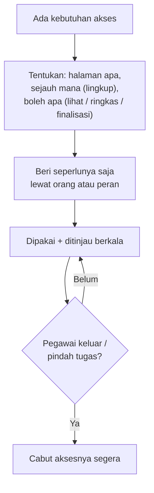

# SOP — Pemberian & Pencabutan Akses (Manajemen Akses)

**Tujuan:** memberi akses **seperlunya** (least-privilege) dan **mencabutnya tepat waktu**, agar tak
ada orang bisa melihat/mengubah data di luar kewenangannya. Otorisasi peran = **inti keamanan** app ini.

**Kapan dipakai:** ada permintaan akses; pegawai jadi koordinator/rekan HRD; pegawai mutasi/keluar;
tinjauan akses berkala.
**Pelaku:** **HRD penuh** (rekan HRD yang aksesnya dibatasi tak bisa membuka Manajemen Akses).

> **Prinsip:** aplikasi hanya membuka **halaman yang SUDAH ADA** dari katalog tetap, dengan **lingkup**
> data + **izin** yang ditegakkan server. Tak ada "halaman buatan sendiri". Kebutuhan tampilan baru =
> permintaan fitur ke pengembang.

---

## Alur singkat



## Jenis akses yang bisa diberikan
| Jenis | Untuk siapa | Catatan |
|-------|-------------|---------|
| **Izin HRD Admin** | pegawai **divisi HRD** (server tolak non-HRD) | akses penuh fitur HRD (mode ganda). Batasi dgn **Atur Akses** bila perlu. |
| **Atur Akses (batas rekan HRD)** | pemegang Izin HRD | membatasi ke **sebagian halaman admin**. ⚠️ Ini pembatasan **tampilan menu**, **bukan** gembok data. Tak bisa ke akun sendiri. |
| **Koordinator** | pegawai (Employee) | Laporan Tim + ACC + Input KPI untuk **tim naungannya** (pilih via Tim Koordinasi). Tak memengaruhi 360°. |
| **Akses halaman berlingkup** | siapa pun (non-HRD) | 1 grant = halaman + **lingkup** + **izin**. Ditegakkan **server** (gembok nyata utk non-HRD). |

**Katalog halaman:** Monitor Kinerja · **Review Hasil Akhir** · Dashboard · Struktur Organisasi ·
Progress 360 · Flag Kepatuhan · Monitoring & Audit KPI.
**Lingkup:** Seluruh / Hanya divisinya / Selain divisinya / Diri sendiri / Tim naungannya.
**Izin (halaman "administrator" spt Review):** 👁 **Lihat** → ✎ **Meringkas** → ✎ **Finalisasi**.

---

## A. Memberi akses — alur "penerima-dulu"
1. **Manajemen Akses → tab Kelola Akses → Langkah 1: pilih penerima** (Seorang pegawai / Sebuah peran / Sebuah halaman).
2. **Seorang pegawai** → buka profilnya → beri di tempat:
   - **Akses halaman** → pilih halaman → panel **Lingkup & Izin** → pilih lingkup (boleh >1) + tingkat izin → **Simpan**.
   - **Izin khusus** → tombol **HRD Admin** / **Koordinator** (+ **Kelola Tim**).
3. **Sebuah peran** → beri akses halaman **massal** ke semua anggota peran **saat ini**. *(Pegawai baru
   TIDAK otomatis ikut — beri ulang bila perlu.)*

> **Peninjau lintas divisi** = beri akses halaman **"Review Hasil Akhir"** lingkup **"Selain divisinya"**
> + izin **"Meringkas"**. (Bukan izin khusus tersendiri lagi.)

## B. Meninjau — kartu "Pegawai Baru"
4. Kartu **Pegawai Baru** menyoroti yang bergabung ≤30 hari & belum ditinjau. Buka profilnya, beri akses
   bila perlu, lalu **"Tandai selesai"**.

## C. Mencabut akses
5. **Cabut satu grant** (reversibel, langsung). **Cabut massal**: semua pemegang satu **halaman**, atau
   semua akses satu **pegawai** (dengan konfirmasi).
6. **WAJIB cabut saat:** pegawai **resign/keluar** (lihat SOP-PEGAWAI-KELUAR) atau **mutasi** yang
   mengubah kewenangan. Jangan tinggalkan izin menggantung.

## D. Tinjauan berkala
7. Tiap awal kuartal / minimal per semester: buka mode **"Sebuah halaman"** → cek **pemegang** tiap
   halaman sensitif (Review, Dashboard, Monitoring KPI). Chip **cakupan peran** membantu melihat bila
   **seluruh** anggota suatu peran memegang halaman. Cabut yang tak lagi perlu.

---

## Catatan / jebakan
- **Least-privilege:** default beri **lingkup sesempit mungkin** (mis. "Hanya divisinya" / "Diri sendiri")
  dan izin **"Lihat"**; naikkan hanya bila memang perlu meringkas/finalisasi.
- **"Atur Akses" bukan gembok data** — untuk pembagian tugas antar rekan HRD **tepercaya** saja.
  Pemegang Izin HRD secara teknis tetap bisa mengakses data.
- **Izin HRD & (dulu) Peninjau** hanya untuk **divisi HRD** — server menolak untuk non-HRD. Pencabutan
  boleh untuk siapa pun.
- Semua pemberian/pencabutan tercatat di **tab Log** Manajemen Akses **dan** Log Aktivitas HRD.

## Checklist ringkas
```
[ ] Tentukan: halaman apa + lingkup apa + izin tingkat berapa (sesempit mungkin)
[ ] Beri lewat penerima Pegawai / Peran
[ ] Tinjau "Pegawai Baru" → Tandai selesai
[ ] Cabut akses saat pegawai resign/mutasi
[ ] Tinjauan berkala pemegang halaman sensitif (mode "Sebuah halaman")
```

## Rujukan
[CARA-PENGGUNAAN.md](../CARA-PENGGUNAAN.md) ("Manajemen Akses" & "Akses Khusus: Review Hasil Akhir berlingkup") ·
[RINCIAN-TOMBOL.md](../RINCIAN-TOMBOL.md) · [SOP-PEGAWAI-KELUAR.md](SOP-PEGAWAI-KELUAR.md)
