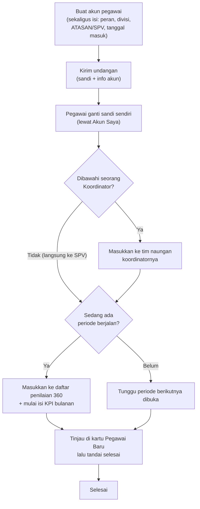

# SOP — Pegawai Baru

**Tujuan:** memastikan pegawai baru "hidup" penuh di sistem — bisa login, ditempatkan di struktur,
masuk siklus penilaian (dinilai 360° + KPI), dan tercermin di laporan — tanpa langkah terlewat.

**Kapan dipakai:** ada karyawan baru bergabung (satuan atau massal).
**Pelaku:** HRD Admin (langkah D7–D8 bisa melibatkan SPV/Koordinator).
**Perkiraan waktu:** ±5 menit/orang.

---

## Alur singkat



> **Catatan:** **atasan/SPV sudah diisi saat membuat akun** (node pertama) — tak ada langkah "atur
> atasan" terpisah. Yang menyusul hanyalah **koordinator** (bila orang ini dibawahi koordinator,
> naungannya diatur di Manajemen Akses — bukan saat buat akun).

## A. Buat akun — *Kelola Pegawai*
1. **HRD → Kelola Pegawai → Tambah Pegawai.** Isi: Nama · **Nama Panggilan** (opsional, untuk tampilan
   padat) · **Peran** (Pegawai/SPV/HRD/Direksi) · **Divisi** · **Kode Pegawai** · Email · **Sandi Awal**
   · **Atasan/SPV** · **Tanggal Masuk**.
2. Banyak orang sekaligus → **Impor dari Excel**. *Tip: impor baris SPV/atasan lebih dulu* agar kolom
   `atasan` bawahannya langsung tertaut.

> **Peran** (bukan kode pegawai) yang menentukan hak akses. Email boleh placeholder (mis.
> `nama@infarm.test`) — bisa diganti kapan saja lewat **Ubah**.

## B. Kirim akun & sandi — *Progress 360*
3. **Progress 360 → Undangan** (tombol **per-orang** pada barisnya). Ini menyetel **sandi acak unik**
   + mengirim email berisi info akun, sandi, & PDF panduan sesuai peran.
4. Minta pegawai **ganti sandi** sendiri via **Akun Saya** (menjaga integritas 360°).

> ⚠️ **JANGAN** pakai "Kirim Undangan **Massal**" hanya untuk 1 pegawai baru di tengah periode — itu
> me-reset sandi **semua** orang (termasuk yang sudah menggantinya). Massal hanya di **awal periode**.

## C. Tempatkan di struktur
5. **Atasan/SPV** sudah diisi saat membuat akun (langkah A1) — cukup **pastikan sudah benar**
   (menentukan siapa input KPI & ACC laporannya). Ubah lewat **Kelola Pegawai → Ubah** bila keliru.
6. **Hanya bila dibawahi Koordinator** (bukan langsung ke SPV): **Manajemen Akses → penerima "Seorang
   pegawai" → pilih koordinatornya → Kelola Tim (Tim Koordinasi)**, tambahkan orang ini ke naungannya.
   *(Langkah terpisah — naungan koordinator tidak diatur saat membuat akun.)*

## D. Masukkan ke siklus penilaian — *hanya bila ada periode aktif ber-360°*
7. **Pemetaan 360°:** tambahkan pasangan penilaian — **siapa menilai dia** & **dia menilai siapa**
   (relasi Atasan/Peer/Cross/Bawahan, sifat Wajib). **Tanpa langkah ini dia tak muncul di daftar
   penilaian siapa pun & tak akan dinilai.**
8. **KPI:** SPV/Koordinator mulai input KPI bulanannya. Bulan yang belum masuk **tidak** dihitung
   (wajar untuk yang bergabung di tengah kuartal).
9. *(Opsional)* **Bobot Khusus per Pegawai** hanya bila kebijakan bobot 360°-nya memang berbeda.

## E. Tinjau akses — *Manajemen Akses*
10. Buka **Manajemen Akses** → kartu **"Pegawai Baru"** (menyorot yang bergabung ≤30 hari & belum
    ditinjau). Buka profilnya, beri akses halaman/izin khusus **bila perlu**, lalu **"Tandai selesai"**.

---

## Cabang keputusan
- **Masuk di tengah periode berjalan** → kerjakan A–C lalu **tambahkan ke Pemetaan periode aktif**
  (D7) agar ikut dinilai kuartal ini. KPI = rata-rata bulan yang sempat terisi.
- **Belum ada periode aktif / periode sudah dikunci** → cukup A–C. Langkah D dilakukan saat **periode
  berikutnya diaktifkan** (salin pemetaan + tambahkan dia).
- **Pegawai eksternal** (vendor/freelance yang hanya *menilai*, tak dinilai) → centang **Penilai
  eksternal** di langkah A; lewati D8 (tak punya KPI/laporan). Cukup dimasukkan Pemetaan sebagai **penilai**.

## Catatan / jebakan
- Aplikasi **tidak** otomatis memasukkan pegawai baru ke pemetaan 360° — itu **keputusan sadar HRD**
  (D7). Disengaja.
- Pegawai baru **tidak** otomatis dapat akses tambahan; hanya bawaan perannya. Kartu "Pegawai Baru"
  ada persis untuk memastikan HRD meninjau ini.
- Semua aksi (buat/undang/pemetaan) tercatat di **Log Aktivitas HRD**.

## Checklist ringkas
```
[ ] A1   Tambah Pegawai (peran, divisi, kode, email, ATASAN, tgl masuk)
[ ] B3   Kirim Undangan (per-orang) → sandi + info akun
[ ] B4   Pegawai ganti sandi sendiri (Akun Saya)
[ ] C5   Pastikan Atasan/SPV benar (sudah diisi di A1)
[ ] C6   (bila dibawahi koordinator) masukkan ke Tim Koordinasi
[ ] D7   Tambah ke Pemetaan 360° periode aktif  (bila ada periode & 360° aktif)
[ ] D8   Mulai input KPI bulanan
[ ] E10  Tinjau di "Pegawai Baru" (Manajemen Akses) → Tandai selesai
```

## Rujukan
[CARA-PENGGUNAAN.md](../CARA-PENGGUNAAN.md) (Kelola Pegawai · Pemetaan · Progress 360 · Manajemen Akses) ·
[RINCIAN-TOMBOL.md](../RINCIAN-TOMBOL.md) · [SOP-PEGAWAI-KELUAR.md](SOP-PEGAWAI-KELUAR.md)
