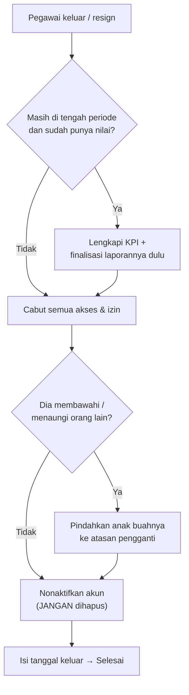

# SOP — Pegawai Keluar / Resign / Nonaktif

**Tujuan:** menonaktifkan pegawai yang keluar **tanpa menghilangkan data historisnya** (KPI, 360°,
laporan tetap utuh untuk audit & hasil kuartal), sekaligus **menutup celah akses** (login & izin).

**Kapan dipakai:** karyawan resign/keluar, cuti panjang, atau perlu dibekukan aksesnya.
**Pelaku:** HRD Admin.
**Prinsip:** **Nonaktifkan, JANGAN hapus.** Menghapus pegawai/periode menghilangkan jejak. Cukup
nonaktifkan — akun terkunci, pemetaannya otomatis nonaktif, data lama aman.

---

## Alur singkat



## A. Selesaikan kewajiban periode berjalan *(bila resign di tengah kuartal)*
1. Bila periode aktif & orang ini **sudah punya data** (KPI/360°): pertimbangkan **selesaikan dulu**
   sebelum menonaktifkan —
   - Lengkapi KPI bulan yang perlu (KPI = rata bulan terisi; tak apa bila hanya sebagian bulan).
   - **① Hitung Ulang Skor 360° → Review Hasil Akhir → Finalisasi** laporannya bila memang ingin
     hasil kuartalnya keluar.
   > Halaman **pelaporan** (Dashboard/Rekap/Monitor/Laporan Tim/Review) **tetap menampilkan** pegawai
   > nonaktif yang **punya data periode** (diberi penanda "nonaktif") — jadi hasilnya **tak hilang** &
   > masih bisa difinalisasi meski sudah dinonaktifkan. Boleh nonaktifkan dulu lalu finalisasi.

## B. Cabut akses & izin — *Manajemen Akses*
2. **Manajemen Akses → penerima "Seorang pegawai" → pilih orang ini:**
   - Cabut **Izin HRD Admin** bila ada.
   - Cabut **Koordinator** (otomatis mengosongkan tim naungannya).
   - Cabut semua **akses halaman** (Review/Monitor/Dashboard/dll) — tombol **"Cabut semua akses halaman"**.
3. Bila dia **menaungi** pegawai lain sebagai Koordinator, atau menjadi **atasan/SPV** orang lain →
   **pindahkan bawahannya** ke atasan/koordinator pengganti (lihat SOP Mutasi) **sebelum** dinonaktifkan,
   agar bawahan tak menggantung tanpa yang meng-input KPI/ACC.

## C. Nonaktifkan akun — *Kelola Pegawai*
4. **Kelola Pegawai → baris pegawai → Nonaktifkan.** Efeknya:
   - Akun **terkunci** (tak bisa login).
   - **Pemetaan 360°-nya otomatis nonaktif** → dia keluar dari siklus: tak lagi dihitung di Progress
     360 & tak jadi tugas penilai lain.
   - Riwayat penilaian/KPI/laporan **tetap tersimpan**.
5. Isi **Tanggal Keluar** (bila tersedia) untuk arsip.

## D. Rapikan pemetaan penilai lain *(opsional, kebersihan siklus)*
6. Bila orang ini terdaftar sebagai **penilai** untuk pegawai lain di **periode aktif** dan
   penilaiannya belum/ tak akan diisi → di **Pemetaan**, hapus pasangan itu atau **Paksa Selesai** di
   **Progress 360** agar kelengkapan 360° target tidak "macet" menunggu penilai yang sudah keluar.

---

## Cabang keputusan
- **Keluar SETELAH periode dikunci** → cukup B–C (data kuartal sudah beku & aman).
- **Keluar SEBELUM sempat dinilai sama sekali** (mis. probation gagal, belum ada data) → langsung
  B–C; di halaman flag/siklus (Kepatuhan/Progress/Penilaian) dia otomatis **disembunyikan**.
- **Hanya cuti panjang / bekukan sementara** → sama: Nonaktifkan. **Aktifkan kembali** kapan pun →
  pemetaannya ikut aktif lagi (tak perlu setup ulang).

## Catatan / jebakan
- **Jangan "Hapus Pegawai" / "Hapus Periode"** untuk kasus resign — itu menghilangkan jejak audit &
  hasil kuartal. Nonaktifkan sudah cukup.
- **Cabut akses (B) dulu, baru nonaktifkan (C)** — supaya tak ada jendela waktu akun keluar masih
  memegang izin sensitif.
- **Sandi:** akun nonaktif tak bisa login; tak perlu reset sandi.
- Semua aksi tercatat di **Log Aktivitas HRD**.

## Checklist ringkas
```
[ ] A1  (bila di tengah periode) lengkapi KPI + Hitung Ulang + Finalisasi laporannya (bila perlu)
[ ] B2  Cabut Izin HRD / Koordinator / akses halaman (Manajemen Akses)
[ ] B3  Pindahkan bawahan/naungannya ke atasan pengganti (bila dia atasan/koordinator)
[ ] C4  Nonaktifkan akun (Kelola Pegawai) — pemetaan ikut nonaktif otomatis
[ ] C5  Isi Tanggal Keluar
[ ] D6  (opsional) Rapikan pemetaan di mana dia jadi PENILAI (hapus / Paksa Selesai)
```

## Rujukan
[CARA-PENGGUNAAN.md](../CARA-PENGGUNAAN.md) (Kelola Pegawai · Manajemen Akses · Pemetaan · Flag Kepatuhan) ·
[SOP-PEGAWAI-BARU.md](SOP-PEGAWAI-BARU.md) · [SOP-AKSES.md](SOP-AKSES.md) · [SOP-SIKLUS-PERIODE.md](SOP-SIKLUS-PERIODE.md)
