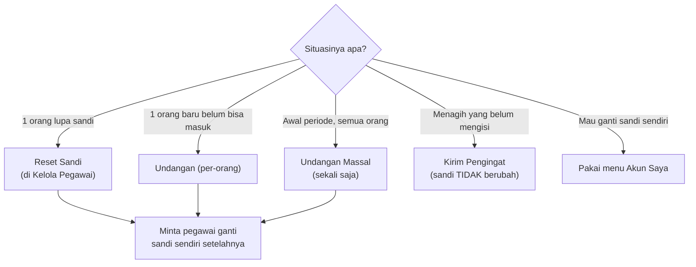

# SOP — Reset Sandi & Masalah Login

**Tujuan:** menangani pegawai yang lupa/bermasalah dengan sandi **tanpa** mengganggu pengguna lain,
dan menjaga integritas 360° (mencegah orang login atas nama orang lain).

**Kapan dipakai:** pegawai lupa sandi, akun baru belum bisa masuk, atau keluhan tak bisa login.
**Pelaku:** HRD Admin.

> **Kunci utama: mana tombol yang MENGUBAH sandi?** Hanya **Reset Sandi** & **Undangan**. "Kirim
> Pengingat" **tidak pernah** menyentuh sandi.

---

## Alur singkat



## Tabel keputusan cepat
| Situasi | Tindakan | Mengubah sandi? |
|---------|----------|-----------------|
| **1 pegawai lupa sandi** | **Kelola Pegawai → Reset Sandi** (tombol **Acak** utk sandi acak) | ✅ ya (1 orang) |
| **1 pegawai baru belum onboarding** | **Progress 360 → Undangan** (per-orang) | ✅ ya (1 orang) |
| **Awal periode, semua pegawai** | **Progress 360 → Undangan Massal** | ✅ ya (SEMUA) |
| **Mengejar yang belum mengisi** | **Progress 360 → Kirim Pengingat** | ❌ tidak |
| **Pegawai mau ganti sandi sendiri** | arahkan ke **Akun Saya** | ✅ oleh pegawai sendiri |

## Langkah — reset 1 pegawai (kasus tersering)
1. **Kelola Pegawai** → cari pegawai → **Reset Sandi**.
2. Ketik sandi baru atau klik **Acak**. Konfirmasi.
3. Sampaikan sandi ke pegawai lewat kanal aman, dan **minta ia segera menggantinya** via **Akun Saya**.

## Langkah — pegawai baru belum bisa masuk
4. Pastikan akunnya **Aktif** & **email benar** (Kelola Pegawai).
5. **Progress 360 → Undangan** (per-orang) → mengirim email berisi info akun + sandi + panduan.

---

## Jebakan penting
- ⚠️ **"Undangan Massal" me-reset sandi SEMUA orang** (termasuk yang sudah menggantinya sendiri).
  **Hanya** untuk **awal periode**. Untuk 1 orang di tengah periode → pakai **Undangan per-orang** atau
  **Reset Sandi**, JANGAN massal.
- **Kirim Pengingat ≠ ubah sandi** — aman dipakai berkali-kali untuk menagih pengisian.
- Sandi **tidak pernah** dicatat sistem/Log. Sampaikan lewat kanal aman.
- Akun **nonaktif** memang tak bisa login — bukan masalah sandi (lihat SOP-PEGAWAI-KELUAR).

## "Lupa Sandi" mandiri (via email) — status
Alur "Lupa sandi?" di halaman login **dormant** sampai diaktifkan. Untuk mengaktifkan (agar pegawai
reset sendiri tanpa HRD): (1) isi **email asli** tiap pegawai; (2) aktifkan **SMTP/Resend** di Supabase;
(3) daftarkan **Redirect URL** `https://<domain>/auth/callback`; (4) set env `NEXT_PUBLIC_ENABLE_PW_RESET=true`
lalu redeploy. Sebelum itu, reset sandi lewat **Reset Sandi** (HRD).

## Checklist ringkas
```
[ ] Identifikasi situasi (tabel keputusan di atas)
[ ] 1 orang lupa      → Kelola Pegawai → Reset Sandi (Acak)
[ ] 1 orang baru      → Progress 360 → Undangan (per-orang)
[ ] Awal periode      → Undangan Massal (SEKALI)
[ ] Menagih pengisian → Kirim Pengingat (tak ubah sandi)
[ ] Selalu: minta pegawai ganti sandi sendiri via Akun Saya
```

## Rujukan
[CARA-PENGGUNAAN.md](../CARA-PENGGUNAAN.md) ("Sandi & Onboarding — tombol mana?" & "Akun Saya") ·
[RINCIAN-TOMBOL.md](../RINCIAN-TOMBOL.md)
