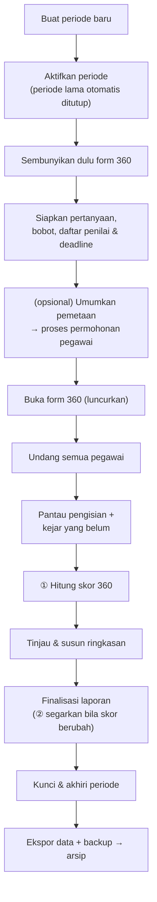

# SOP — Menjalankan Satu Periode Penilaian (mulai → kunci → arsip)

**Tujuan:** menjalankan satu siklus penilaian kuartalan secara benar & berurutan, dari membuat
periode hingga menguncinya, agar Skor Akhir setiap pegawai valid dan hasilnya terarsip.

**Kapan dipakai:** memulai kuartal penilaian baru.
**Pelaku:** HRD Admin (Mode Admin).

> **Dua "saklar" yang JANGAN tertukar:**
> - **Aktifkan 360° / Set Tanpa 360°** = buka/tutup **bagian 360°** saja (form + skor).
> - **Aktivasi / Kunci & Akhiri** = hidup/mati **seluruh periode** (KPI **dan** 360°).

---

## Alur singkat



## Urutan baku
```
Buat → Aktivasi → Set Tanpa 360° → Pertanyaan → Bobot → Pemetaan → Deadline 360°
  → (opsional) Umumkan Pemetaan + proses Permohonan
  → Aktifkan 360° / Buka Form (LUNCURKAN) → Undangan Massal → (pegawai mengisi; pantau Progress)
  → ① Hitung Ulang Skor 360° → Review → Rilis ke SPV → Finalisasi (+ ② Perbarui Laporan Final yang Berubah)
  → Kunci & Akhiri → Ekspor + Backup → periode berikutnya
```

## Langkah
1. **Buat periode** — *Kelola Periode → Buat Periode Baru*: Label, Tanggal Mulai/Selesai, centang
   **Sertakan Evaluasi 360°**, **Standar KPI** (default 80, hanya untuk kartu dashboard "KPI Di Atas
   Standar", tak memengaruhi rumus). Periode baru berstatus *Terkunci* sampai di-Aktivasi.
2. **Aktivasi Periode** — status → aktif; Input KPI terbuka. **Hanya 1 periode aktif** (yang lain
   otomatis diakhiri; muncul peringatan bila periode lama masih ada tugas tertunda).
3. **Set Tanpa 360°** — sembunyikan form 360° dari pegawai selama menyiapkan konfigurasi.
4. **Susun konfigurasi (form masih tertutup, aman):**
   - **Kelola Pertanyaan** — aspek + indikator (rating 1–5) + esai. Bisa **Salin dari periode sebelumnya**.
   - **Bobot & Kalkulasi 360°** — pilih Model 4-Kelas / 2-Kelas + angka bobot; **total wajib 100%**.
   - **Pemetaan 360°** — siapa menilai siapa + relasi (Atasan/Peer/Cross/Bawahan) — semua **Wajib**.
     **Self Assessment dinonaktifkan** (Q3 2026). Bisa **Salin dari periode sebelumnya**. Opsional hanya
     muncul dari **Ajuan** pegawai yang disetujui HRD (dan Ad-Hoc lama).
   - **Deadline 360°** — isi di kolom *Deadline 360°* tabel periode (WIB). Kiriman pertama sesudahnya
     tercatat Terlambat → potongan **−3** pada Skor 360° si penilai (berlaku juga bagi yang belum
     mengirim sama sekali saat deadline lewat).
   - *(Opsional)* **Umumkan Pemetaan** (menu ⋯, saat form masih tertutup) — pegawai meninjau daftar
     penilaiannya & boleh **Ajukan Hapus / Ajukan Penilaian / Minta Koreksi**. Proses di **Pemetaan → tab
     Permohonan** (tolak wajib beralasan).
5. **Aktifkan 360°** 🚀 — form tampil serentak ke semua pegawai berpemetaan = **peluncuran**.
   *Divalidasi:* ditolak bila belum ada pertanyaan/pemetaan.
6. **Kirim Undangan Massal** — *Progress 360*: kirim info akun + sandi + panduan. **Sekali di awal**
   (me-reset sandi semua). Periode berikutnya cukup **Kirim Pengingat**.
7. **Pantau pengisian** — *Progress 360*: kejar yang belum lengkap dengan **Kirim Pengingat**;
   *Flag Kepatuhan*: pantau **Belum Kirim / Kirim Terlambat / ajuan tertunda**, tinjau **potongan
   keterlambatan** (bisa **Ubah** nilainya dengan alasan; 0 = dikecualikan).
8. **① Hitung Ulang Skor 360°** — *Review & Finalisasi* (kokpit "Sinkronkan Skor"; tombol ini **hanya ada
   di sana**). Menulis `result_360` (termasuk potongan keterlambatan, yang juga diterapkan otomatis saat
   halaman dibuka). **Wajib sebelum finalisasi** — sebelum ditekan, Skor Akhir = 100% KPI.
9. **Review & susun ringkasan** — buka **Tinjau** tiap pegawai; tulis Ringkasan Aspek (auto-simpan).
   Opsional **Rilis ke SPV** (`in_review`) agar SPV/Koordinator lihat detail agregat & beri ACC (non-blok).
10. **Finalisasi** — per pegawai, atau **Finalisasi Semua Ber-ACC (N)** untuk yang sudah di-ACC. Setelah
    Final, pegawai bisa lihat **Laporan Hasil Saya**. Bila data berubah setelah Final → **② Perbarui
    Laporan Final yang Berubah** untuk menyegarkan angka. Catatan: ACC gugur bila laporan dikembalikan ke
    draf / dirilis ulang dengan skor berbeda; laporan yang skornya berubah sejak di-ACC dilewati oleh
    Finalisasi Semua Ber-ACC.
11. **Kunci & Akhiri Periode** — status → ended; server menolak isi/edit. **Finalisasi semua DULU** —
    setelah dikunci, finalisasi butuh aktivasi ulang. (Ada konfirmasi + daftar isu tertunda.) Periode
    terkunci **bisa dibuka kembali** lewat **Aktivasi** bila perlu koreksi (periode aktif lain ikut terkunci).
12. **Arsip:** **Ekspor Dataset** (.xlsx) + **Backup** (lihat CARA-BACKUP) untuk simpanan kuartal.

---

## Menghentikan pengisian untuk tahap review (opsional)
- **Tutup Form** (muncul saat 360° menyala) = bekukan pengisian pegawai **tetapi 360° tetap dihitung**
  & bisa di-Hitung Ulang. Pakai saat mau meninjau/finalisasi dengan data beku. **Buka Form** mengembalikan.
- Ini **beda** dari "Set Tanpa 360°" (yang mematikan komponen 360° → Skor Akhir jadi 100% KPI).

## Cabang keputusan
- **Kuartal tanpa 360°** → lewati langkah 3–5, 8–9 bagian 360°; Skor Akhir = 100% KPI; 4-Box hanya
  B-KPI/C yang mungkin.
- **Pergantian kalender di tengah pengisian** → **biarkan periode lama tetap aktif** sampai semua
  penilaian + KPI selesai (penilaian masuk ke periode yang aktif saat Kirim, bukan by tanggal), baru
  Hitung Ulang → Finalisasi → Kunci.
- **Pegawai baru/keluar di tengah** → lihat SOP-PEGAWAI-BARU / SOP-PEGAWAI-KELUAR.

## Catatan / jebakan
- **Urutan wajib:** finalisasi **sebelum** Kunci & Akhiri. Kunci hanya untuk **akhir siklus**, bukan
  untuk menyembunyikan form sementara (itu tugas Tutup Form / Set Tanpa 360°).
- **Peluncuran 360° = tombol "Aktifkan 360°"**, bukan sekadar membuat pemetaan.
- Semua aksi sensitif tercatat di **Log Aktivitas HRD**.

## Checklist ringkas
```
[ ] Buat periode (+ Standar KPI)          [ ] Aktivasi
[ ] Set Tanpa 360°                         [ ] Pertanyaan → Bobot → Pemetaan → Deadline 360°
[ ] (opsional) Umumkan Pemetaan + Permohonan
[ ] Aktifkan 360°                          [ ] Undangan Massal
[ ] Pantau Progress + Kepatuhan            [ ] ① Hitung Ulang Skor 360°
[ ] Review + Rilis ke SPV + ACC            [ ] Finalisasi (+ ② Perbarui Laporan Final yang Berubah)
[ ] Kunci & Akhiri                         [ ] Ekspor + Backup
```

## Rujukan
[CARA-PENGGUNAAN.md](../CARA-PENGGUNAAN.md) ("Ceklis HRD — Menjalankan Satu Periode" & "Alur Lengkap") ·
[CARA-BACKUP.md](../CARA-BACKUP.md) · [RINCIAN-TOMBOL.md](../RINCIAN-TOMBOL.md)
