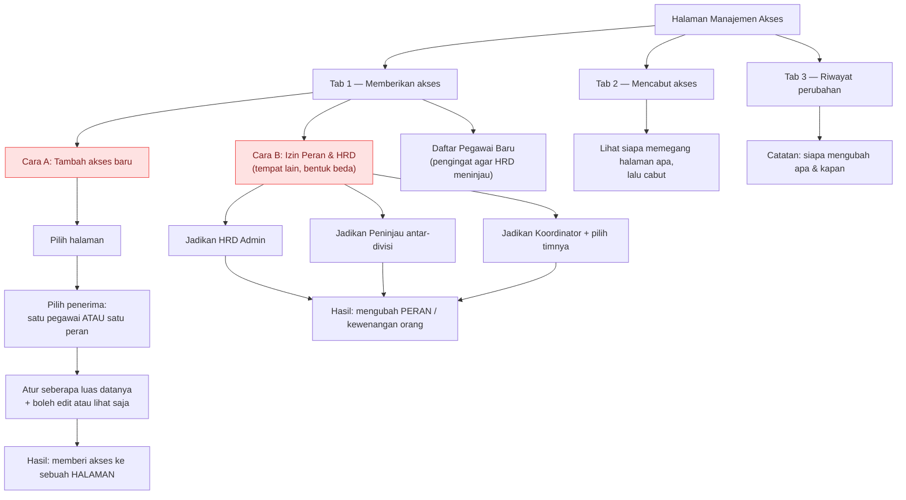
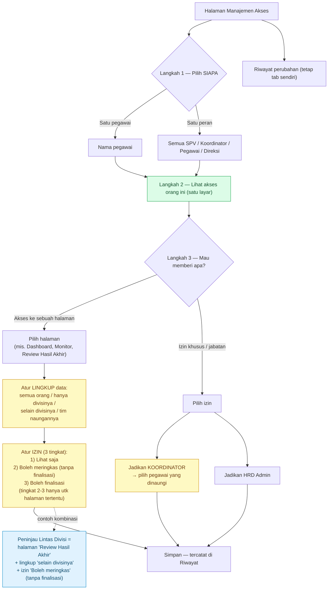
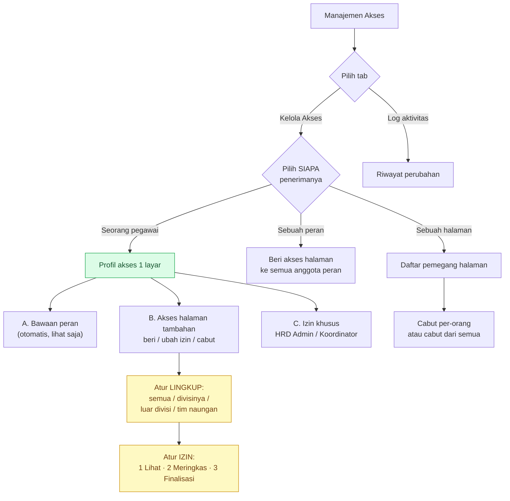

# DESAIN — Halaman Manajemen Akses (RBAC) — Infarm 360°

> **Status:** spec desain (belum dibangun). Konsolidasi diskusi 2026-07-17. Acuan saat membangun.
> Panduan durable: [CLAUDE.md](../../CLAUDE.md) · backlog: [BACKLOG.md](../perencanaan/BACKLOG.md).

Dokumen ini menyatukan visi RBAC yang dibahas bertahap: dari "akses HRD granular per-halaman"
menjadi **halaman Manajemen Akses** yang mengatur siapa boleh mengakses halaman/data apa & sejauh mana.

---

## 1. Tujuan

Memberi HRD Admin **satu tempat** untuk mengatur akses secara **fleksibel & data-driven** (aktif/
nonaktif per orang), tanpa deploy — atas **katalog halaman TETAP** (bukan page-builder; lihat
keputusan terkunci CLAUDE.md). Termasuk memberi **SPV/Koordinator** akses melihat **kinerja pegawai
naungannya** yang belum mereka punya (mis. Dashboard berlingkup tim).

## 2. Keputusan terkunci (hasil diskusi)

- **AUGMENT, bukan replace** (dikonfirmasi 2026-07-17): akses default per-peran **tetap** (SPV/
  Koordinator otomatis lihat timnya lewat Monitor/Laporan Kinerja Tim/Input KPI). Halaman akses hanya
  **MENAMBAH** akses ekstra (mis. Dashboard berlingkup) atau **MENCABUT** bila perlu. Tak mengubah
  perilaku yang sudah jalan.
- **Audit Akses = status + riwayat** (dikonfirmasi 2026-07-17): sub-tab menampilkan **matriks status
  sekarang** (siapa punya apa + lingkup) **dan** **riwayat perubahan** (kapan diberi/dicabut, oleh siapa).
- **Katalog halaman TETAP** (bukan URL bebas): sejalan keputusan "tak ada page-builder". Variasi
  per-mandat lewat **SCOPE/parameter** pada halaman existing, bukan menggandakan halaman.
- **Keamanan NYATA (Jalur B)** untuk data sensitif: akses berlingkup (tim/divisi) ditegakkan di
  **RLS/service_role**, bukan sekadar sembunyi menu. Pola: grant yang **tidak** menyalakan `is_hrd()`
  penuh + baca via `service_role` berfilter (pola Peninjau/Koordinator yang sudah ada).

## 3. Sudah ada vs baru

**Sudah ada (jangan bangun ulang):**
- Akses HRD granular per-HALAMAN (Jalur A, menu) — `hrd_sections` + `canSection` (migrasi 0023). SELESAI.
- SPV: Monitor Kinerja, Laporan Kinerja Tim, Input KPI (berlingkup `spv_team_members`).
- Koordinator: Laporan Kinerja Tim, Input KPI, ACC (berlingkup `coordinator_team_members`).
- Peninjau Lintas Divisi (`is_cross_reviewer`) — pola grant-tanpa-`is_hrd()` + `service_role` berfilter.
- Overview Struktur Organisasi (`/admin/struktur`) — SELESAI 2026-07-17.
- Grant changes SUDAH tercatat di `hrd_audit_log` (`logHrdAction`, kategori 'pegawai').

**Baru (yang dibangun halaman ini):**
- **Dashboard berlingkup tim** untuk SPV/Koordinator (satu halaman Dashboard yang **scope** menurut
  penonton — org-wide utk HRD, tim-saja utk SPV/Koord). Butuh RLS/service_role scoping (Jalur B).
- **Toggle akses** per orang (aktif/nonaktif) di satu halaman.
- **Sub-tab Audit Akses** (status matriks + riwayat).

## 4. Struktur halaman (usulan)

`/admin/akses` (bagian katalog baru `akses`; gerbang: HANYA HRD **tak-terbatas** — rekan HRD terbatas
tak boleh membuka, agar tak bisa menaikkan aksesnya sendiri).

- **Sub-tab "Kelola Akses"** — matriks/daftar: baris = orang (HRD/SPV/Koordinator yang relevan),
  kolom = kapabilitas yang bisa di-toggle + **lingkup** (mis. Semua / Divisi sendiri / Tim naungan).
  Contoh kapabilitas: "Dashboard (berlingkup tim)", "Ekspor tim", dsb — dari katalog tetap.
- **Sub-tab "Audit Akses"** — (a) **Status**: snapshot siapa punya akses apa + lingkup, dihitung dari
  data (`employees` grants + tabel scope); (b) **Riwayat**: log perubahan akses, difilter dari
  `hrd_audit_log` ke aksi-akses (grant/revoke/set_sections/set_scope).

## 5. Model data (arah, belum final)

- Kapabilitas ekstra sebagai **grant boolean** atau kolom **text[]** per orang (pola `hrd_sections`).
- **Lingkup** per grant: `all` / `own_division` / `own_team` — ditegakkan RLS/service_role.
- Hindari role baru — pakai **grant/kapabilitas** (pola terbukti: HRD Admin, Koordinator, Peninjau
  semua grant, bukan role). Role hanya untuk posisi kepegawaian eksklusif.

## 6. Keamanan (wajib)

- Bagian **konfigurasi** (tak bocorkan data pribadi) → app-level `canSection` cukup.
- Bagian **data sensitif** (kinerja/laporan/dashboard/ekspor) → **RLS/service_role berfilter** wajib;
  grant TIDAK menyalakan `is_hrd()` penuh. Lingkup "tim/divisi sendiri" hanya berarti bila ditegakkan DB.
- Tambah assertion di `npm run verify:rls` untuk skenario baru (mis. SPV-berscope tak bisa baca tim lain).

## 7. Pentahapan & risiko

1. **(SELESAI)** Overview Struktur Organisasi — fondasi visual.
2. Halaman Manajemen Akses **kerangka + Jalur A** (toggle + audit status/riwayat untuk grant yang sudah
   ada; belum sentuh RLS).
3. **Jalur B**: Dashboard berlingkup + lingkup tim/divisi (RLS/service_role) — **butuh DB terisolasi
   untuk uji** (free tier: local dev = DB production; menerapkan migrasi RLS ke DB bersama = langsung
   memengaruhi app live). Backup + jendela sepi bila terpaksa di production.

## 8. Pertanyaan terbuka

- Daftar pasti kapabilitas ekstra yang bisa di-toggle (mulai dari: Dashboard berlingkup tim).
- Apakah "lingkup tim naungan" untuk SPV = `spv_team_members`, dan untuk Koordinator =
  `coordinator_team_members` (kemungkinan ya).
- Field **jabatan spesifik** (mis. "Koordinator Gudang") — fitur terpisah, lihat catatan memori.

---

## 9. Rencana disetujui (2026-07-21) — tata letak 3-kolom + multi-lingkup + grant per-peran

> **STATUS: DIRENCANAKAN, PENGERJAAN DITUNDA atas permintaan pengguna.** Belum ada kode Fase 1 yang
> ditulis (baru daftar tugas). Bagian ini merekam mockup yang disetujui + seluruh keputusan diskusi
> agar bisa dilanjutkan kapan saja.

### 9.1 Mockup yang disetujui (3 kolom)
Konsol Manajemen Akses ditata jadi 3 kolom, satu pemberian akses = **1 halaman × 1 penerima × lingkup × izin**:
1. **Pilih halaman** (centang, 1 halaman/pemberian) — dikelompokkan **Pemantauan** (Dashboard Organisasi,
   Monitor Kinerja, dll) & **Menu Administrator** (Kelola Periode, Review Hasil Akhir, dll).
2. **Pilih penerima** (centang, 1/pemberian): salah satu **PERAN utuh** (Direksi / SPV / Koordinator /
   Pegawai) **ATAU** **pegawai tertentu** (dropdown searchable — yang sudah ada).
3. **Cara**: **Lingkup** (Sesama divisi / Selain divisi / Seluruh pegawai / Diri sendiri) + **Izin**
   (Izinkan edit / Hanya melihat).

### 9.2 Keputusan diskusi (mengikat)
1. **"Supervisor" = "SPV"** — satu peran (`role='spv'`). Mockup menuliskannya dua kali; anggap duplikat.
2. **Koordinator ADALAH target sah** (walau teknisnya grant `is_coordinator`, bukan role DB) — alasan:
   halaman pemantauan bisa dipakai koordinator memantau kinerja bawahannya. ✅ **DIPUTUSKAN (2026-07-22):**
   lingkup Koordinator = **per-daftar-tim** (`coordinator_team_members`), BUKAN per-divisi. Diwujudkan
   sebagai scope baru **`'coordinator_team'`** (migrasi 0029) — tiap koordinator melihat TIM NAUNGANNYA
   sendiri. Penegakan: `employeeInScopes(..., teamIds)` (fail-closed tanpa teamIds); helper divisi
   (`deptScopeFilter`/`allowedDeptsFor`/`isDeptInScope`) fail-closed `op:'none'` seperti 'self'.
3. **Lingkup = MULTI-pilih** (membalik keputusan 2026-07-21 sebelumnya yang "pilih-satu"). Kombinasi
   bermakna terutama **"Selain divisi + Diri sendiri"**. → butuh skema multi (`scopes[]`).
4. **Izin Edit pada halaman Administrator ke peran luas DIIZINKAN**, TAPI wajib **peringatan/konfirmasi**
   saat HRD menyimpan (mis. "Anda akan mengizinkan SEMUA Pegawai memfinalisasi laporan — lanjutkan?").
5. **Pegawai baru TIDAK otomatis dapat akses.** Grant per-peran = **terapkan ke anggota SAAT INI**
   (materialize jadi baris `page_grants` individual — *Pendekatan B*), BUKAN aturan hidup. Sebagai gantinya
   ada **section "Pegawai Baru"** di konsol yang menampilkan pegawai baru (deteksi via kolom `joined_on`
   yang sudah ada, mis. ≤30 hari) agar HRD memutuskan aksesnya manual + tombol **"Tandai sudah ditinjau"**
   (opsional kolom `access_reviewed_at`; tanpa itu kartu hilang sendiri setelah jendela waktu).
   - Catatan: akses **bawaan peran** tetap jalan untuk pegawai baru; section ini hanya soal grant TAMBAHAN.

### 9.3 Pentahapan yang disepakati (tiap fase diuji & bisa berhenti)
- **Fase 1 — Skema multi-lingkup (fondasi).**
  - Migrasi **0028** *aditif*: tambah `page_grants.scopes text[]` (backfill `array[scope]`), CHECK tiap
    elemen ∈ {all, own_division, other_divisions, self}. **PERTAHANKAN kolom `scope` lama** (Monitor grant
    sudah LIVE di `main` membacanya) → tulis SINKRON: `scope = scopes[0]` + `scopes = <array>`. `database.types.ts`
    tambah `scopes`.
  - `lib/auth/roles.ts`: `grantedAccess()` → `{ scopes: PageScope[]; canEdit }` (fallback `scope`→`[scope]`).
    Helper inti baru **`employeeInScopes(scopes, ownDept, ownId, emp)`** = OR dari tiap lingkup
    (all→true; self→emp.id===ownId; own_division→emp.dept===ownDept; other_divisions→emp.dept≠null && ≠own).
    `allowedDeptsForMulti(depts, scopes, ownDept)` = union divisi (utk dropdown). Helper single lama boleh
    tetap untuk kompat/tes.
  - **Pola penegakan disederhanakan:** halaman **ambil semua pegawai lalu SARING di JS** dengan
    `employeeInScopes` (union OR sulit dibangun sebagai satu query; ukuran ~100 pegawai → aman). Untuk query
    berat (kpi/360 lintas periode) tetap hanya untuk id yang lolos saring.
  - Terapkan di: **Monitor** (`admin/monitor/page.tsx`), **Review list** (`admin/laporan/page.tsx`),
    **Review detail** (`laporan/[employeeId]/page.tsx`), **guard tulis** (`admin/laporan/actions.ts`
    resolver → `employeeInScopes` untuk target tunggal).
  - **Panel konsol** kembali **multi-select** (checkbox; "Seluruh pegawai" mematikan own/other). `akses/page.tsx`
    muat `scopes`. Audit Akses tampilkan daftar lingkup.
  - Tes `tests/page-scope.test.ts` ditulis ulang untuk `employeeInScopes` + multi.
- **Fase 2 — Target PERAN + terapkan massal** (Direksi/SPV/Pegawai/Koordinator): saat peran dicentang,
  upsert `page_grants` untuk semua anggota peran SAAT INI. **Peringatan/konfirmasi** untuk Edit pada
  halaman Administrator ke peran luas. Putuskan semantik lingkup Koordinator (poin 9.2#2).
  ✅ **SELESAI di `dev` (2026-07-22):** scope baru `coordinator_team` (migrasi 0029) + `employeeInScopes`
  menerima `teamIds` + `allowedDeptsForMulti` menerima `teamDepts`; ditegakkan di Monitor / Review list /
  Review detail / guard tulis `admin/laporan/actions.ts`. Server action `setPageGrantForRole` (materialisasi
  ke anggota peran saat ini via service_role). Konsol: pemilih Penerima (pegawai tertentu ATAU peran),
  opsi scope "Tim naungannya" (hanya untuk Koordinator/pegawai koordinator), ConfirmDialog peringatan saat
  Edit halaman administrator ke peran luas. 145 tes hijau. **PRASYARAT deploy: apply 0029 ke DB.**
- **Fase 3 — Section "Pegawai Baru"** (dari `joined_on` + "tandai ditinjau").
  ✅ **SELESAI di `dev` (2026-07-22):** migrasi 0030 (`employees.access_reviewed_at timestamptz`). Konsol
  menampilkan section "Pegawai Baru" (joined_on ≤ 30 hari & `access_reviewed_at` null): kartu per pegawai
  dgn "Tinjau akses" (prefill card Tambah akses) + "Tandai sudah ditinjau" (`markAccessReviewed` → set
  penanda → kartu hilang). Akses bawaan peran tetap; ini hanya soal grant TAMBAHAN. **PRASYARAT: apply 0030.**
- **Fase 4 — Tata letak 3 kolom** (mempercantik; paling murah, terakhir).
  ✅ **SELESAI di `dev` (2026-07-22):** area "Tambah akses baru" ditata 3 kolom — (1) Pilih halaman (radio
  dikelompokkan Pemantauan / Menu Administrator), (2) Pilih penerima (peran ATAU pegawai tertentu + "Atur
  akses"), (3) Lingkup & izin (panel). Murni presentasi; logika panel/simpan tak berubah. ✅ **SEMUA FASE 1–4 SELESAI.**

### 9.4 Yang MENIMPA pekerjaan sebelumnya (perlu diingat saat lanjut)
- Migrasi **0027** (self *single-value*) & **panel pilih-satu** (dibuat 2026-07-21) **DISUPERSEDE** oleh
  Fase 1 (multi). 0027 boleh tetap ada (aditif, memperlebar CHECK `scope` lama utk 'self') — tak perlu di-revert.
- Semua ini masih di branch `dev`, **belum commit, belum apply ke DB live**.

### 9.5 Status saat penundaan
- Tahap 2 (edit/finalisasi non-HRD) + lingkup 'self' single + tata letak card/panel v1 = **selesai di `dev`,
  134 tes hijau, belum commit/push, migrasi 0027 belum di-apply ke live.**
- Fase 1 multi = **belum dimulai** (hanya daftar tugas).

---

## 10. Redesain "satu alur besar" — PENERIMA-DULU (diskusi 2026-07-24)

> **STATUS: DISKUSI, BELUM DIBANGUN.** Keluhan pengguna: fitur **tumpang tindih** — ada tempat
> memberi akses per-PERAN (di "Tambah akses baru") dan ada tempat terpisah untuk **izin peran & HRD**
> (blok "Izin Peran & Akses HRD"). Dua model data (grant halaman vs kapabilitas peran) tinggal di dua
> UI berbeda → membingungkan. Target: **satu alur** yang dimulai dari **memilih penerima dulu**.

### 10.1 Diagram — struktur SAAT INI (as-is)

Inti kebingungan: ada **DUA cara berbeda** memberi akses di halaman yang sama. Keduanya sama-sama
"memberi sesuatu ke seseorang", tapi tampil sebagai dua tempat terpisah — dan kata "peran" muncul di
keduanya dengan arti berbeda.

**Yang bikin bingung (kotak merah):**
1. **Dua cara memberi akses** (Cara A dan Cara B) padahal tujuannya sama — memberi sesuatu ke seseorang.
2. **"Peran" punya dua arti**: di Cara A = *siapa yang menerima*; di Cara B = *jabatan/kewenangan yang diubah*.
3. **Tidak ada satu tempat** yang langsung menjawab: *"orang ini sebenarnya punya akses apa saja?"*

### 10.2 Diagram — usulan ALUR BESAR (penerima-dulu)

Satu alur, tiga langkah: **pilih SIAPA → lihat semua aksesnya dalam satu layar → beri/ubah/cabut di
situ juga.** Tidak ada lagi "Cara A vs Cara B" — semuanya jadi satu.

**Di mana tiap kontrol berada (kotak kuning):**
- **Seberapa luas datanya (lingkup)** → `G1a`, saat memberi **akses ke sebuah halaman**: semua orang /
  hanya divisinya / selain divisinya / tim naungannya.
- **Boleh edit atau lihat saja** → `G1b`, tepat setelah lingkup. Catatan: kebanyakan halaman
  *pemantauan* memang **selalu "lihat saja"**, jadi pilihan "boleh edit" hanya muncul untuk halaman yang
  mendukungnya (mis. Review Hasil Akhir).
- **Memberi akses sebagai Koordinator** → `G2a`, di cabang **izin khusus/jabatan** — sekaligus memilih
  pegawai mana saja yang dinaungi. (HRD Admin juga di cabang ini.)

**Peninjau Lintas Divisi bukan lagi "fitur khusus" (kotak biru `EX`) — SUDAH terakomodasi hari ini:**
- Cukup **kombinasi di cabang halaman**: halaman *Review Hasil Akhir* + lingkup *"selain divisinya"* +
  izin *edit*. **Tahap 2 sudah AKTIF & ditegakkan server** (`resolveReportWriteActor` di
  `admin/laporan/actions.ts` cek `can_edit` + lingkup, tulis via `service_role`) — bukan sekadar UI.
  Fitur/toggle `is_cross_reviewer` + route `/peninjau` kini **redundan** & bisa dipensiunkan.
- **⚠️ Nuansa penting (bukan blocker, tapi perlu diputuskan):** izin grant **biner** — *lihat-saja*
  (tak bisa tulis ringkasan) vs *edit* (tulis ringkasan **DAN boleh finalisasi** dalam lingkup). Peninjau
  lama = **ringkas-saja, tanpa finalisasi**. Grant Review+edit memberi **lebih** (termasuk finalisasi),
  jadi melonggarkan invarian lama "finalisasi tetap HRD". Bila peran "ringkas-saja tanpa finalisasi"
  masih diinginkan → perlu **level izin ke-3** sebelum `is_cross_reviewer` dipensiunkan total.

**Inti usulan (bahasa sederhana):**
- **Pilih orangnya dulu** — sesuai caramu berpikir: "saya mau kasih si A akses ini".
- **Satu layar menampilkan semua** akses orang itu, lalu di Langkah 3 kamu pilih **mau memberi apa**:
  *akses ke sebuah halaman* (lingkup + edit/lihat) atau *izin khusus* (tinggal **Koordinator** & **HRD Admin**).
- **Pilihan menyesuaikan orangnya**: mis. kalau dia bukan orang HRD, opsi "HRD Admin" tak akan muncul.
- Daftar halaman yang bisa diberikan **tidak berubah** (tetap dari katalog yang sudah ada).

### 10.3 Pokok diskusi (perlu keputusan sebelum bangun)

1. **Penerima = PERAN untuk kapabilitas?** Grant halaman per-peran sudah ada & masuk akal. Tapi
   *kapabilitas* (HRD Admin/Peninjau/Koordinator) hampir selalu **per-orang**. Usul: saat penerima =
   Peran, **sembunyikan** kapabilitas yang tak masuk akal massal (mis. "jadikan semua Pegawai
   Koordinator" → tak ditawarkan) — hanya grant halaman + kapabilitas yang benar-benar bermakna massal.
2. **Cabut-massal per-halaman** (cabut 1 halaman dari SEMUA pemegang) = operasi **halaman-dulu**, tak
   pas di alur penerima-dulu. Opsi: (a) sediakan mode kedua "Kelola per-halaman" kecil, atau (b) tambah
   pilihan penerima ke-3 = **"Halaman"** (lihat semua pemegang halaman itu → cabut). Aku condong (b):
   tetap satu alur, cuma sumbu penerimanya "halaman".
3. **Lapis "bawaan peran"** perlu **sumber data**: dihitung dari peran + tabel scope (spv_team_members/
   coordinator_team_members). Ini read-only, murni informasional — mengurangi kebingungan terbesar.
4. **"Pegawai Baru"** jadi **pintu masuk cepat** ke alur (daftar orang → klik → profil aksesnya),
   bukan section terpisah dengan tombol prefill.
5. **Nasib 3 tab lama**: "Memberikan" + "Mencabut" **melebur** ke alur penerima-dulu (beri & cabut di
   profil yang sama). "Log aktivitas" **tetap** tab sendiri.
6. **✅ DISEPAKATI (2026-07-24) — Peninjau Lintas Divisi = kombinasi akses halaman, bukan fitur khusus.**
   = halaman *Review Hasil Akhir* + lingkup *"selain divisinya"* + izin *edit*. **KOREKSI:** Tahap 2
   ternyata **SUDAH DIBANGUN & ditegakkan server** (`resolveReportWriteActor`) — jadi ini **sudah bisa
   dipakai hari ini**, bukan "prasyarat". `is_cross_reviewer` + `/peninjau` **redundan** → bisa dipensiunkan.
   **⚠️ Nuansa terbuka:** izin biner (lihat-saja / edit-termasuk-finalisasi). Peninjau lama = ringkas-saja
   TANPA finalisasi; grant edit memberi lebih (bisa finalisasi berlingkup → melonggarkan invarian
   "finalisasi tetap HRD"). Bila peran ringkas-saja-tanpa-finalisasi masih diinginkan → butuh **level izin
   ke-3** dulu. Sisa "izin khusus" = **Koordinator** (hubungan supervisi + daftar tim) & **HRD Admin**.

### 10.5 Keputusan B (2026-07-24) — level izin ke-3 "Boleh meringkas"

> Pilihan pengguna: **pertahankan peran "meringkas saja, tanpa finalisasi"** (seperti Peninjau lama).
> Karena itu izin grant halaman diperluas dari **biner** → **3 tingkat**. Baru setelah ini
> `is_cross_reviewer` + `/peninjau` boleh dipensiunkan (butuh migrasi data + pembersihan route).

**Tiga tingkat izin (halaman jenis 'administrator'; halaman 'pemantauan' tetap Lihat-saja):**
| Tingkat | Boleh | Contoh peran |
|---|---|---|
| 1 · **Lihat saja** | baca daftar + detail (berlingkup) | penonton read-only |
| 2 · **Boleh meringkas** | + tulis Ringkasan Aspek / Ringkasan Kualitatif; **TIDAK** finalisasi/rilis/kembalikan-draf | **Peninjau Lintas Divisi** |
| 3 · **Boleh finalisasi** | + finalisasi, rilis ke SPV, kembalikan ke draf | wakil HRD penuh berlingkup |

**Model data (usul — additif, aman ke data lama):**
- `page_grants` sudah punya `can_edit boolean`. Tambah **`can_finalize boolean default false`**.
  Pemetaan: Lihat=`(edit false)` · Meringkas=`(edit true, finalize false)` · Finalisasi=`(edit true, finalize true)`.
- **Backfill migrasi:** set `can_finalize = can_edit` untuk baris LAMA → grant edit yang sudah ada
  **tetap** bisa finalisasi (tak ada yang diam-diam kehilangan kemampuan). HRD lalu bisa menurunkan
  grant tertentu ke "Meringkas".
- (Alternatif ditolak: mengubah `can_edit` jadi enum 3-nilai — lebih bersih konseptual tapi menyentuh
  semua pengecekan `can_edit` yang ada + migrasi lebih berisiko. `can_finalize` additif lebih murah.)

**Titik penegakan (server — `admin/laporan/actions.ts`):**
- `resolveReportWriteActor` sudah cek `can_edit` + lingkup + tulis via `service_role`. Tambahkan: kembalikan
  juga `canFinalize`.
- `saveAspectSummaries` / `saveQualSummaries` → butuh **≥ Meringkas** (`can_edit`). (sudah begini)
- `saveOrFinalizeReport(finalize=true)`, `releaseToSpv`, kembalikan-ke-draf → butuh **Finalisasi** (`can_finalize`).
  Ini yang **berubah**: saat ini `finalize=true` hanya cek `can_edit`.

**UI:** kolom izin di panel akses jadi **3 radio** (Lihat / Meringkas / Finalisasi), hanya untuk halaman
'administrator'. Peringatan "beri finalisasi ke banyak orang" tetap berlaku untuk tingkat 3 per-peran.

**Pensiun `is_cross_reviewer` + `/peninjau` (setelah level 3 ada):**
1. Migrasi data: tiap `is_cross_reviewer=true` → buat `page_grants` (review, scope `other_divisions`,
   `can_edit=true, can_finalize=false`).
2. Hapus route `/peninjau` + `/peninjau/[id]` + toggle di konsol akses + helper `canCrossReview` (atau
   tandai deprecated). Perbarui tes/`verify:rls`.
3. Perbarui CLAUDE.md (invarian "finalisasi tetap HRD" → "finalisasi = HRD atau grant Finalisasi berlingkup").

**Pentahapan aman:** (F1) migrasi `can_finalize` + backfill → (F2) penegakan server + UI 3-radio →
(F3) migrasi cross-reviewer + pensiun `/peninjau`. Tiap fase diuji & bisa berhenti.

> **✅ SELESAI di `dev` (2026-07-24).** F1 (migrasi 0032) + F2 (grantedAccess canFinalize, penegakan
> `resolveReportWriteActor`, UI 3-radio + chip putar, detail page) + F3 (migrasi **0033** cross-reviewer→grant
> Meringkas + set flag false; route `/peninjau` DIHAPUS; toggle & `canCrossReview`/`setCrossReviewer`/
> `loadCrossDivisionReport` dicabut; badge/stat Peninjau di Struktur dihapus; CLAUDE.md diperbarui).
> 160 tes hijau · typecheck · build. **PRASYARAT DEPLOY: apply 0032 & 0033 ke DB sebelum merge.** Kolom
> `is_cross_reviewer` dibiarkan vestigial (tak di-drop) — tak dibaca kode lagi.

### 10.6 ✅ TERBANGUN (2026-07-24) — alur penerima-dulu live di `akses-client.tsx`

**Diagram alur terbangun** (ringkas):

**Baca diagram:** pilih **siapa** dulu → kalau *pegawai*, satu layar menampilkan tiga lapis akses
(bawaan / halaman tambahan / izin khusus); **lingkup** dan **izin 3-tingkat** diatur saat memberi akses
halaman (kotak kuning). Mode *peran* = beri halaman massal; mode *halaman* = cabut massal.

UI dirombak penuh sesuai §10.2: tab utama **Kelola Akses** (satu alur) + **Log aktivitas** (terpisah).
- **Langkah 1** — segmented penerima: **Seorang pegawai** / **Sebuah peran** / **Sebuah halaman**.
- **Langkah 2 (pegawai)** — profil 1 layar: (A) akses bawaan peran (read-only, `inheritedAccess`),
  (B) akses halaman tambahan (chip + putar izin + cabut + "＋ beri akses" → panel Lingkup&Izin inline),
  (C) izin khusus (HRD Admin/Atur Akses/Koordinator/Kelola Tim — hanya bila memenuhi syarat).
- **Mode Peran** — beri akses halaman ke semua anggota peran (materialisasi; izin khusus tetap per-orang).
- **Mode Halaman** — daftar pemegang (paginasi 5) + cabut per-orang + **cabut dari semua** (sumbu ke-3).
- Bekas "Tambah akses baru" + "Izin Peran & Akses HRD" + tab "Mencabut" **dilebur**. Semua handler server
  (setPageGrant/ForRole, removePageGrant/All, toggleHrd/Coord, dialog) dipertahankan. 160 tes · build hijau.

### 10.4 Rekomendasiku
Setuju **penerima-dulu** — itu menyederhanakan model mental & otomatis menyatukan dua pintu jadi satu.
Kunci suksesnya: **profil akses 3-lapis** (bawaan / halaman / kapabilitas) dalam satu layar, dengan
**kelayakan** yang menyaring pilihan. Untuk cabut-massal per-halaman, tambahkan penerima "Halaman"
sebagai sumbu ke-3 (opsi 10.3#2b) supaya benar-benar **satu alur** tanpa tab cabut terpisah.
