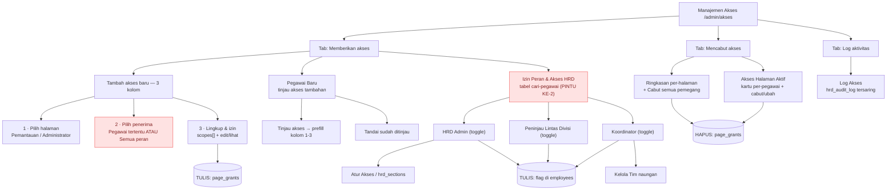
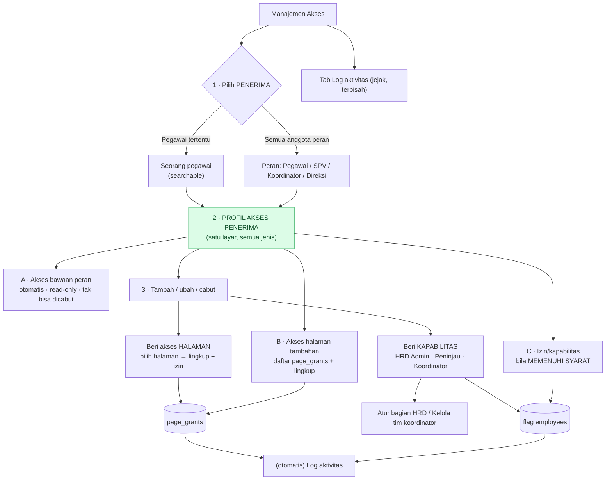

# DESAIN — Halaman Manajemen Akses (RBAC) — Infarm 360°

> **Status:** spec desain (belum dibangun). Konsolidasi diskusi 2026-07-17. Acuan saat membangun.
> Panduan durable: [CLAUDE.md](../../CLAUDE.md) · backlog: [BACKLOG.md](../perencanaan/BACKLOG.md).

Dokumen ini menyatukan visi RBAC yang dibahas bertahap: dari "akses HRD granular per-halaman"
menjadi **halaman Manajemen Akses** yang mengatur siapa boleh mengakses halaman/data apa & sejauh mana.

---

## 1. Tujuan

Memberi HRD Admin **satu tempat** untuk mengatur akses secara **fleksibel & data-driven** (aktif/
nonaktif per orang), tanpa deploy — atas **katalog halaman TETAP** (bukan page-builder; lihat
keputusan terkunci CLAUDE.md). Termasuk memberi **SPV/Koordinator** akses melihat **kinerja pegawai
naungannya** yang belum mereka punya (mis. Dashboard berlingkup tim).

## 2. Keputusan terkunci (hasil diskusi)

- **AUGMENT, bukan replace** (dikonfirmasi 2026-07-17): akses default per-peran **tetap** (SPV/
  Koordinator otomatis lihat timnya lewat Monitor/Laporan Kinerja Tim/Input KPI). Halaman akses hanya
  **MENAMBAH** akses ekstra (mis. Dashboard berlingkup) atau **MENCABUT** bila perlu. Tak mengubah
  perilaku yang sudah jalan.
- **Audit Akses = status + riwayat** (dikonfirmasi 2026-07-17): sub-tab menampilkan **matriks status
  sekarang** (siapa punya apa + lingkup) **dan** **riwayat perubahan** (kapan diberi/dicabut, oleh siapa).
- **Katalog halaman TETAP** (bukan URL bebas): sejalan keputusan "tak ada page-builder". Variasi
  per-mandat lewat **SCOPE/parameter** pada halaman existing, bukan menggandakan halaman.
- **Keamanan NYATA (Jalur B)** untuk data sensitif: akses berlingkup (tim/divisi) ditegakkan di
  **RLS/service_role**, bukan sekadar sembunyi menu. Pola: grant yang **tidak** menyalakan `is_hrd()`
  penuh + baca via `service_role` berfilter (pola Peninjau/Koordinator yang sudah ada).

## 3. Sudah ada vs baru

**Sudah ada (jangan bangun ulang):**
- Akses HRD granular per-HALAMAN (Jalur A, menu) — `hrd_sections` + `canSection` (migrasi 0023). SELESAI.
- SPV: Monitor Kinerja, Laporan Kinerja Tim, Input KPI (berlingkup `spv_team_members`).
- Koordinator: Laporan Kinerja Tim, Input KPI, ACC (berlingkup `coordinator_team_members`).
- Peninjau Lintas Divisi (`is_cross_reviewer`) — pola grant-tanpa-`is_hrd()` + `service_role` berfilter.
- Overview Struktur Organisasi (`/admin/struktur`) — SELESAI 2026-07-17.
- Grant changes SUDAH tercatat di `hrd_audit_log` (`logHrdAction`, kategori 'pegawai').

**Baru (yang dibangun halaman ini):**
- **Dashboard berlingkup tim** untuk SPV/Koordinator (satu halaman Dashboard yang **scope** menurut
  penonton — org-wide utk HRD, tim-saja utk SPV/Koord). Butuh RLS/service_role scoping (Jalur B).
- **Toggle akses** per orang (aktif/nonaktif) di satu halaman.
- **Sub-tab Audit Akses** (status matriks + riwayat).

## 4. Struktur halaman (usulan)

`/admin/akses` (bagian katalog baru `akses`; gerbang: HANYA HRD **tak-terbatas** — rekan HRD terbatas
tak boleh membuka, agar tak bisa menaikkan aksesnya sendiri).

- **Sub-tab "Kelola Akses"** — matriks/daftar: baris = orang (HRD/SPV/Koordinator yang relevan),
  kolom = kapabilitas yang bisa di-toggle + **lingkup** (mis. Semua / Divisi sendiri / Tim naungan).
  Contoh kapabilitas: "Dashboard (berlingkup tim)", "Ekspor tim", dsb — dari katalog tetap.
- **Sub-tab "Audit Akses"** — (a) **Status**: snapshot siapa punya akses apa + lingkup, dihitung dari
  data (`employees` grants + tabel scope); (b) **Riwayat**: log perubahan akses, difilter dari
  `hrd_audit_log` ke aksi-akses (grant/revoke/set_sections/set_scope).

## 5. Model data (arah, belum final)

- Kapabilitas ekstra sebagai **grant boolean** atau kolom **text[]** per orang (pola `hrd_sections`).
- **Lingkup** per grant: `all` / `own_division` / `own_team` — ditegakkan RLS/service_role.
- Hindari role baru — pakai **grant/kapabilitas** (pola terbukti: HRD Admin, Koordinator, Peninjau
  semua grant, bukan role). Role hanya untuk posisi kepegawaian eksklusif.

## 6. Keamanan (wajib)

- Bagian **konfigurasi** (tak bocorkan data pribadi) → app-level `canSection` cukup.
- Bagian **data sensitif** (kinerja/laporan/dashboard/ekspor) → **RLS/service_role berfilter** wajib;
  grant TIDAK menyalakan `is_hrd()` penuh. Lingkup "tim/divisi sendiri" hanya berarti bila ditegakkan DB.
- Tambah assertion di `npm run verify:rls` untuk skenario baru (mis. SPV-berscope tak bisa baca tim lain).

## 7. Pentahapan & risiko

1. **(SELESAI)** Overview Struktur Organisasi — fondasi visual.
2. Halaman Manajemen Akses **kerangka + Jalur A** (toggle + audit status/riwayat untuk grant yang sudah
   ada; belum sentuh RLS).
3. **Jalur B**: Dashboard berlingkup + lingkup tim/divisi (RLS/service_role) — **butuh DB terisolasi
   untuk uji** (free tier: local dev = DB production; menerapkan migrasi RLS ke DB bersama = langsung
   memengaruhi app live). Backup + jendela sepi bila terpaksa di production.

## 8. Pertanyaan terbuka

- Daftar pasti kapabilitas ekstra yang bisa di-toggle (mulai dari: Dashboard berlingkup tim).
- Apakah "lingkup tim naungan" untuk SPV = `spv_team_members`, dan untuk Koordinator =
  `coordinator_team_members` (kemungkinan ya).
- Field **jabatan spesifik** (mis. "Koordinator Gudang") — fitur terpisah, lihat catatan memori.

---

## 9. Rencana disetujui (2026-07-21) — tata letak 3-kolom + multi-lingkup + grant per-peran

> **STATUS: DIRENCANAKAN, PENGERJAAN DITUNDA atas permintaan pengguna.** Belum ada kode Fase 1 yang
> ditulis (baru daftar tugas). Bagian ini merekam mockup yang disetujui + seluruh keputusan diskusi
> agar bisa dilanjutkan kapan saja.

### 9.1 Mockup yang disetujui (3 kolom)
Konsol Manajemen Akses ditata jadi 3 kolom, satu pemberian akses = **1 halaman × 1 penerima × lingkup × izin**:
1. **Pilih halaman** (centang, 1 halaman/pemberian) — dikelompokkan **Pemantauan** (Dashboard Organisasi,
   Monitor Kinerja, dll) & **Menu Administrator** (Kelola Periode, Review Hasil Akhir, dll).
2. **Pilih penerima** (centang, 1/pemberian): salah satu **PERAN utuh** (Direksi / SPV / Koordinator /
   Pegawai) **ATAU** **pegawai tertentu** (dropdown searchable — yang sudah ada).
3. **Cara**: **Lingkup** (Sesama divisi / Selain divisi / Seluruh pegawai / Diri sendiri) + **Izin**
   (Izinkan edit / Hanya melihat).

### 9.2 Keputusan diskusi (mengikat)
1. **"Supervisor" = "SPV"** — satu peran (`role='spv'`). Mockup menuliskannya dua kali; anggap duplikat.
2. **Koordinator ADALAH target sah** (walau teknisnya grant `is_coordinator`, bukan role DB) — alasan:
   halaman pemantauan bisa dipakai koordinator memantau kinerja bawahannya. ✅ **DIPUTUSKAN (2026-07-22):**
   lingkup Koordinator = **per-daftar-tim** (`coordinator_team_members`), BUKAN per-divisi. Diwujudkan
   sebagai scope baru **`'coordinator_team'`** (migrasi 0029) — tiap koordinator melihat TIM NAUNGANNYA
   sendiri. Penegakan: `employeeInScopes(..., teamIds)` (fail-closed tanpa teamIds); helper divisi
   (`deptScopeFilter`/`allowedDeptsFor`/`isDeptInScope`) fail-closed `op:'none'` seperti 'self'.
3. **Lingkup = MULTI-pilih** (membalik keputusan 2026-07-21 sebelumnya yang "pilih-satu"). Kombinasi
   bermakna terutama **"Selain divisi + Diri sendiri"**. → butuh skema multi (`scopes[]`).
4. **Izin Edit pada halaman Administrator ke peran luas DIIZINKAN**, TAPI wajib **peringatan/konfirmasi**
   saat HRD menyimpan (mis. "Anda akan mengizinkan SEMUA Pegawai memfinalisasi laporan — lanjutkan?").
5. **Pegawai baru TIDAK otomatis dapat akses.** Grant per-peran = **terapkan ke anggota SAAT INI**
   (materialize jadi baris `page_grants` individual — *Pendekatan B*), BUKAN aturan hidup. Sebagai gantinya
   ada **section "Pegawai Baru"** di konsol yang menampilkan pegawai baru (deteksi via kolom `joined_on`
   yang sudah ada, mis. ≤30 hari) agar HRD memutuskan aksesnya manual + tombol **"Tandai sudah ditinjau"**
   (opsional kolom `access_reviewed_at`; tanpa itu kartu hilang sendiri setelah jendela waktu).
   - Catatan: akses **bawaan peran** tetap jalan untuk pegawai baru; section ini hanya soal grant TAMBAHAN.

### 9.3 Pentahapan yang disepakati (tiap fase diuji & bisa berhenti)
- **Fase 1 — Skema multi-lingkup (fondasi).**
  - Migrasi **0028** *aditif*: tambah `page_grants.scopes text[]` (backfill `array[scope]`), CHECK tiap
    elemen ∈ {all, own_division, other_divisions, self}. **PERTAHANKAN kolom `scope` lama** (Monitor grant
    sudah LIVE di `main` membacanya) → tulis SINKRON: `scope = scopes[0]` + `scopes = <array>`. `database.types.ts`
    tambah `scopes`.
  - `lib/auth/roles.ts`: `grantedAccess()` → `{ scopes: PageScope[]; canEdit }` (fallback `scope`→`[scope]`).
    Helper inti baru **`employeeInScopes(scopes, ownDept, ownId, emp)`** = OR dari tiap lingkup
    (all→true; self→emp.id===ownId; own_division→emp.dept===ownDept; other_divisions→emp.dept≠null && ≠own).
    `allowedDeptsForMulti(depts, scopes, ownDept)` = union divisi (utk dropdown). Helper single lama boleh
    tetap untuk kompat/tes.
  - **Pola penegakan disederhanakan:** halaman **ambil semua pegawai lalu SARING di JS** dengan
    `employeeInScopes` (union OR sulit dibangun sebagai satu query; ukuran ~100 pegawai → aman). Untuk query
    berat (kpi/360 lintas periode) tetap hanya untuk id yang lolos saring.
  - Terapkan di: **Monitor** (`admin/monitor/page.tsx`), **Review list** (`admin/laporan/page.tsx`),
    **Review detail** (`laporan/[employeeId]/page.tsx`), **guard tulis** (`admin/laporan/actions.ts`
    resolver → `employeeInScopes` untuk target tunggal).
  - **Panel konsol** kembali **multi-select** (checkbox; "Seluruh pegawai" mematikan own/other). `akses/page.tsx`
    muat `scopes`. Audit Akses tampilkan daftar lingkup.
  - Tes `tests/page-scope.test.ts` ditulis ulang untuk `employeeInScopes` + multi.
- **Fase 2 — Target PERAN + terapkan massal** (Direksi/SPV/Pegawai/Koordinator): saat peran dicentang,
  upsert `page_grants` untuk semua anggota peran SAAT INI. **Peringatan/konfirmasi** untuk Edit pada
  halaman Administrator ke peran luas. Putuskan semantik lingkup Koordinator (poin 9.2#2).
  ✅ **SELESAI di `dev` (2026-07-22):** scope baru `coordinator_team` (migrasi 0029) + `employeeInScopes`
  menerima `teamIds` + `allowedDeptsForMulti` menerima `teamDepts`; ditegakkan di Monitor / Review list /
  Review detail / guard tulis `admin/laporan/actions.ts`. Server action `setPageGrantForRole` (materialisasi
  ke anggota peran saat ini via service_role). Konsol: pemilih Penerima (pegawai tertentu ATAU peran),
  opsi scope "Tim naungannya" (hanya untuk Koordinator/pegawai koordinator), ConfirmDialog peringatan saat
  Edit halaman administrator ke peran luas. 145 tes hijau. **PRASYARAT deploy: apply 0029 ke DB.**
- **Fase 3 — Section "Pegawai Baru"** (dari `joined_on` + "tandai ditinjau").
  ✅ **SELESAI di `dev` (2026-07-22):** migrasi 0030 (`employees.access_reviewed_at timestamptz`). Konsol
  menampilkan section "Pegawai Baru" (joined_on ≤ 30 hari & `access_reviewed_at` null): kartu per pegawai
  dgn "Tinjau akses" (prefill card Tambah akses) + "Tandai sudah ditinjau" (`markAccessReviewed` → set
  penanda → kartu hilang). Akses bawaan peran tetap; ini hanya soal grant TAMBAHAN. **PRASYARAT: apply 0030.**
- **Fase 4 — Tata letak 3 kolom** (mempercantik; paling murah, terakhir).
  ✅ **SELESAI di `dev` (2026-07-22):** area "Tambah akses baru" ditata 3 kolom — (1) Pilih halaman (radio
  dikelompokkan Pemantauan / Menu Administrator), (2) Pilih penerima (peran ATAU pegawai tertentu + "Atur
  akses"), (3) Lingkup & izin (panel). Murni presentasi; logika panel/simpan tak berubah. ✅ **SEMUA FASE 1–4 SELESAI.**

### 9.4 Yang MENIMPA pekerjaan sebelumnya (perlu diingat saat lanjut)
- Migrasi **0027** (self *single-value*) & **panel pilih-satu** (dibuat 2026-07-21) **DISUPERSEDE** oleh
  Fase 1 (multi). 0027 boleh tetap ada (aditif, memperlebar CHECK `scope` lama utk 'self') — tak perlu di-revert.
- Semua ini masih di branch `dev`, **belum commit, belum apply ke DB live**.

### 9.5 Status saat penundaan
- Tahap 2 (edit/finalisasi non-HRD) + lingkup 'self' single + tata letak card/panel v1 = **selesai di `dev`,
  134 tes hijau, belum commit/push, migrasi 0027 belum di-apply ke live.**
- Fase 1 multi = **belum dimulai** (hanya daftar tugas).

---

## 10. Redesain "satu alur besar" — PENERIMA-DULU (diskusi 2026-07-24)

> **STATUS: DISKUSI, BELUM DIBANGUN.** Keluhan pengguna: fitur **tumpang tindih** — ada tempat
> memberi akses per-PERAN (di "Tambah akses baru") dan ada tempat terpisah untuk **izin peran & HRD**
> (blok "Izin Peran & Akses HRD"). Dua model data (grant halaman vs kapabilitas peran) tinggal di dua
> UI berbeda → membingungkan. Target: **satu alur** yang dimulai dari **memilih penerima dulu**.

### 10.1 Diagram — struktur SAAT INI (as-is)

Akar kebingungan: **dua "pintu masuk" pemberian akses** dengan model mental berbeda, dan **dua target
tulis** (`page_grants` vs flag di `employees`). "Peran" muncul di dua tempat berbeda.

**Masalah yang terlihat di diagram:**
1. **Dua pintu pemberian** (B1 "Tambah akses baru" & B3 "Izin Peran & Akses HRD") — keduanya soal
   "memberi sesuatu ke seseorang", tapi tampil sebagai dua UI berbeda (kartu 3-kolom vs tabel cari).
2. **"Peran" bermakna dua hal**: di B1b = *penerima* grant halaman; di B3 = *kapabilitas* (mis. jadikan
   Koordinator). Pengguna harus tahu bedanya untuk memilih tempat yang benar.
3. **Penerima dipilih di TENGAH** alur B1 (kolom 2), dan **tidak eksplisit** di B3 (dicari lewat tabel).
   Tak ada satu tempat yang menjawab "orang ini punya akses apa saja?".

### 10.2 Diagram — usulan ALUR BESAR (penerima-dulu)

Satu alur: **pilih penerima → lihat profil aksesnya (semua jenis) → tambah/ubah/cabut di tempat.**
Grant halaman & kapabilitas peran **disatukan** di bawah satu penerima; kelayakan menyaring apa yang
ditawarkan. Log tetap terpisah (jejak, bukan alur pemberian).

**Prinsip usulan:**
- **Penerima dulu** (sesuai harapan pengguna): model mental "saya ingin memberi si A akses X".
- **Profil akses = satu layar** menyatukan 3 lapis yang selama ini berserak: (A) **bawaan peran**
  (info, tak bisa diubah — menghilangkan salah paham "kenapa SPV sudah bisa lihat timnya?"),
  (B) **grant halaman**, (C) **kapabilitas**. Cabut dilakukan **di tempat** (tak perlu tab terpisah).
- **Kelayakan menyaring pilihan**: kalau penerima = Pegawai non-HRD, opsi "HRD Admin" tak muncul; kalau
  penerima = Peran, hanya kapabilitas yang masuk akal untuk massal yang ditawarkan.
- **Katalog halaman tetap** (keputusan terkunci) — tak berubah.

### 10.3 Pokok diskusi (perlu keputusan sebelum bangun)

1. **Penerima = PERAN untuk kapabilitas?** Grant halaman per-peran sudah ada & masuk akal. Tapi
   *kapabilitas* (HRD Admin/Peninjau/Koordinator) hampir selalu **per-orang**. Usul: saat penerima =
   Peran, **sembunyikan** kapabilitas yang tak masuk akal massal (mis. "jadikan semua Pegawai
   Koordinator" → tak ditawarkan) — hanya grant halaman + kapabilitas yang benar-benar bermakna massal.
2. **Cabut-massal per-halaman** (cabut 1 halaman dari SEMUA pemegang) = operasi **halaman-dulu**, tak
   pas di alur penerima-dulu. Opsi: (a) sediakan mode kedua "Kelola per-halaman" kecil, atau (b) tambah
   pilihan penerima ke-3 = **"Halaman"** (lihat semua pemegang halaman itu → cabut). Aku condong (b):
   tetap satu alur, cuma sumbu penerimanya "halaman".
3. **Lapis "bawaan peran"** perlu **sumber data**: dihitung dari peran + tabel scope (spv_team_members/
   coordinator_team_members). Ini read-only, murni informasional — mengurangi kebingungan terbesar.
4. **"Pegawai Baru"** jadi **pintu masuk cepat** ke alur (daftar orang → klik → profil aksesnya),
   bukan section terpisah dengan tombol prefill.
5. **Nasib 3 tab lama**: "Memberikan" + "Mencabut" **melebur** ke alur penerima-dulu (beri & cabut di
   profil yang sama). "Log aktivitas" **tetap** tab sendiri.

### 10.4 Rekomendasiku
Setuju **penerima-dulu** — itu menyederhanakan model mental & otomatis menyatukan dua pintu jadi satu.
Kunci suksesnya: **profil akses 3-lapis** (bawaan / halaman / kapabilitas) dalam satu layar, dengan
**kelayakan** yang menyaring pilihan. Untuk cabut-massal per-halaman, tambahkan penerima "Halaman"
sebagai sumbu ke-3 (opsi 10.3#2b) supaya benar-benar **satu alur** tanpa tab cabut terpisah.
